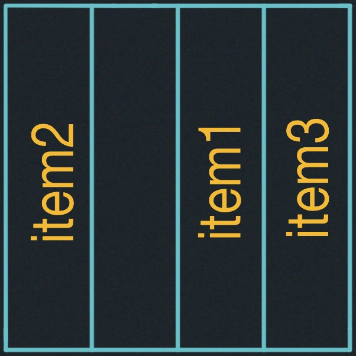
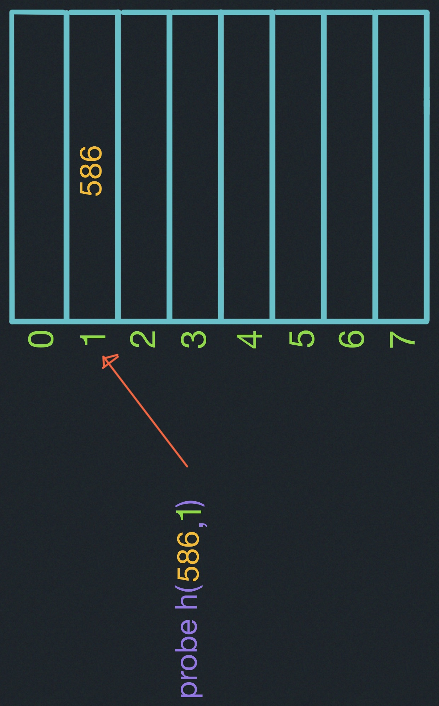
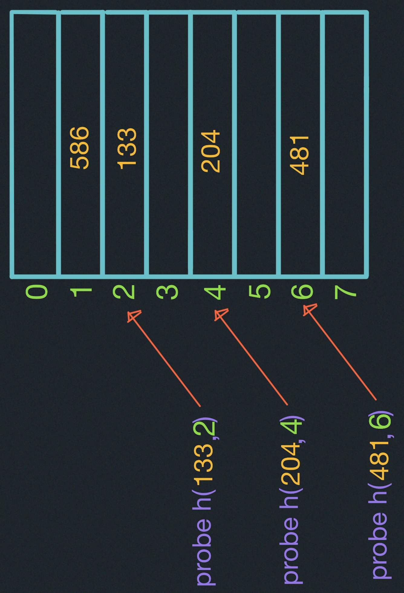
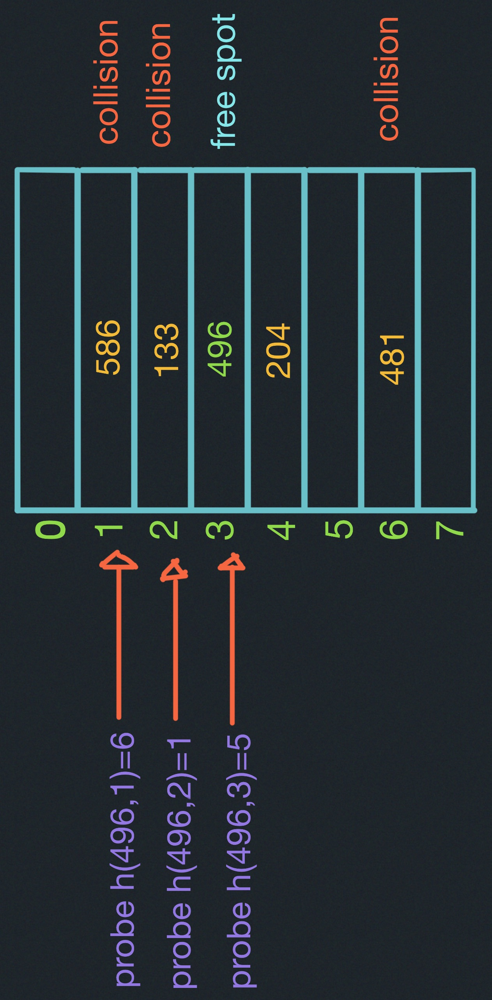
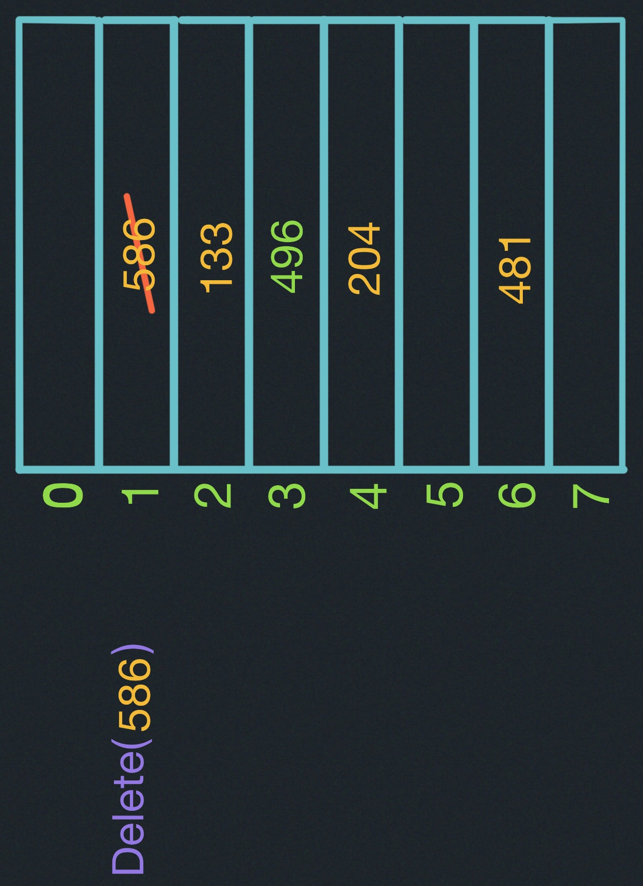
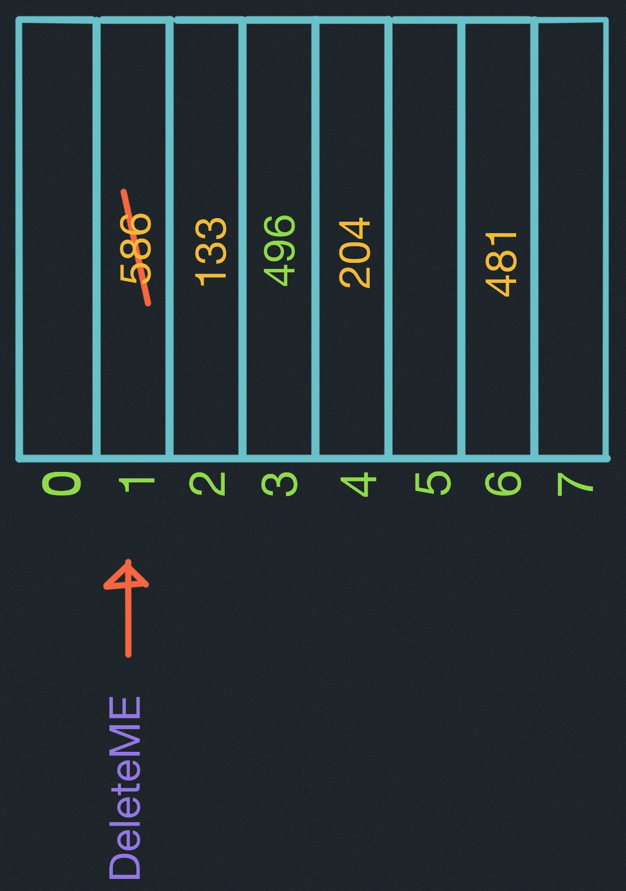
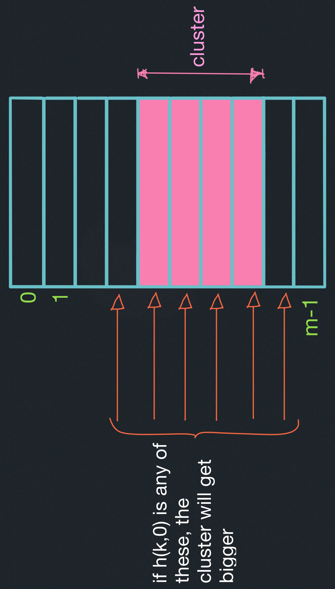
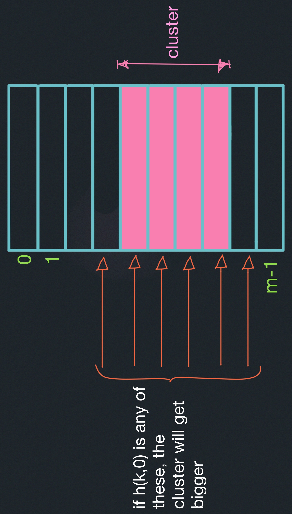

# Hashing III:Open Addressing
- Open Addressing, Probing Strategies (with single array DS).
- Uniform hashing analysis (making open addressing efficient)
- Cryptographic hashing

## Open Addressing
Another approach to collisions:

- no chaining; instead all items stored in hash table (array because we want to avoid pointers):

- one item per slot:

  $\implies m\geq n$

  where:
  - $m$: the number of slots in the table
  - $n$: the number of elements in the table

### Probing
- hash function specifies order of slots, to probe (try) for a key
(for insert/search/delete), 

    We want to design a function $h$, with the property that 
    for all  $k \in \vartheta$: 

    $h:\underbrace{\vartheta}_{\text{universe of keys}} \times 
    \underbrace{\{0,1, \dots,m-1\}}_{\text{trial count}}
    \to\underbrace{\{0,1, \dots,m-1\}}_{\text{slot in table}}$

    $\left< h(k,0),h(k,1),\dots,h(k,m-1) \right>$

is a permutation of $0,1,\dots,m-1$. i.e. if I keep trying $h(k,i)$
for increasing $i$, I will eventually hit all slots of the table.

We start with array of empty slots:
  
  
  Compute `h(586,1)` to insert 586:
  
  

  The operation returns `1`

  Now we compute `h(133,2)`, `h(204,4)` and `h(481,6)`:

  

**Example:** Insert $k=496$


`Insert(k,v)`: keep probing until an empty slot is found. Insert
item into that slot.

```
for i in range(m):
  if T[h(k,i)] is None:  # empty slot
    T[h(k,i)] = (k,v)    # store item
    return 
raise 'full'
```


**Search(k):** As long as the slots you encounter by probing are occupied by $keys \neq k,$
keep probing until you either encounter $k$ or find an empty slot --- return success or
failure respectively.

```
for i in range(m):
  if T[h(k,i)] is None:   # empty slot?
    return None           # end of "chain"
  elif T[h(k,i)][0] == k: # matching key
    return T[h(k,i)]      # return item
return None               # exhausted table
```


<span style="color:yellow; font-weight: bold"> Deleting items? </span>
- can't just find item and remove it from its slot (i.e. set $T[h(k,i)]=None$)
- example: $delete(586) \implies search(496)$ fails

- replace item with special flag: "DeleteMe", which Insert treats as None but 
search doesn't. 

  Search keeps going and treats different from None.


## Probing Strategies
This is essentially the same as taking a hash function and changing it 
so it is actually applicable to open addressing.
### Linear Probing
$h(k,i) = (h'(k)+i) \cdot mod \cdot m$ 

where:

  $h'(k):$ is ordinary hash function.

- <span style="color:cyan"> like street parking</span>
- <span style="color:yellow"> problem?</span> clustring --- cluster: 
consecutive group of occupied slots as clusters become longer,
it gets more likely to grow further. Clustering is reverse of load balancing.
> 
- can be shown that for $0.01<\alpha<0.99$ say, clusters of size
$\Theta(\log n)$.

### Double Hashing
$h(k,i) = (h_{1}(k) + i\cdot h_2(k)) \cdot mod \cdot m$ 

where:

$h_{1}(k)$ and $h_2(k)$ are two ordinary hash functions.



- Actually, hit all slots (permutation), if $h_2(k)$ is relatively
prime to $m$ for all $k$ <span style="color:yellow; font-weight: bold"> why?</span>

<span style="color:#FA7FB1; font-weight: bold; display: flex; justify-content: center"> $h1(k)+i\cdot h2(k) \cdot mod \cdot m \implies m \cdot (\text{divides}) (i-j)$ </span>

- **e.g.**  $m=2^r$, make $h_2(k)$ always odd

Open Addressing is easy to implement, it uses less memory, because you don't need
pointers, but you better be careful that you $\alpha$ stays small, around $0.5$. 

You have slightly different strategies for resizing your table, when you use open addressing,
as opposed to chaining hash tables.
#### Uniform Hashing Assumption <span style="color:green;"> (cf. Simple Uniform Hashing Assumption)</span>

Each key is equally likely to have any one of the $m!$ permutations as its probe sequence
- not really true
- but double hashing can come close

### Analysis
Suppose we have used open addressing to insert $n$ items into table of size $m$.
Under the uniform hashing assumption the next operation has expected cost of 
$\leq \frac{1}{1-\alpha}$ 


where $\alpha= \frac{1}{m}$ ($<1$)


 Example: $\alpha = 90\% \implies 10$ expected probes

### Proof:
Suppose we want to insert an item with key $k$. Suppose that the item is not in the table.
- probability first probe successful: $\frac{m-n}{m}=: p$
  
  (
    <span style="color:green; font-weight: bold">
    $n$ bad slots, $m$ total slots, and first probe is uniformly random
    </span>
  )
- if first probe fails, probability second probe successful: 
$\frac{m-n}{m} \geq \frac{m-n}{m}=p$

  (
    <span style="color:green; font-weight: bold">
    one bad slot already found, $m$ - $n$ good slots remain and the second probe is uniformly random over the
    $m$ -1 total slots left
    </span>
  )

- if 1st & 2nd probe fail, probability 3rd probe successful:
$\frac{m-n}{m-2} \geq \frac{m-n}{m}=p$

  (
    <span style="color:green; font-weight: bold">
    since two bad slots already found, $m-n$ good slots remain and the third probe is uniformly random 
    over the $m-2$ total slots left
    </span>
  )

- ...

$\implies$ Every trial, sucess with probability at least p.

<span style="color:yellow; font-weight: bold;"> 
Expected Number of trials for success?
</span>

.<span style="color:green; font-weight: bold; display: flex; justify-content: center"> 
$\frac{1}{p}=\frac{1}{1-\alpha}$
</span>

With a little thought it follows that search, delete take time $O\left(\frac{1}{(1-\alpha)}\right)$.
Ditto if we attempt to insert an item that is already there.

### Open Addressing vs. Chaining

**Open Addressing:** better cache performance 
<span style="color:green; font-weight: bold">better memory usage, no pointers needed</span>

**Chaining:** less sensitive to hash functions 
(
<span style="color:green; font-weight: bold">
OA  requires extra care to avoid clustering
</span>
)
and the load factor $\alpha$
(
<span style="color:green; font-weight: bold">
OA degrades past 70% or so and in any event cannot support values larger than 1
</span>
)

### Cryptographic Hashing
A cryptographic hash function is a deterministic procedure that takes an arbitrary 
block of data and returns a fixed-size bit string, the (cryptographic) hash value, 
such that an accidental or intentional change to the data will change the hash value. 
The data to be encoded is often called the "message", and the hash value is sometimes 
called the "message digest" or simply "digest".

The ideal cryptographic hash function has the properties listed below. $d$ is the number of bits
in the output of the hash function. you can think of $m$ as being $2^d$. $d$ is 
typically 160 or more. These hash functions can be used to index hash tables, but
they are typically used in computer security applications.

#### Desirable properties
1. **One-way (OW):** Infeasible, given $y \in R \{0,1\}^d$ to find any $x$ s.t. $h(x) = y$.
This means that if you choose a random $d-bit$ vector, it is hard to find an input 
to the hash that produces that vector. This involves "inverting" the hash function.

2. **Collision-resistance (CR):** Indeasible to find $x$,$x'$, s.t. $x\neq x'$, 
and $h(x)=h(x')$. This is a collision, two input vales have the same hash.

3. **Target collision-resistance (TCR):** Infeasible given $x$ to find $x' = x$ 
s.t. $h(x)=h(x')$. 

**TCR** is weaker than **CR**. If a hash function satisfies **CR**, it 
automatically satisfies **TCR**. There is no implication relationship
between **OW** and **$\frac{CR}{TCR}$**.

### Applications
1. **Password storage:** Store $h(PW)$, not $PW$ on computer. When user inputs $PW'$,
compute $h(PW')$ and compare against $h(PW)$. The Property required of the 
property required of the hash function is **OW**. The adversary does not know **PW**
or **PW'** so **TCR** or **CR** is not really required. Of course, if many, many
passwords have the same hash, it is a problem, but a small number of collisions
doesn't really affect security.

2. **File modification detector:** For each file **F**, store $h(F)$ securely. Check 
if **F** is modified by recomputing $h(F)$. The property that is required is **TCR**, since
the adversary wins if he/she is able to modify **F** without changing $h(F)$

3. **Digital signatures:** In public-key cryptography, Alice has a public key $PK_A$
and a private key $SK_A$. Alice can sign a message $M$ using her private key 
to produce $\sigma = sign(SK_A, M)$. Anyone who knows Alice's public key $PK_A$
and verify Alice's signature by checking that $verify(M, \sigma, PK_A)$ 
is <span style="color:green; font-weight: bold">true</span>. The adversary 
wants to forge a signature that verifies. For large $M$ it is easier to 
sign $h(M)$ rather than **M**, i.e., $\sigma = sign(SK_A,h(M))$. The property 
that we require is **CR**. We don't want an adversary to ask Alice to sign $x$
and then claim that she signed $x'$, where $h(x) = h(x')$.

### Implementations

There have been many proposals for hash functions which are **OW**, **CR**, and **TCR**.
Some of these have been broken. **MD-5**, for example, has been shown to not be **CR**.
There is a competition underway to determine **SHA-3**, which would be a Secure Hash
Algorithm Certified by **NIST**. Cryptographic hash functions are significantly
more complex than those used in hash tables. You can think of a cryptographic 
hash as running a regular hash function many, many times with pseudo-random permutations
interspersed.
