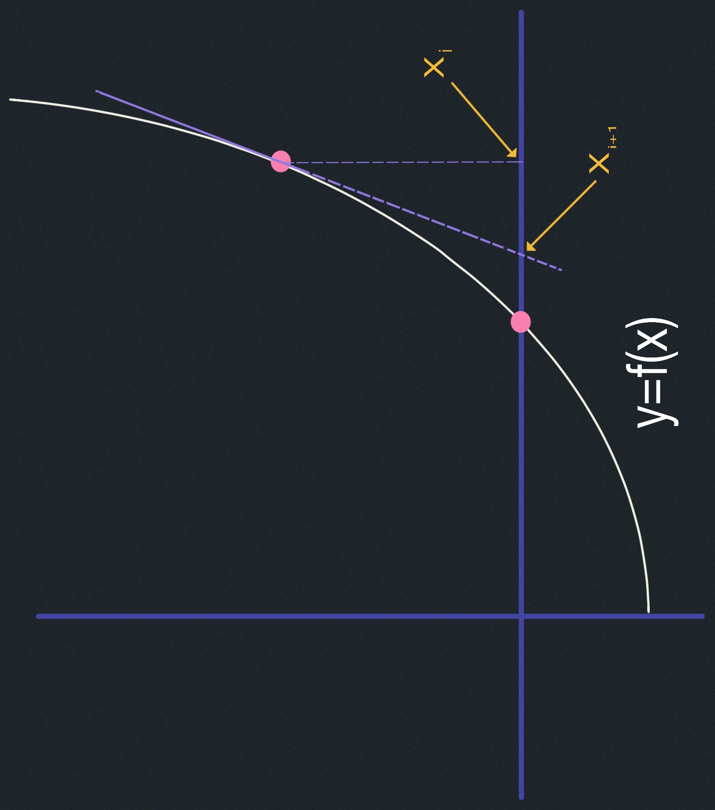
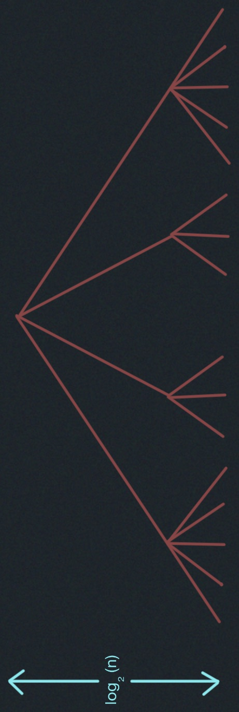
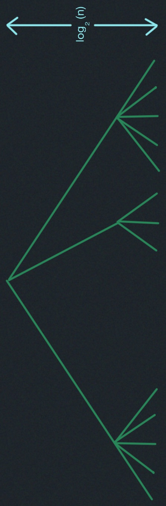
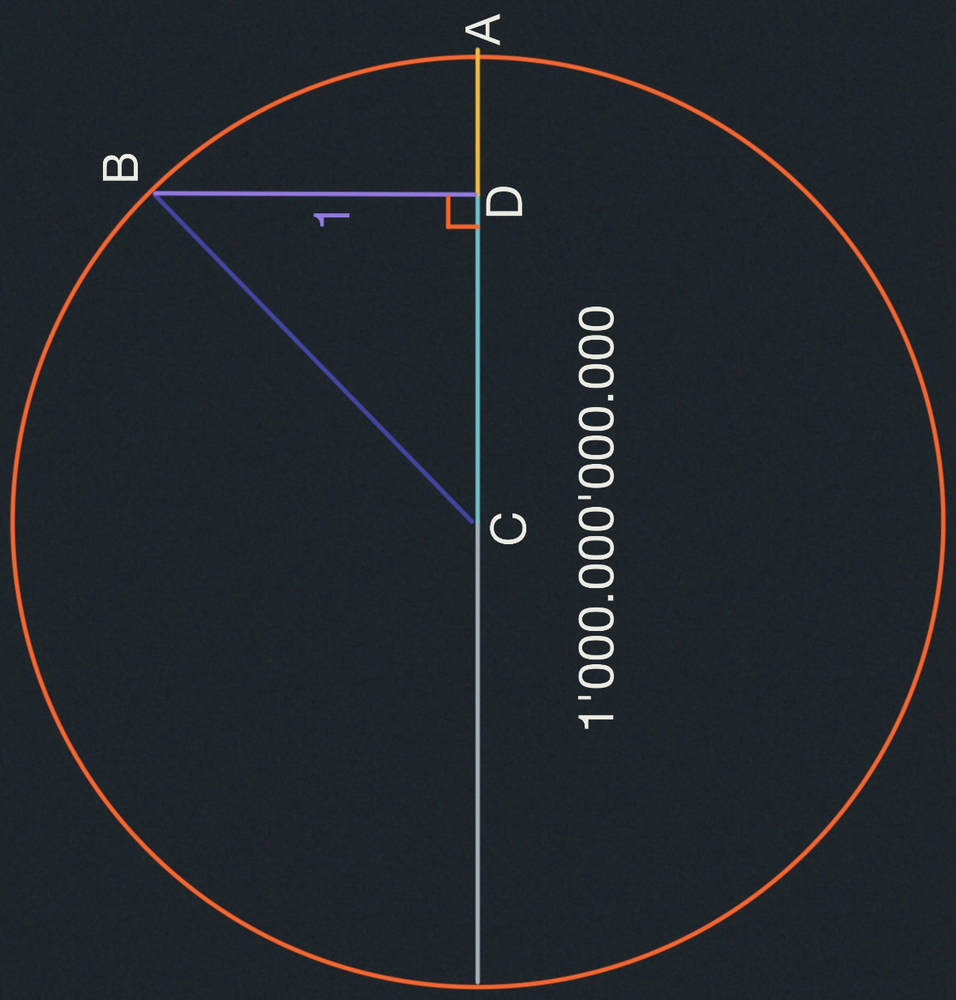

# Numerics I: Integer Arithmetic, Karatsuba Multiplication

- Irrationals
- Newton's method $(\sqrt(a), \frac{1}{b})$
- High precision multiply.

## Irrationals
Pythagoras discovered that a square's diagonal and its side
are incommensurable, i.e., could not be expressed as a ratio -
he called the ratio "speecheless"!, because it is something
he could explain.

> Pythagoras worshipped numbers "_All is a number_". Irrationals
were a threat!

#### Motivating Question:
Are there hidden patterns in irrationals?

$\sqrt(2)= 1.$ $414$ $213$ $562$ $373$ $095$ $048$ $801$ $688$ $724$ $209$ $698$ $078$ $569$ $671$ $875$ 

Can you see a pattern? No way!

#### Digression
##### Catalan numbers:
You can think of the Catalan numbers as representing the cardinality of the set P 
of balanced parentheses strings.

Set P of <u>balanced</u> parentheses strings are recursively defined as:
1. $\lambda \in P$ ($\lambda$ is empty string)
2. If "$\alpha$" and "$\beta" \in P$, then ($\alpha \cdot \beta) \in P$ 

Every non-empty balanced parent string can be obtained via Rule 2 
from a unique $\alpha,\beta$ pair.

For Example: (()) () () obtained by :
$(\underbrace{()}_{\alpha})$   $\underbrace{()()}_{\beta}$

### Enumeration
- $C_{n}:$ number of balanced parentheses strings with exactly $n$ pairs of parentheses 
- $C_0=1$ empty string. ()

- $C_{n+1}?:$ Every string with n+1 pairs of parentheses can be obtained in a unique 
way via rule 2.

One paren pair comes explicitly from the rule.
$k$ pairs from $\alpha$, $n - k$ pairs from $\beta$.

$C_{n+1} =\displaystyle \sum_{k=0}^{n} C_k \cdot C_{n-k}$ 

where:
- $n\geq 0$
- $C_0 = 1$ 
- $C_1 = {C_{0}}^2 = 1$ ()
- $C_2 = C_0 \cdot C_1 + C_1 \cdot C_{0} = 2 \cdot(C_0 \cdot C_1) = 2$ which means:  (()) or ()()
- $C_3 = \dots = 5$

The following catalan numbers are:

$1,1,2,5,14,42,132, 429,1430, 4862, 16796, 58786, 208012, 742900, 2674440, 9694845,$ 
$35357670, 129644790, 477638700, 1767263190, 6564120420, 24466267020, 91492563640,$ 
$343059613650, 1289904147324, 4861946401452, 18367353072152, 69533550916004,$
$263747951750360, 1002242216651368 \dots$

### Newton's Method
Find root of $f(x)=0$ through successive approximation e.g., $f(x)=x^2-a$

Tangent at $x_i,f(x_i)$ is line $y=f(x_i)+$ 
<u>$f'(x_i)$</u>
$\cdot(x-x_i)$

where $f'(x_i)$ is the derivative.

$x_{i+1}:$ intercept on x-axis

 $x_{i+1}=x_i-\frac{f(x_i)}{f'(x_i)}$ 

### Square Roots

$f(x)=x^2 -a$

$x_{i+1}=x_i-\frac{f(x_i)}{f'(x_i)}=x_i-\frac{({x_i}^2-a)}{2x_i}=\frac{x_i+\frac{a}{x_i}}{2}$

Example:

$a=2$

$x_{0}=1$

$x_{1}=\frac{x_0+\frac{2}{x_0}}{2}=\frac{(1)+\frac{2}{(1)}}{2}=\frac{1+2}{2}=\frac{3}{2}=1.5$ 

$x_{2}=\frac{x_1+\frac{2}{x_1}}{2}=\frac{(1.5)+\frac{2}{(\frac{3}{2})}}{2}=\frac{1+\frac{4}{3}}{2}=\frac{(\frac{7}{3})}{2}=\frac{7}{6}=1.416666665$ 

|iteration | value       |
| -------- | ----------- |
| $x_0$    | 1.000000000 |
| $x_1$    | 1.500000000 |
| $x_2$    | 1.416666665 |
| $x_3$    | 1.414215686 |
| $x_3$    | 1.414213562 |

> $\sqrt(2)= 1.$ $414$ $213$ $562$ $373$ $095$ $048$ $801$ $688$ $724$ $209$ $698$ $078$ $569$ $671$ $875$ 

Quadratic convergence, # digits doubles. Of course, in order to use Newton's method,
we need high-precision division. We'll start with multiplication and cover division in 
Lecture 12.

### High Precision Computation

$\sqrt{2}$ to d-digit precision: $\underbrace{1.414213562372}_{d-digits} \dots$

Want integer $\left[10^d\cdot \sqrt{2}\right]=\left[\sqrt{2 \cdot 10^{2d}}\right]$ --- 
integral part of square root Can still use Newton's Method.

### High Precision Multiplication

Multiplying two n-digit numbers (radix r=2,10) $0\leq x,y< r^n$

$x_1:$ high half

$x_0:$ low half

$x= x\cdot r^{\frac{n}{2}}+x_0$ 

$y= y\cdot r^{\frac{n}{2}}+y_0$

$0 \leq x_0,x_1 < r^{n/2}$

$0 \leq y_0,y_1 < r^{n/2}$

$z = x\cdot y
= x_1\cdot y_1\cdot r^n+(x_0\cdot y_1 +x_1\cdot y_0)\cdot r^{\frac{n}{2}}+ x_0 \cdot y_0$

4 multiplications of half-sized numbers $\implies$ quadratic algorithm $\Theta(n^2)$ time.

## karatsuba's Method

$4T\cdot(\frac{n}{2})$
$4^{\log_2 n}=n^{log_2 4}=n^{2}$

$3T\cdot(\frac{n}{2})$
$3^{\log_2 n}=n^{log_{2} 3}$

Let 

$z_0=x_0 \cdot y_0$

$z_2=x_1 \cdot y_1$

$z_1= (x_0 + x_1) \cdot (y_0 + y_1) - z_2 - z_0= x_0\cdot y_1 + x_1 \cdot y_0$

$z_1 = (x_0 \cdot y_0 + x_0 \cdot y_1 + x_1 \cdot y_0 + x_1 \cdot y_1) - z_2 - z_0$

$z_1 = x_0 \cdot y_0 + x_0 \cdot y_1 + x_1 \cdot y_0 + x_1 \cdot y_1 - z_2 - z_0$

$z_1 = x_0 \cdot y_1 + x_1 \cdot y_0$

$z=$ 

$z_2$ 

$\cdot r^{n} +$ 

$z_1$ 

$\cdot r^{n/2}+$ 

$z_0$

There are three multiplies in the above calculations.

$T(n):$ time to multiply two n-digit numbers

$T(n)= 3T(\frac{n}{2}+ \Theta(n))$

$T(n)= \Theta(n^{log_2{3}})$

$T(n)= \Theta\left(n^{1.5849625\dots}\right)$

This is better than $\Theta(n^{2})$. Python does this, and more (see Lecture 12).

## Fun Geometry Problem

$BD=1$

Whats is 

$AD$

?

  

  $AD=$

  

  $AC -$

  

  $CD$

  

  

  $=500.000'000.000 - \sqrt{\underbrace{  500.000'000.000^{2} - 1}_{a}}$

  

Let's calculate

$AD$

to a million places. (This assumes we have high-precision division, 
which we will cover in Lecture 12). Remarkably, if we evaluate the 
length to several hundred digits of precision using Newton's Method,
the Catalan numbers come marching out!. Try it at:
[Catalan Numbers](http://people.csail.mit.edu/devadas/numerics_demo/chord.html)

### An Explanation
This was not covered in lecture and will not be on a test. Let's 
start by looking at the power series of a real-valued function $Q$.

  

  $Q(x)= c_0 + c_1 \cdot x + c_2 \cdot x^2 + c_3 \cdot x^3\dots + c_n \cdot x^n$ 

  

$(1)$

  

  $Q(x)^2 = (c_0 + c_1 \cdot x + c_2 \cdot x^2 + c_3 \cdot x^3 + \dots + c_n \cdot x^n) \cdot (c_0 + c_1 \cdot x + c_2 \cdot x^2 + c_3 \cdot x^3 + \dots + c_n \cdot x^n)$

  

$(2)$

  

$Q(x)^2 = c_0^2 + 2c_0c_1x + 2c_0c_2x^2 + 2c_0c_3x^3 + \dots + 2c_0c_nx^n c_1^2x^2 + 2c_1c_2x^3 + 2c_1c_3x^4 + \dots + 2c_1c_nx^{n+1} c_2^2x^4 + 2c_2c_3x^5 + \dots + 2c_2c_nx^{n+2} \dots c_n^2x^{2n}$

  

$(3)$

  

  $x\cdot Q(x)^2 = c_2\cdot x + 2\cdot(c_0\cdot c_1)\cdot x^2 + (c_0c_2 + c_1c_1 + c_2c_0)\cdot x^3 + \dots$ 

  

$(5)$

  

  $1 + x\cdot Q(x)^2 = 1 + c_2\cdot x + 2\cdot(c_0\cdot c_1)\cdot x^2 + (c_0c_2 + c_1c_1 + c_2c_0)\cdot x^3 + \dots$ 

  

$(6)$

Now consider the equation:

$Q(x)=1 + x\cdot Q(x)^2$

For this equation to hold, the power series of $Q(x)$ must equal 
the power series of $1 + x\cdot Q(x)^2$. This happens only if all 
the coefficients of the two power series are equal; that is, if:

  

  $c_0 = 1$ 

  

$(7)$

  

  $c_1 = {c_0}^2$ 

  

$(8)$

  

  $c_2 = {c_0}\cdot {c_1} + {c_1}\cdot {c_0}$ 

  

$(9)$

  

  $c_3 = {c_0}\cdot {c_2} + {c_1}\cdot {c_1} + {c_2}\cdot {c_0}$ 

  

$(10)$

In other words, the coefficients of the function $Q$ must be the Catalan numbers!

  - We can solve for $Q$ using the quadratic equation:

  

  $Q(x)= \frac{1 \pm \sqrt{1-4x}}{2\cdot x}$

  

  $(11)$

Let's use the negative square root. From this formula for $Q$, we find:

  

  $10^{-12}\cdot Q(10^(-24))= 10^{-12} \cdot \frac{1 \pm \sqrt{1-4\cdot(10^{-24})}}{2\cdot (10^{-24})}$ 

  $10^{-12}\cdot Q(10^(-24))= 5000000000 - \sqrt{\underbrace{  5000000000^{2} - 1}_{a}}$

  

$(12)$

Form the original power-series expression for $Q$, we find:

  

  $10^{-12}\cdot Q(10^{-24})= c_0\cdot 10^{-12} + c_1\cdot 10^{-36} + c_2\cdot 10^{-60} + c_3\cdot 10^{-84} + \dots$ 

  

$(12)$

Therefore, $5000000000 - \sqrt{5000000000^{2} - 1}$ should contain a Catalan number 
in every twenty-fourth position, which is what we observed.
