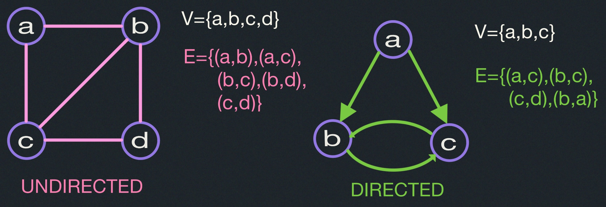
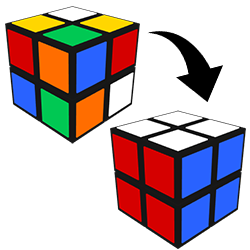

# Graphs I: Breadth First Search
- Applications of Graph Search.
- Graph Representations.
- Breadth-First Search

---
##### Recall:

Graph $G=(V,E)$
- $V$: set of vertices (arbitrary labels)
- $E$: set of edges i.e. vertex pairs $(v,w)$ 
  - ordered pair $\implies$ <u>directed</u> edge of graph.
  - unordered pair $\implies$ <u>undirected</u> edge of graph.

  

## Graph Search
"Explore a graph", e.g.:
- find a path from start vertex $s$ to a desired vertex
- visit all vertices or edges of graph, or only those 
reachable from $s$

### Applications:
There are many.
- Web crawling (how Google finds pages)
- Social networking (Facebook friend finder)
- Network bradcast routing.
- Garbage collection.
- Model checking (finite state machine)
- checking mathematical conjectures
- solving puzzles and games.

#### Pocket Cube:
Consider a 2 x 2 x 2 Rubik's cube:

Configuration Graph:
- vertex for each possible state.
- Edge for each basic move (e.g., 90 degree turn) from one state to another.
- undirected: moves are reversible

Diameter ("God's Number")

11 for $2$ x $2$ x $2$, 20 for $3$ x $3$ x $3$, $\Theta\left(\frac{n^2}{log_2(n)}\right)$
for $n$ x $n$ x $n$ [Demaine, Demaine, Eisenstat, Lubiw winslow 2011]
