# Graphs I: Breadth First Search
- Applications of Graph Search.
- Graph Representations.
- Breadth-First Search

---
##### Recall:

Graph $G=(V,E)$
- $V$: set of vertices (arbitrary labels)
- $E$: set of edges i.e. vertex pairs $(v,w)$ 
  - <span style="color:rgb(121,202,66)">ordered pair $\implies$ <u>directed</u> edge of graph.</span>
  - <span style="color:rgb(255,154,223)">unordered pair $\implies$ <u>undirected</u> edge of graph.</span>

  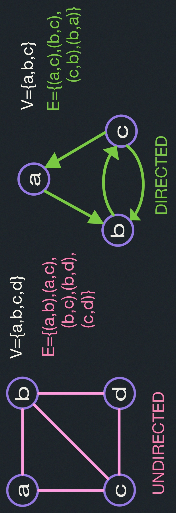

## Graph Search
"Explore a graph", e.g.:
- <span style="color:rgb(121,202,66)">find a path from start vertex $s$ to a desired vertex</span>
- <span style="color:rgb(121,202,66)">visit all vertices or edges of graph, or only those 
reachable from $s$</span>

### Applications:
<span style="color:rgb(121,202,66)">There are many.</span>
- Web crawling (<span style="color:rgb(121,202,66)">how Google finds pages</span>)
- Social networking (<span style="color:rgb(121,202,66)">Facebook friend finder</span>)
- Network broadcast routing.
- Garbage collection.
- Model checking (<span style="color:rgb(121,202,66)">finite state machine</span>)
- checking mathematical conjectures
- solving puzzles and games.

#### Pocket Cube:
Consider a 2 x 2 x 2 Rubik's cube:


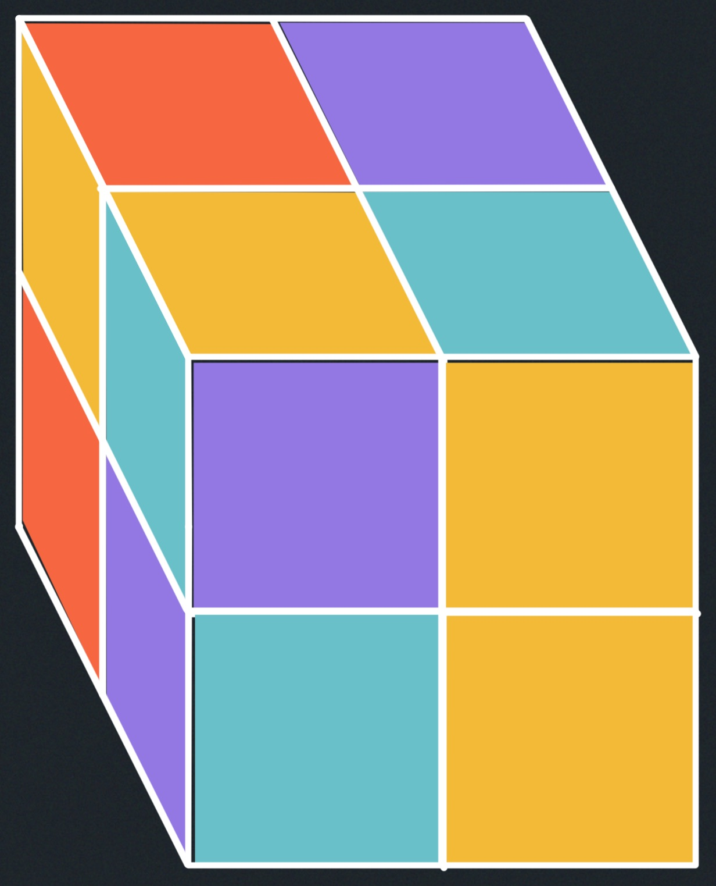

Configuration Graph:
- vertex for each possible state.
- Edge for each basic move (e.g., 90 degree turn) from one state to another:
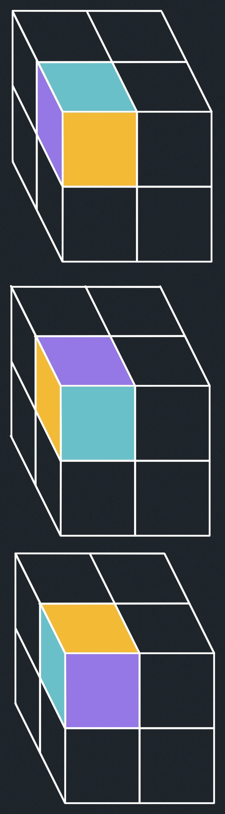
- undirected: moves are reversible:

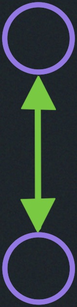

Diameter ("God's Number")

<span style="color:cyan">

- 11 for $2$ x $2$ x $2$, 
- 20 for $3$ x $3$ x $3$, 
- $\Theta\left(\frac{n^2}{log_2(n)}\right)$ for $n$ x $n$ x $n$</span> <span style="color:rgb(255,154,223)">[Demaine, Demaine, Eisenstat, Lubiw winslow 2011]

</span>

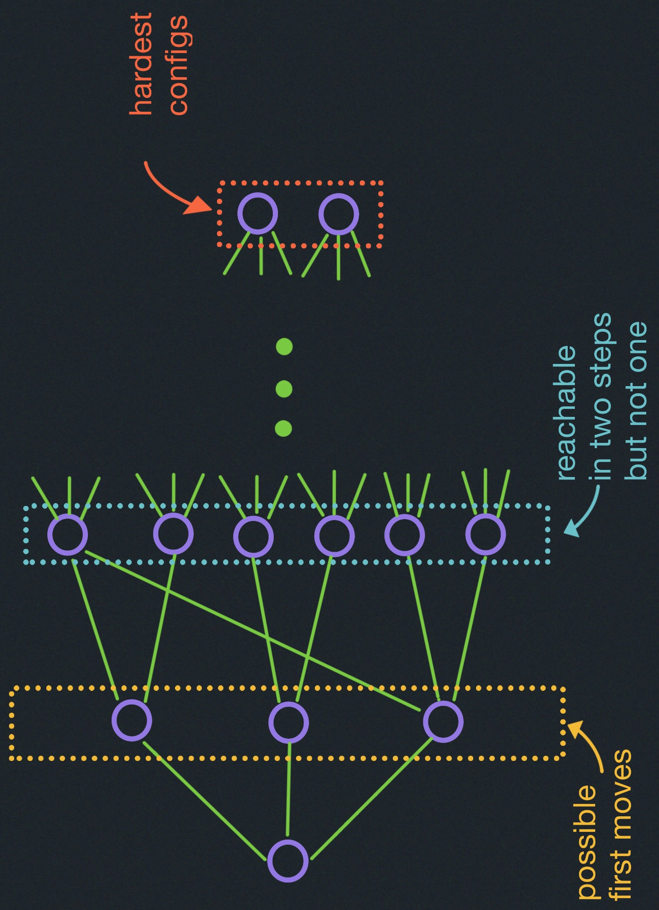

number of vertices $v= 8! \cdot 3^8 = 264'439.520$ where 
<span style="color:yellow">$8!$ comes from having 8 cubelets in arbitrary positions and $3^8$ comes as each 
cubelet has 3 possible twists</span>.

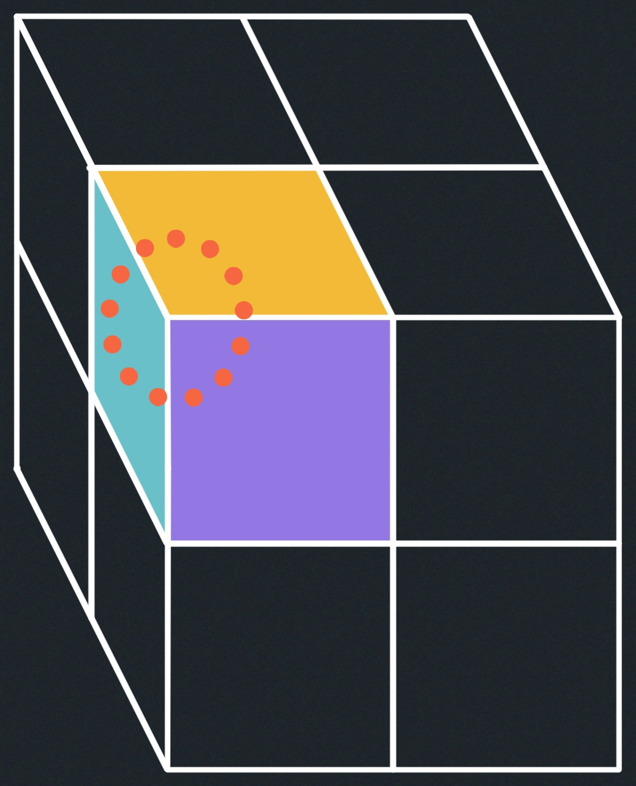

<span style="color:pink">This can be divided by 24 if we remove cube symmetries and further divided 
by 3 to account for actually reachable configurations (there are 3 connected components)</span>.

### Graph Representations: (<span style="color:rgb(255,154,223)"> data structures </span>)

#### Adjacency lists:
Array $Adj$ of $|V|$ linked lists
- for each vertex $u \in V,Adj[u]$ stores $u$'s neighbors, i.e.,

$
\{v\in V | (u,v) \in E\}
$.

$Adj[b]=\{a,c\}$

$Adj[a]=\{c\}$

$Adj[c]=\{b\}$

For pretty much every exploration problem, this is the representation you want,
because you're at some vertex, and you want to know, where can I go next.
And Adj of that vertex ($Adj[u]$) tells you exactly where you can go next.

<span style="color:rgb(243,186,56)">$(u,v)$ are just outgoing edges if directed.</span>
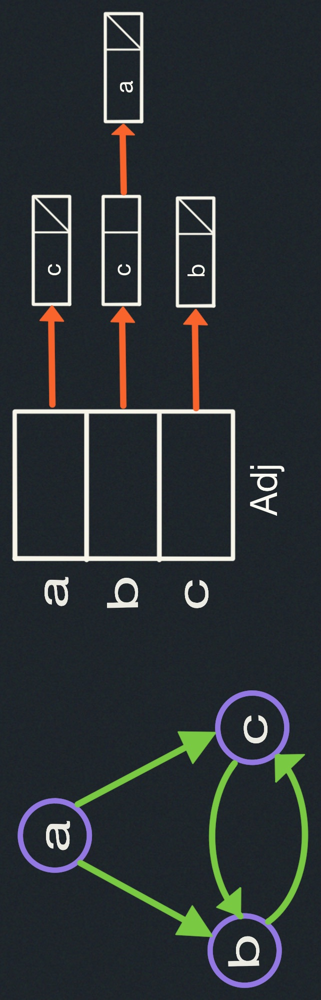


- in Python $Adj =$ dictionary of list/set values; $vertex =$ any hashable object (e.g., int, tuple)
- advantage: multiple graphs on same vertices.

#### Implicit Graphs:
$Adj(u)$ is a function --- compute local structure on the fly
<span style="color:pink">(e.g., Rubik's Cube)</span>. This requires
<span style="color:cyan">"Zero" Space</span>

##### Object-oriented Variations:
- Object for each vertex $u$
- $u.neighbors = list$ of neighbors i.e. $Adj[u]$.

<span style="color:pink">In other words, this method for implicit graphs</span>

##### Incidence Lists:
- can also make edges objects

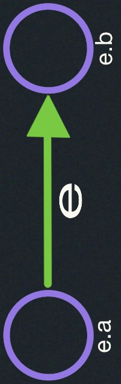

- $u.edges:$ list of (outgoing) edges from $u$.
- advantage: store edge data without hashing.

### Breadth-First Search
Explore graph level by level from $s$:
- level $0=\{s\}$
- level $i= vertices$ reachable by path of $i$ edges but not fewer. 

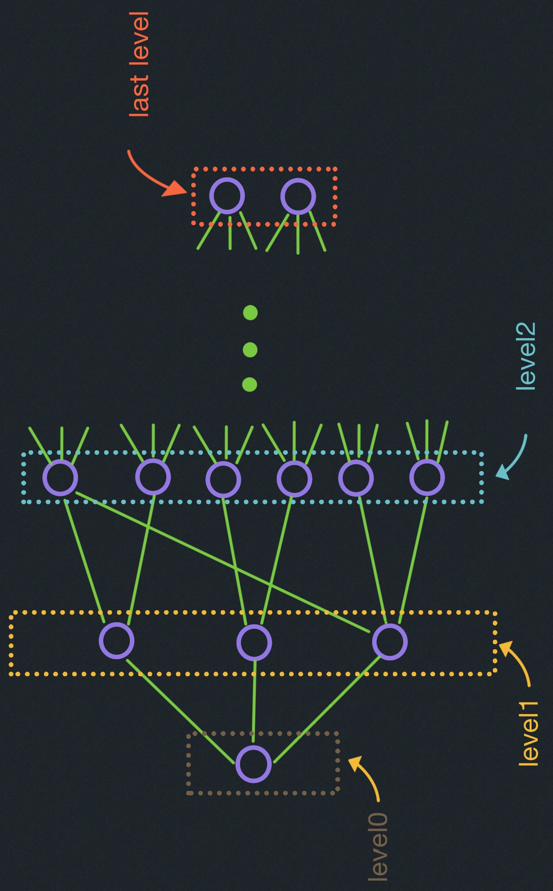

- build level $i>0$ from level $i-1$ by trying all outgoing edges, but ignoring 
vertices from previous levels.

### Breadth-First-Search Algorithm
```
BFS(V,Adj,s):
  level = { s: 0 }
  parent = { s: None }
  i = 1
  frontier = [s]     # what we can reach in level `i-1` moves.
  while frontier:
    next = []        # what we can reach in level `i` moves.
    for u in frontier:
      for v in Adj[u]:
        if v not in level:
          level[v] = i
          parent[v] = u
          next.append(v)
    frontier = next
    i += 1
```

##### Example
For this example we illustrate an <u>undirected</u> graph, but this algorithm works
just as well on directed and undirected graphs.
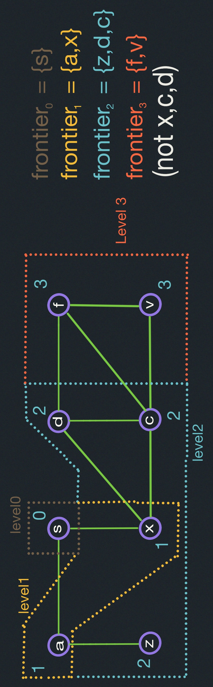

We're given some start vertex $s$, and we are given the graph by being given the 
adjacency lists.

#### Analysis:
- vertex $V$ enters next ($\&$ then frontier) only once (because level$[v]$ then set)
  base case: $v=s$

- $\implies$ $Adj[v]$ looped through only once

<span style="">

$$
\displaystyle time=\sum_{v \in V} |Adj[V]|=
\begin{cases}
|E| & \text{for directed graphs} \\
2 |E| & \text{for undirected graphs} \\
\end{cases}
$$

    This is the handshaking lemma, that basically says that we visit every node twice.
</span>

- $\implies$ $O(E)$ time.

- $O(V+E)$ <span style="color:rgb(243,186,56)">("LINEAR TIME")</span> to also list vertices 
unreachable from $v$ (those still not assigned level)

### Shortest Paths:
<span style="color:green">cf. Lectures 15-18</span>

<span style="">

- for every vertex $v$, fewest edges to get from $s$ to $v$ is
$$
\begin{cases}
level[v] & \text{if $v$ assigned level} \\
\infty & \text{else (no path)} \\
\end{cases}
$$

</span>


- <span style="background:rgb(0,158,241)"> **Parent:** </span> pointers form <u>shortest-path tree</u> = union of such a shortest path
for each $v$ $\implies$ to find shortest path take $v$, $parent[v]$, $parent[parent[v]]$,etc.,
  until $s$ (or None).

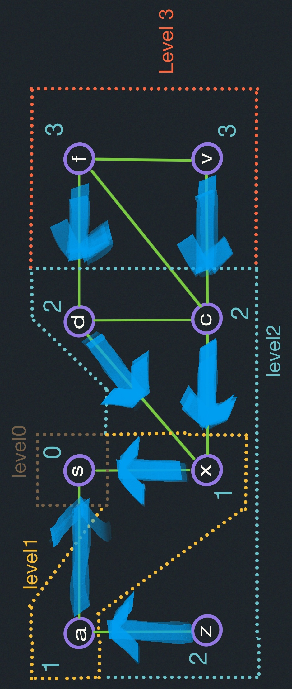
