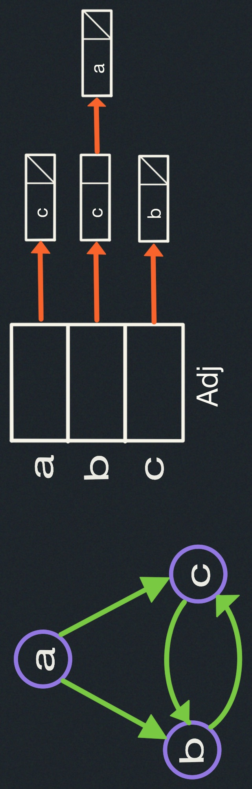
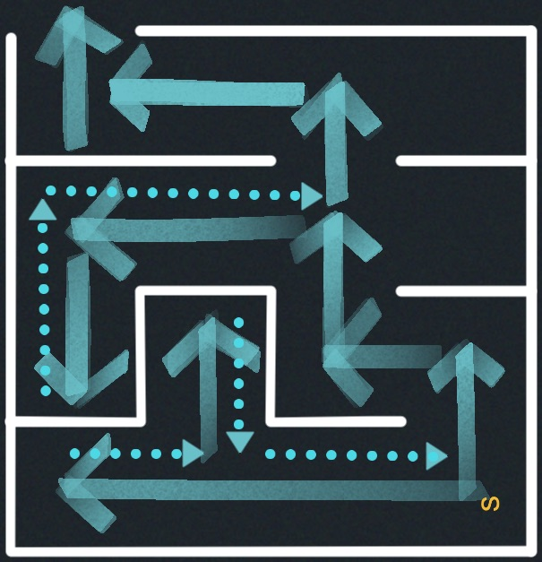
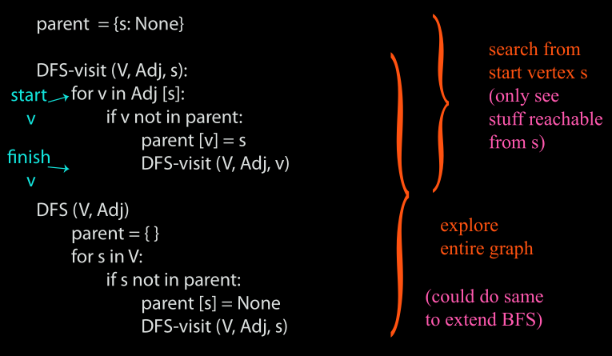
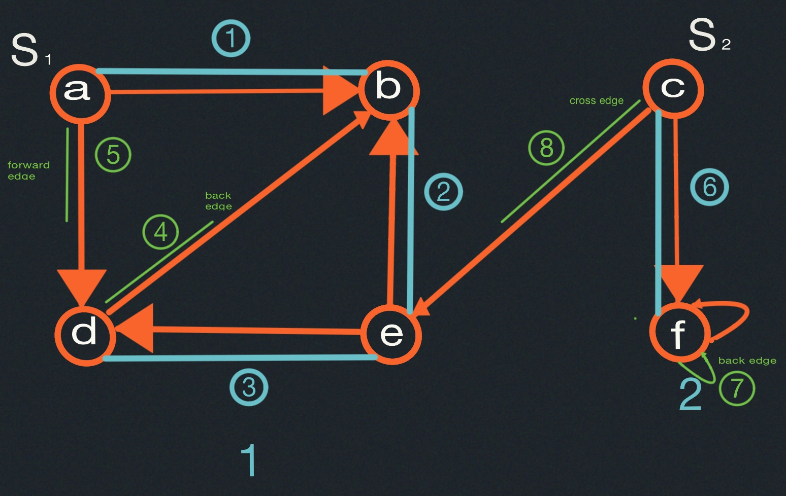
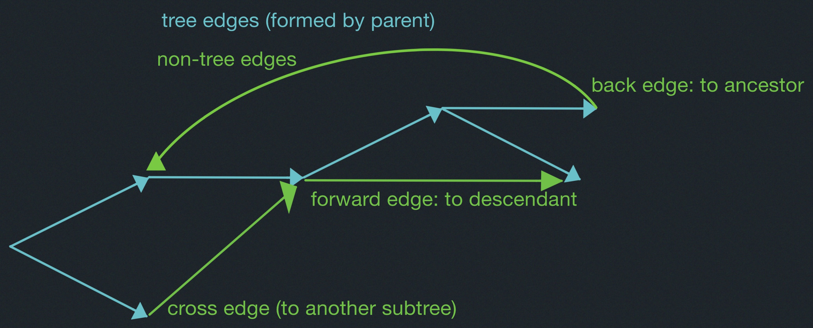
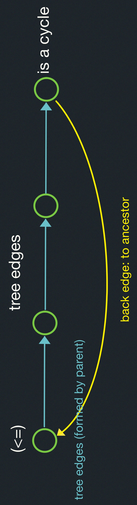
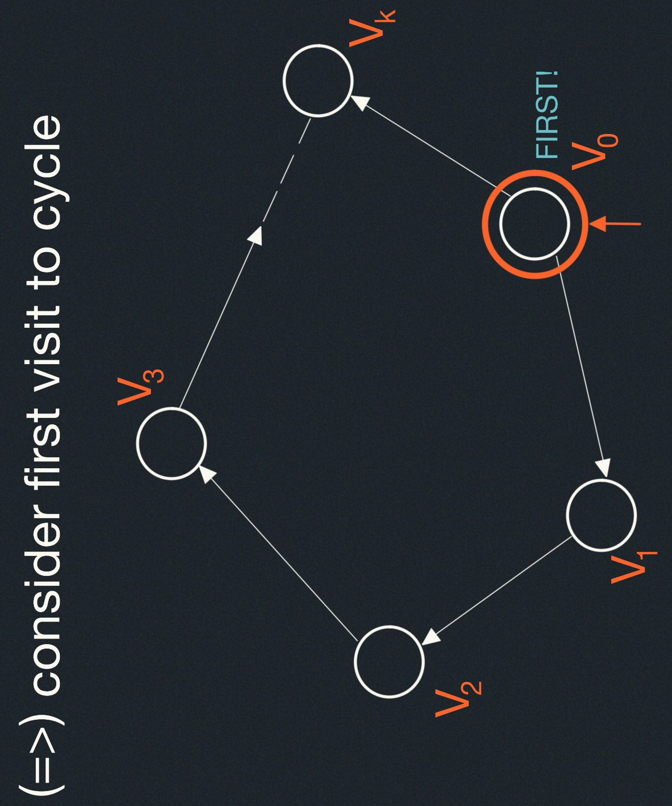
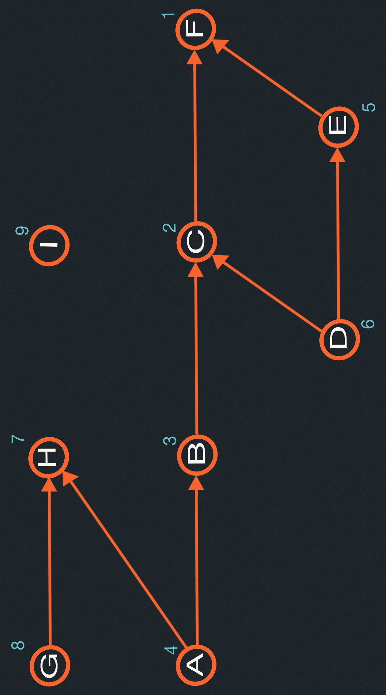

# Graphs II: Depth-First Search
- Depth-First Search (DFS)
- Edge Classification
- Cycle Testing
- Topological Sort

## Recall:
- <u style="color:rgb(237,93,177)">Graph search</u>: Explore a graph
  - e.g., find a path from start vertex $s$ to a desired vertex.
- <u style="color:rgb(237,93,7)">Adjacency list</u>: array 
$Adj$ of $|V|$ linked lists.
  - for each vertex $u \in V$, $Adj[u]$ stores $u$'s neighbors,
  i.e., 
  $\{v \in V | (u,v)\in E\}$ (just outgoing
  edges if directed)

For example:

### Breadth-first Search (BFS):
Explore level-by-level from $s$ --- find shortest paths.

### Depth-First Search (DFS):
This is like exploring a maze:

#### Depth-First Search Algorithm:
- Follow path until you get stuck.
- Backtrack along breadcrumbs until reach unexplored neighbor.
- Recursively explore.
- Careful not to repeat a vertex.

##### Example:

##### Edge Classification

- To compute this classification (back or not), mark nodes for duration they are
"on the stack".

- Only tree and back edges in undirected graph.

#### Analysis
- DFS-visit gets called with a vertex $s$ only once (because then $parent[s]$ set).
$\implies$ time in DFS-visit $= \sum_{s \in V} |Adj[s]| = O(E)$

- DFS outer loop adds just $O(V)$
$\implies O(V+E)$ time (linear time).

### Cycle Detection
Graph $G$ has a cycle $\iff$ DFS has a back edge.

### Proof:

- before visit to $v_i$ finishes,

  Will visit $v_{i+1}$ ($\&$ finish):

  Will consider edge $(v_i, v_{i+1})$

  $\implies$ visit $v_{i+1}$ now or already did

- $\implies$ before visit to $v_0$ finishes,
will visit $v_k$ ($\&$ didn't before)

- $\implies$ before visit to $v_k$ (or $v_0$) finishes,
will see (v_k, v_0) as back edge.

##### Job scheduling
Given Directed Acylic Graph ($DAG$), where vertices represent tasks $\&$ edges represent 
dependencies, order tasks without violationg dependencies.

###### Source:

Source : vertex with no incoming edges : schedulable at beginning
(A,G,I)

### Attempt:
BFS from each source:
- from A finds A, BH, C,F
- from D finds D, BE, CF $\leftarrow slow ... wrong!$
- from G finds G, H
- from I finds I

### Topological Sort

Reverse of DFS <u style="color:cyan">finishing times</u> (time at which DFS-Visit($v$) finishes)

$$
\begin{cases}
DFS-Visit(v) \\
\ \ \ \ \cdots \\
\ \ \ \ order.append(v)\\
order.reverse()
\end{cases}
$$

##### Correctness
For any edge $(u,v)$ --- $u$ ordered before $v$, i.e., $v$ finished before $u$.

- if $u$ visited before $v$:
  - before visit to $u$ finishes, will visit $v$ (via ($u,v$) or otherwise)
  - $\implies v$ finishes before $u$. 

- if $v$ visited before $u$:
  - graph is acyclic
  - $\implies$ $u$ cannot be reached from $v$.
  - $\implies$ visit to $v$ finishes before visiting $u$.
