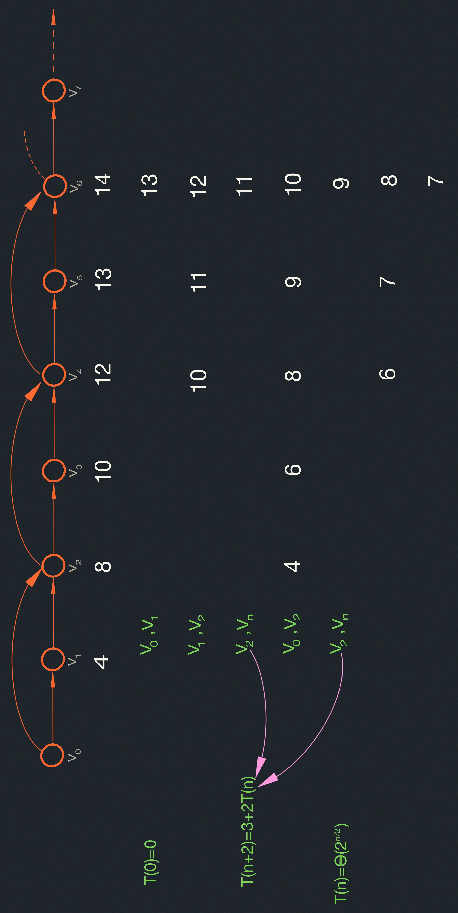

# Shortest Paths I: Intro
- Weighted Graphs
- General Approach
- Negative Edges
- Optimal Substructure

## Readings
CLRS Sections 24 (intro).

## Motivations
Shortest way to drive from A to B Google maps "get directions"

  Formulation: Problem on a weighted graph $G(V,E)$ $W:E\implies \mathbb{R}$

  Two algorithms: Dijkstra $O(( V \cdot log_2 V ) + E )$, assumes non-negative
  edge weights Bellman Ford $O(V\cdot E)$ is a general algorithm.

## Application
- Find shortest path from CalTech to MIT
  - See "CalTech Cannon Hack" photos web.mit.edu
  - See Google Maps from CalTech to MIT.
- Model as `a` weghted fraph $G(V,E),W:E\implies \mathbb{R}$
  - $V:$ vertices (street intersections)
  - $E:$ edges (street, roads) directed edges (one way roads)
  - $W(U,V):$ weight of edge from $u$ to $v$ (distance, toll)

  $$
  \text{path }p=<v_0,v_1,\dots,v_k>\\
  (v_i, v_{i+1}) \in E for 0 \geq i \leq k \\
  w(p) = \displaystyle \sum_{i=0}^{k-1}  w(v_i, v_{i+1})
  $$

## Weighted Graphs:
#### Notation:
$u \xrightarrow[]{\text{p}} v$ means $p$ is a path from $v_0$ to $v_k$.
where v_0 is a path from $v_0$ to $v_0$  of weight $0$.

#### Definition:
Shortest path weight from $u$ to $v$ as:

$$
\delta(u,v) =
\begin{cases}
\text{min } \;    
\{w(p): u \xrightarrow[]{\text{p}} v \} & \text{if } \exists \; \text{any such path}\\
\\ 
\infty & \text{otherwise ($v$ unreachable from $u$) } 
\end{cases}
$$

#### Single Source Shortest Paths:
Given $G=(V,E)$, $w$ and $a$ source vertex $S$, find $\delta(S,V)$ [and the best path] from $S$
to each $v \in V$.

Data structures:

$$
d[v]: \text{value inside circle}\\
d[v] = \begin{cases}
0 & \text{if } v = S\\
\infty & \text{otherwise }
\end{cases} \Bigg\} \impliedby initially\\
d[v] = \delta(s,v) \impliedby \text{at end}\\[10px]

d[v] \geq \delta(s,v) \text{at all times}
$$

- $d[v]$ decreases as we find better paths to $v$, see Figure.

- $\prod [v]:$ predecessor on best path to $v, \prod[s]=NIL$

##### Example:

#### Negative-Weighted Edges:
- Natural in some applications (e.g., logarithms used for weights)
- Some algorithms disallow negative weight edges (e.g., Dijkstra)
- If you have negative weight edges, you might alse have negative weight
cycles

  $\implies$ may make certain shortest paths undefined!

##### Example:

$B \rightarrow D \rightarrow C \rightarrow B$ (origin) has weight $-6+2+3=-1 < 0!$

Shortest path $S \rightarrow C$ (or B,D,E) is undefined. Can go around 
$B\rightarrow D\rightarrow C$ as many times as you like.

If negative weight edges are present, s.p. algorithm should find negative weight cycles (e.g., Bellman Ford)

###### General structure of S.P. Algorithms (no negative cycles)
| Column2   | Column3   |
|-------------- | -------------- |
| Initialize    | $for v \in V: \begin{cases} d[v] \leftarrow \infty\\ \prod[v] \leftarrow NIL \end{cases}\\  d[S] \leftarrow 0\\$     |
| Main    | repeat   select edge $(u,v)$  [somehow]    |
| "Relax" edge $(u,v)$    | $\Bigg[{\text{if } d[v] \geq + w(u,v):\\ d[v] \leftarrow d[u] + w(u,v) \; \pi[v] \leftarrow u}$  until all edges have $d[v] \leq d[u] + w(u,v)$ |

###### Complexity:
Termination? (needs to be shown even without negative cycles)
Could be exponential time with poor choice of edges.

Running Generic Algorithm. The outgoing edges from $v_0$ and $v_1$ have weight $4$,
the outgoing edges from $v_2$ and $v_3$ have weight $2$, the outgoing edges from 
$v_4$ and $v_5$ have weight $3$ have weight 1.

In a generalized example based on the previous figure. We have n nodes, and the 
weights of edges in the first 3-tuple of nodes are $2^{\frac{n}{2}}$, the weights on the second set are
$2^{\frac{n}{2}-1}$, and so on. A pathological selection of edges will result in the initial value of 
$d(v_{n-1})$ to be $2\dot(2^{\frac{n}{2}}+2^{\frac{n}{2}-1}+\dots+4+2+1)$. In this ordering,
we may then relax the edge of weight $1$ that connects $v_{n-3}$ to $v_{n-1}$. This will
reduce $d(v_{n-1})$ by 1. After we relax the edge between $v_{n-5}$ and $v_{n-3}$ of weight 2,
$d(v_{0-2})$ reduces by 2. We then might relax the edges $(v_{n-3},v_{n-2})$ and $(v_{n-2},v_{n-1})$ 
to reduce $d(v_{n-1})$ by 1. Then, we relax the edge from $v_{n-3}$ to $v_{n-1}$ again. In this 
manner, we might reduce $d(v_{n-1})$ by 1 at each relaxation all the way down to $2^{\frac{n}{2}}+2^{\frac{n}{2}-1}+\dots+4+2+1$.
This will take $O(2^{\frac{n}{2}})$ time.

#### Optimal Substructure:

<u style="color:cyan; font-weight:bold">Theorem</u>: Sub-paths of shortest paths are shortest paths

  Let $p=<v_0,v_1,\dots,v_k>$ be the shortest path.

  Let $p_{i,j}=<v_i,v_{i+1},\dots,v_j>$  where $0\leq i \leq j \leq k$

  Then $p_{i,j}$ is a shortest path.

  __Proof:__ $p= \xrightarrow[p'_{i,j}]{v_0 \xrightarrow[]{p_{0,i}} v_i \xrightarrow[]{p_{i,j}} v_j \xrightarrow[]{p_{j,k}} v_k}$

  If $p'_{i,j}$ is a shorter than $p_{i,j}$, then $p_{i,j}$ cut out $p'_{i,j}$ and replace with $p'_{i,j}$;
  result is shorter than $p$. <u style="color:cyan">Contradiction</u>.

### Triangle Inequality:
<u style="color:cyan; font-weight:bold">Theorem:</u> For all $u,v,x \in X$, we have:

$$
\delta(u,v)\leq \delta(u,x)+\delta(x,v)
$$

__Proof:__

