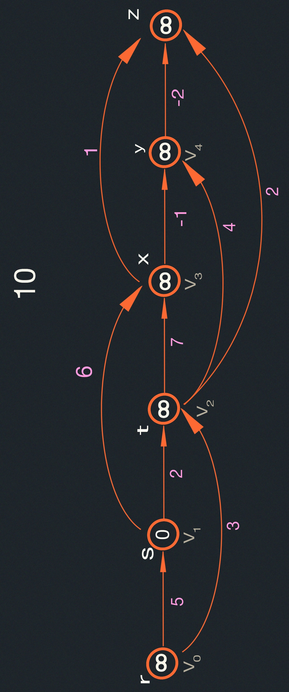
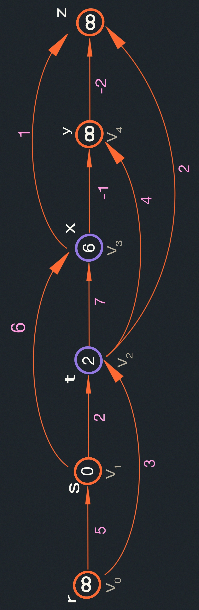
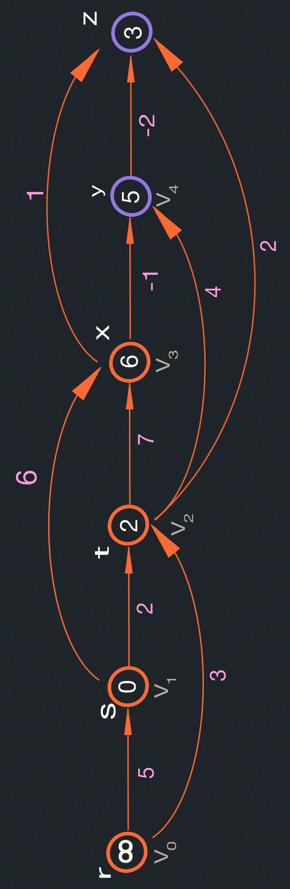
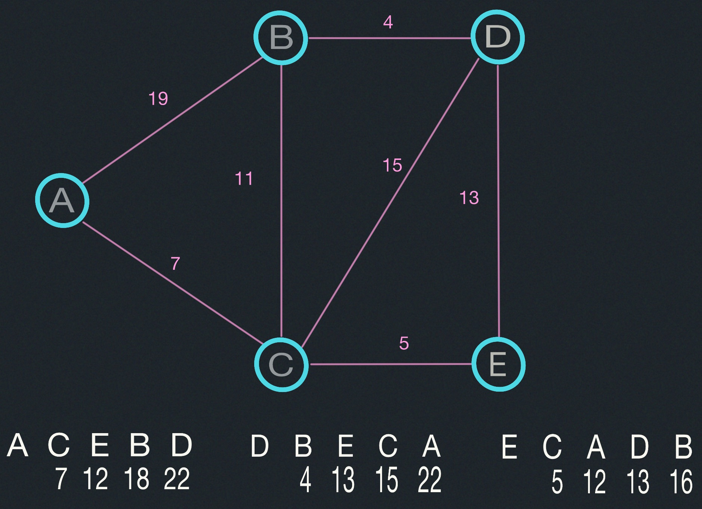
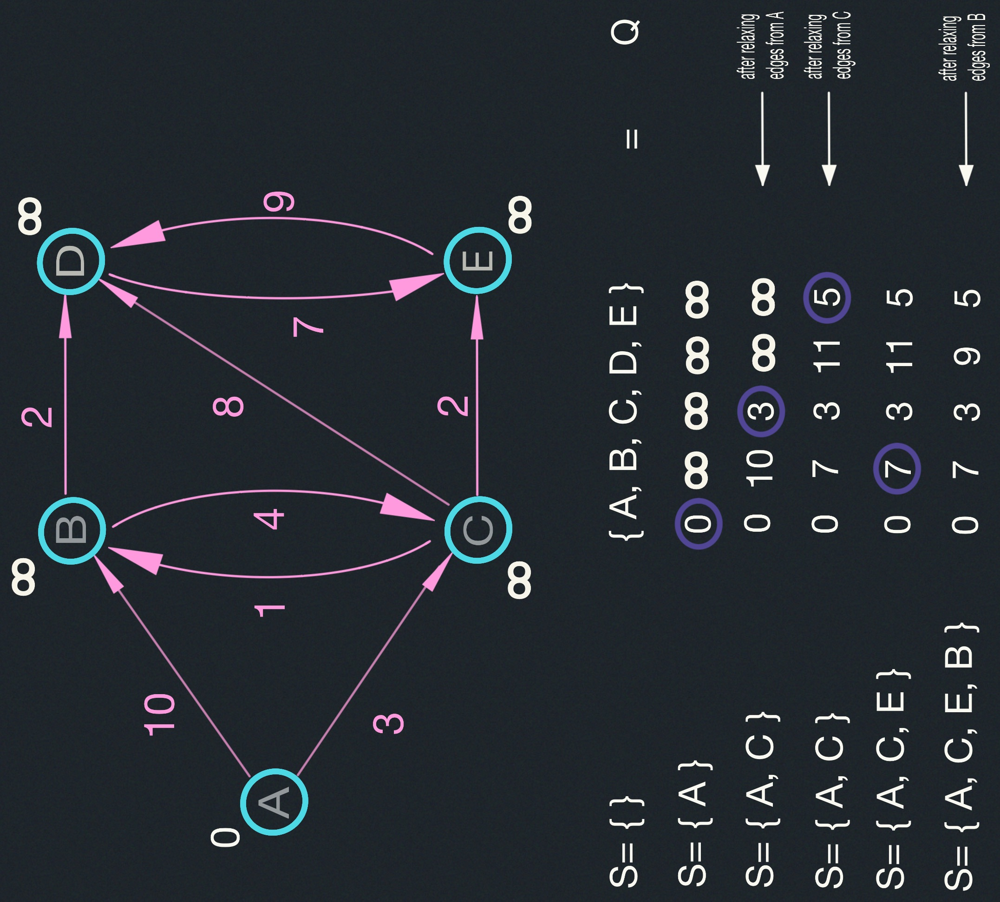

# Shortest Paths II - Dijkstra
- Review
- Shortest paths in DAGs.
- Shortest paths in graphs without negative edges.
- Dijsktra's Algorithm.

## Readings
CLRS, Sections 24.2-24.3

## Review

$d[v]$ is the length of the current shortest path from starting vertex $s$.
Through a process of relaxation, $d[v]$ should eventually become
$\delta(s,v)$, which is the length of the shortest path from $s$ to $v$.
$\prod[v]$ is the predecessor of $v$ in the shortest path from $s$ to $v$.

&nbsp;  Basic operation in shortest-path computation is the relaxation 
operation:
```
RELAX(u,v,w):
  if d[v] > d[u] + w(u,v):
    d[v] = d[u] + w(u,v)
    pred[v] = u
```

$RELAX(u,v,w)$<br>
&nbsp;&nbsp;&nbsp;if $d[v] > d[u] + w(u,v)$<br>
&nbsp;&nbsp;&nbsp;&nbsp;&nbsp;&nbsp;then $d[v] = d[u] + w(u,v)$<br>
&nbsp;&nbsp;&nbsp;&nbsp;&nbsp;&nbsp;&nbsp;&nbsp;&nbsp;$\prod[v]\leftarrow u$

## Relaxation is Safe
<span style="color:cyan; font-weight:bold">Lemma:</span> The relaxation 
algorithm maintains the invariant that $d[v] \geq \delta(s,v)$ for all
vertices in the graph ($v \in V$).

<span style="color:cyan; font-weight:bold">Proof:</span> By induction on the 
of steps:

&nbsp; Consider $RELAX(u,v,w)$. By induction $d[u] \geq \delta(s,u)$. By the 
Triangle Inequality, $\delta(s,v) \leq \delta(s,u) + \delta(u,v)$. This means
that $\delta(s,v) \leq d[u] + w(u,v)$, since $d[u] \geq \delta(s,u)$ and 
$w(u,v) \geq \delta(u,v)$. So setting $d[v] = d[u] + w(u,v)$ is safe.

### Directed Acyclic Graphs (DAGs):
Can't have negative cycles because there are no cycles!

  1. Topologically sort the DAG, Path from $u$ to $v$ implies that 
  $u$ is before $v$ in the linear ordering.
  2. One pass over vertices in topologically sorted order relaxing each edge 
  that leaves each vertex:<br>
&nbsp;&nbsp;&nbsp;&nbsp;&nbsp;&nbsp;&nbsp;&nbsp;&nbsp;$\theta(V+E)$ time

###### Example:


&nbsp;&nbsp;&nbsp;Vertices sorted left to right in topological order.
Process $r$: stays $\infty$. All vertices to the left of $s$ will be $\infty$ by definition.
Process $s: t: \infty \rightarrow 2$ $x:\infty \rightarrow 6$





DIJKSTRA Demo:



### Dijkstra's Algorithm
For each edge $(u,v) \in E$, assume $w(u,v) \geq 0$, maintain a set $S$ of vertices whose
final shortest path weights have been detemined. Repeatedly select $u \in V - S$ with 
<u>minimum</u> shortest path estimate, add $u$ to $S$, relax all edges out of $u$.

#### Pseudo-code
Dijkstra $(G,W,s)$ // uses priority queue Q<br> 
&nbsp;&nbsp;&nbsp;Initialize$(G,s)$<br>
&nbsp;&nbsp;&nbsp;$S\leftarrow\phi$<br>
&nbsp;&nbsp;&nbsp;$Q\leftarrow V[G]$ //Insert into Q<br>
&nbsp;&nbsp;&nbsp;while $Q\neq \phi$<br>
&nbsp;&nbsp;&nbsp;&nbsp;&nbsp;&nbsp;do $u \leftarrow$ EXTRACT_MIN$(Q)$ //deletes $u$ from $Q$<br>
&nbsp;&nbsp;&nbsp;&nbsp;&nbsp;&nbsp;$S= S \cup {u}$<br>
&nbsp;&nbsp;&nbsp;&nbsp;&nbsp;&nbsp;for each vertex $v \in Adj[u]$<br>
&nbsp;&nbsp;&nbsp;&nbsp;&nbsp;&nbsp;&nbsp;&nbsp;&nbsp;&nbsp;&nbsp;&nbsp;do RELAX $(u,v,w) 
\leftarrow$ this is an implicit DECREASE_KEY operation



- Strategy: Dijkstra is a greedy algorithm: choose closest vertex in $V - S$ to add to 
set $S$.

- Correctness: We know relaxation is safe. The key observation is that each time a
vertex $u$ is added to set $S$, we have $d[u] = \delta(s,u)$.

### Dijkstra Complexity
$$
\Theta(v) \text{ inserts into priority queue.} \\
\Theta(v) \text{ EXTRACT\_MIN operations} \\
\Theta(E) \text{DECREASE\_KEY operations}\\
$$

Array impl:
$$
\Theta(v) \text{ time for extra min. } \\
\Theta(1) \text{ for decrease key } \\
Total: \Theta(V.V + E.1) = \Theta(V^2+E)=\Theta(V^2)
$$

Binary min-heap:
$$
\Theta(\log_{2}V) \text{ for extract min.}\\
\Theta(\log_{2}V) \text{ for decrease key}\\
Total: \Theta(V \cdot \log_2 V + E \cdot \log_2 E)\\
$$

Fibonacci heap (not covered in 6.006):
$$
\Theta(\log_{2}V) \text{ for extract min.}\\
\Theta(1) for decrease key\\
amortized cost\\
Total: \Theta\left(V \cdot \log_2 (V + E)\right)\\
$$
