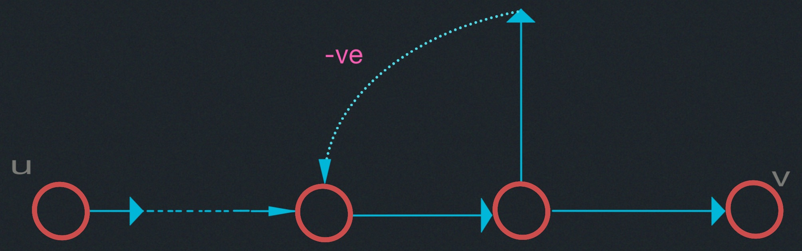
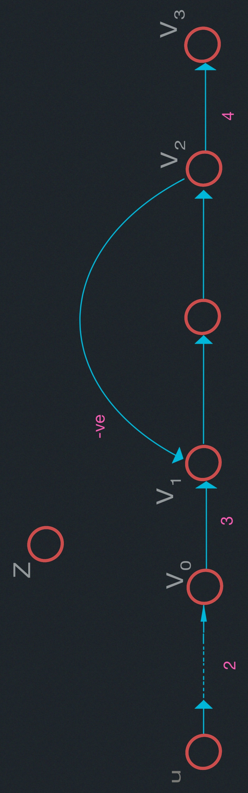
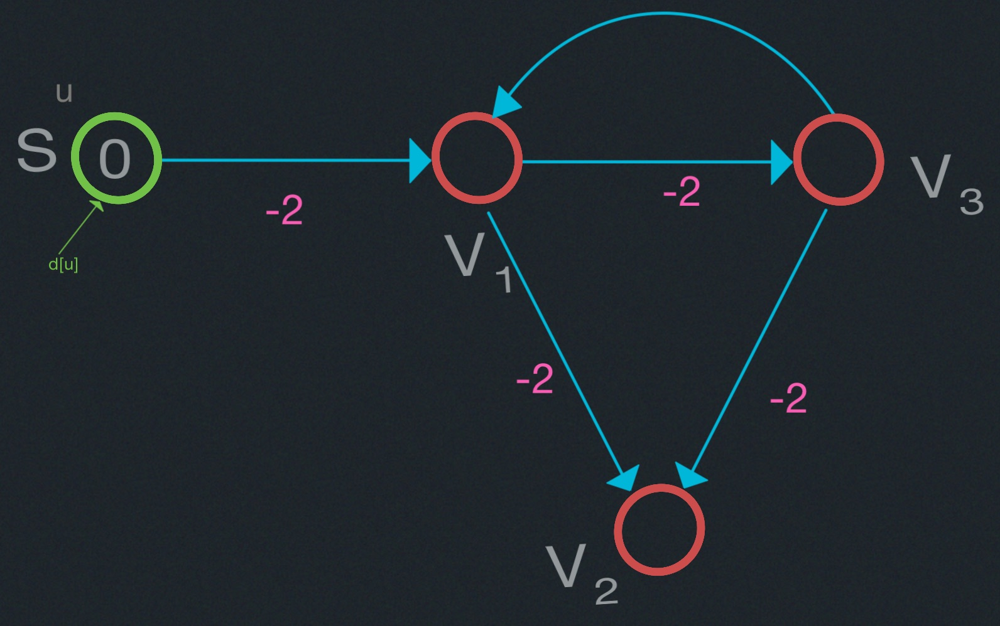
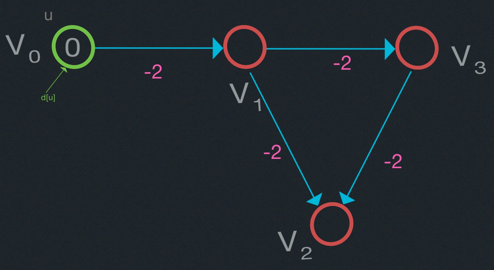
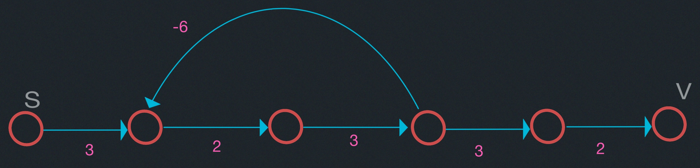

# Shortest Paths III: Bellman-Ford

- Review Notation
- Generic S.P. Algorithm
- Bellman-Ford Algorithm
  - Analysis
  - Correctness

### Recall:
$$
\text{path } p = \langle v_1, v_2, \ldots, v_k \rangle
$$
$$
(v_1, v_2, \ldots, v_k) \in E \;\; 0 \leq i \leq k
$$
$$
w(p) = \displaystyle \sum_{i=1}^{k-1} w(v_i, v_{i+1})
$$

Shortest path weight from $u$ to $v$ is $\delta(u,v)$.
$\delta(u,v)$ is $\infty$ if $v$ is unreachable from $u$.
"undefined" if there is a negative cycle on some path from $u$ to $v$. 





$\delta(u,v_1) = \infty =$ undefined  ?

$\delta(u,v_0) = 2$

$\delta(u,z) = \infty =$ undefined 


### Generic S.P. Algorithm


|    |    |
|-------------- | -------------- |
| Initialize    | $for \; v \in V: \begin{cases} d[v] \leftarrow \infty\\ \prod[v] \leftarrow NIL \end{cases}\\  d[S] \leftarrow 0\\$     |
| Main    | repeat<br/> select edge $(u,v)$  [somehow]    |
| "Relax" edge $(u,v,w)$ |if $d[v]>d[u]+w(u,v):$<br>$\;\; d[v] \leftarrow d[u] + w(u,v) \;\\\;\; \pi[v] \leftarrow u$<br> until you can't relax any more edges |

#### Complexity
Termination: Algorithm will continually relax edges when there are negative
cycles present.


There are two problem cases:

1. Complexity could be exponential time:

Algorithm could take exponential time. The outgoing edges from $v_0$
and $v_1$ have weight $4$, the outgoing edges from $v_2$ and $v_3$ have 
weight $2$, the outgoing edges from $v_4$ and $v_5$ have weight $1$.

2. The algorithm execution will not even terminate if there is a $-ve$
with cycles reachable from the source $u$

## 5-Minute 6.006
This figure is what I want you to remember from 6.006.


- Polynomial time is great. 
- Exponential time is bad.
- Infinite time gets you fired.

### Bellman-Ford(G,W,s)

```
Initialize()
for i = 1 to |V|-1:          # O(V E)
  for each edge (u,v) in E:
    Relax(u,v,w)
for each edge (u,v) in E:    # Check
  do if (d[v] > d[u] + w(u,v)):
    then report a negative-weight cycle exists
```

At the end, $d[v]=\delta(s,v)$, if no negative-weight cycles.

<u style="color:red">Theorem:</u>
If $G=(V,E)$ contains no negative-weight cycles, then after Bellman-Ford
executes $d[v]=\delta(s,v)$ for all $v \in V$.

<u style="color:yellow">Corollary:</u>
If a value $d[v]$ fails to converge after $|V|-1$ passes, there exists a 
$-ve$ with cycle reachable from $S$.


#### Proof:
Let $v \in V$ be any vertex. Consider path $p=\langle v_0, v_1, \ldots, v_k\rangle$ from
$v_0=s$ to $v_k=v$ that is a shortest path with minimum number of edges. No negative weight cycles.

<u style="color:cyan">Notice:</u>
How big is $k$?
(ans: $|V|-1$)

$\implies$ p is simple $\implies$ $k \leq |V| -1$

else I have a cycle


Consider figure:


Initially $d[v_0]= 0 = \delta(s,v_0)$ and is unchanged since no negative cycles.

After $2$ passes through $E$, we have $d[v_2] = \delta(s,v_i)$.

After $k \leq |V| -1$ passess through $E$, we have $d[v_k]=d[v]= \delta(s,v)$.

### Corollary

If a value $d[v]$ fails to converge after $|V|-1$ passess, there exists a 
negative weight cycle reachable from $s$.

#### Proof:

After $|V|-1$ passes, if we find an edge that can be relaxed, it means that the current
shortest path from $s$ to some vertex is not simple and vertices are repeated. Since this
cyclic path has less weight than any simple path the cycle has to be a negative-weight cycle.


##### Longest Simple Path and Shortest Simple Path

Finding the longest simple path in a graph with non-negative edge weights is an NP-hard problem, 
for which no known polynomial-time algorithm exists. Suppose one simple negates each of the edge 
weights and runs Bellman-Ford to compute shortest paths. Bellman-Ford will not necessarily compute
the longest paths in the original graph, since there might be a negative-weight cycle reachable 
from the source, and the algorithm will abort.

Similarly, if we have a graph with negative cycles, and we wish to find the longest simple path 
from the source $s$ to a vertex $v$, we cannot use Bellman-Ford. The shortest simple path problem
is also NP-hard.






The shortest simple path problem is $13$.

