# Shortest Paths IV - Speeding up Dijkstra

- single-source single-target Dijkstra
- Bidirectional search
- Goal directed search - potentials and landmarks

#### Readings
<span style="color:rgb(90,255,100)">Wagner, Dorothea, and Thomas Willhalm.
"Speed-up Techniques for Shortest for Shortest-Path Computations."
Proceedings of the 24th International Symposium on Theoretical Aspects
of Computer Science (STACS 2007): 23-36. Read up to Section 3.2</span>

## DIJKSTRA single-source, single target
```
Initialize()
Q <- V[G]
while Q is not empty:
  do u <- Extract_min(Q)(stop if u = t!)
  for each vertex v in Adj[u]:
    do RELAX(u,v,w)
```

__Observation__: If only shortest path from $s$ to $t$ is required, stop when $t$ is removed
from $Q$, $i.e.$, when $u=t$

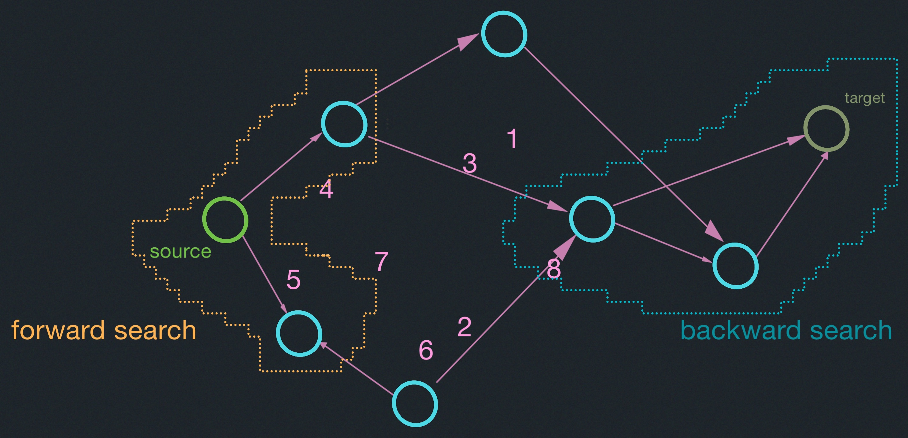

## Bi-Directional Search
<span style="color:rgb(90,255,100)">NOTE:</span>
Speed-up techniques covered here do not change worst-case behavior, but 
reduce the number of visited vertices in practice.

<span style="color:cyan;font-weight:bold">Bi-D Search</span>

Alternate forward search from $s$ <br/>
&nbsp;&nbsp;&nbsp;&nbsp;&nbsp;&nbsp;&nbsp;&nbsp;&nbsp;&nbsp;&nbsp;&nbsp;&nbsp;&nbsp;backward search from $t$<br/>
&nbsp;&nbsp;&nbsp;&nbsp;&nbsp;&nbsp;&nbsp;&nbsp;&nbsp;&nbsp;&nbsp;&nbsp;&nbsp;&nbsp;(follow edges backward)<br/>
$d_f(u)$ distances for forward search<br/>
$d_b(u)$ distances for backward search<br/>

Algorithm terminates when some vertex $w$ has been processed, i.e.,
deleted from the queue of both searches, $Q_f$ and $Q_b$.

Subtlety: After search terminates, find node $x$ with minimum value
of $d_f(x)+d_b(x)$. $x$ may not be the vertex $w$ that caused termination
as in example to the left!.
Find shortest path from $s$ to $x$ using $\prod_f$ and shortest path backwards
from $t$ to $x$ using $\prod_b$.
<span style="color:yellow">Note:</span> x will have been deleted from 
either $Q_f$ or $Q_b$ or both.

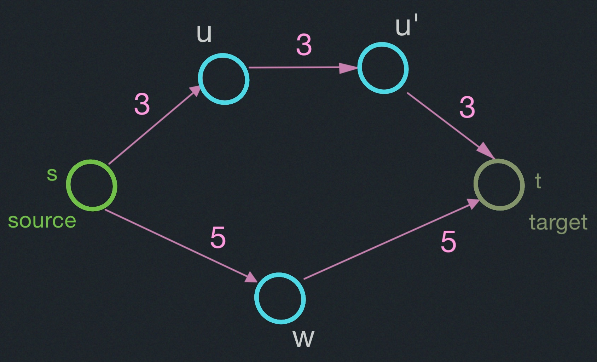


Minimum value for $d_f(x)+d_b(x)$ over all vertices that have been processed
in at least one search (see figure):
$$
d_f(u)+d_b(u) = 3 + 6 = 9\\
d_f(u')+d_b(u') = 6 + 3 = 9\\
d_f(w)+d_b(w) = 5 + 5 = 10\\
$$

### Goal-Directed Search or A*
Modify edge weights with potential function over vertices.
$$
\bar{w}(p)=w(p) - \lambda_t(s) + \lambda_t(t)
$$
So Shortest paths are maintained in modified graph with $\bar{w}$ weights
(see Figure).

&nbsp;&nbsp;&nbsp;To apply Dijkstra, we need $\bar{w}(u,v) \geq 0$ for all (u,v).
&nbsp;&nbsp;&nbsp;Choose potential function approriately, to be feasible.

### Landmarks
Small set of landmarks $LCV$. For all $u \in V, l \in L$, pre-compute
$\delta(u,l)$.
&nbsp;&nbsp;&nbsp;Potential $\lambda_t^{(l)}(u)=\delta(u,l)- \delta(t,l)$
for each l.

<span style="color:rgb(90,255,100)">CLAIM:</span>$\lambda_t^{(l)}$
is feasible.

### Feasibility

$\bar{w}(u,v) = w(u,v) - \lambda_t^{(l)}(u)+\lambda_t^{(l)}{v}$

$\;\;\;\;\;\;\;\;\;\;\;\;= w(u,v) - \delta(u,l)+\delta(t,l)+\delta(v,l)-\delta(t,l)$

$\;\;\;\;\;\;\;\;\;\;\;\;= w(u,v) - \delta(u,l)+\delta(v,l)\geq 0$ by the $\Delta$-inequality

  $\lambda_t(u)= \text{max}_{{}_{(l\; \in\; L)}} (\lambda_t^{(l)}(u))$

Original:
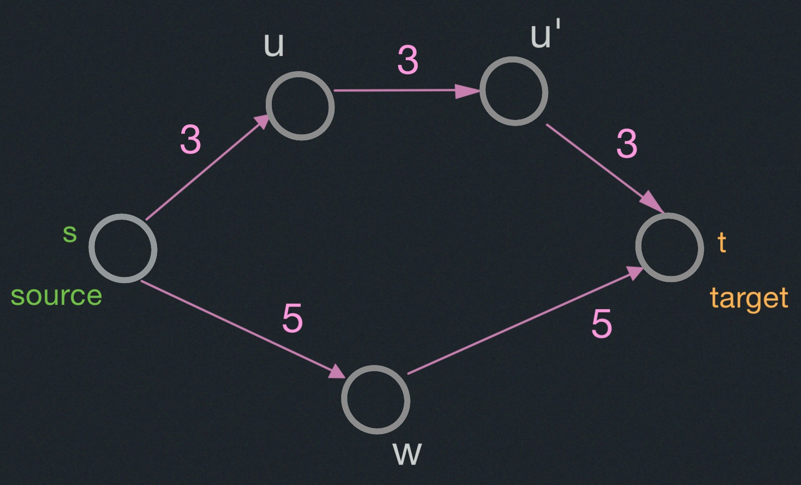
Forward:
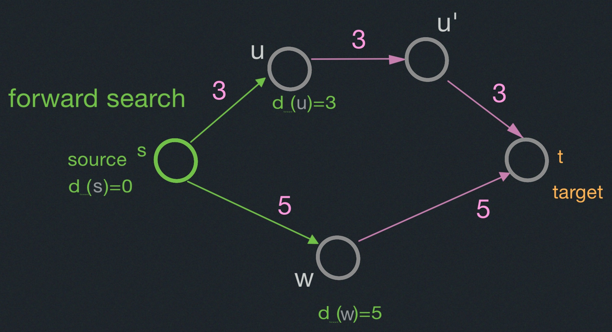
Backward:
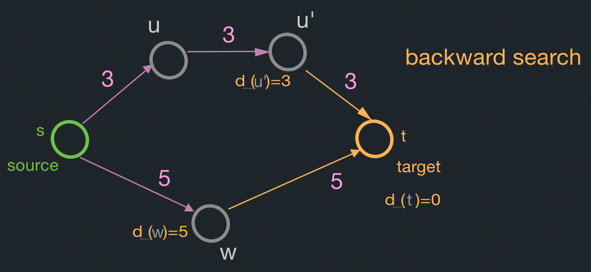
Forward:
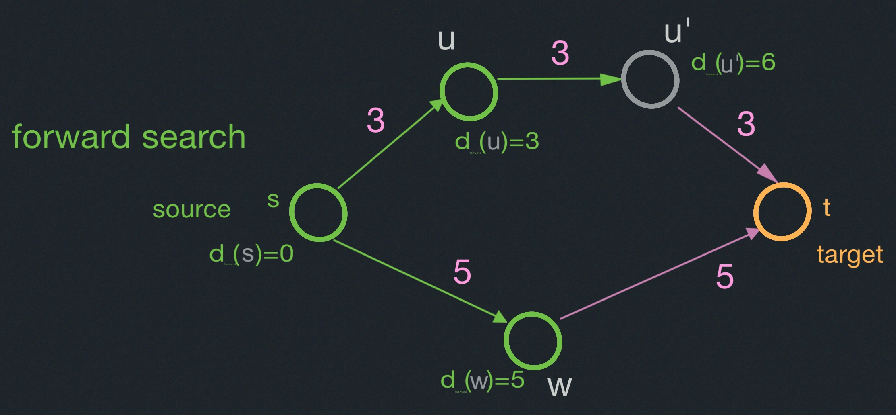
Backward:
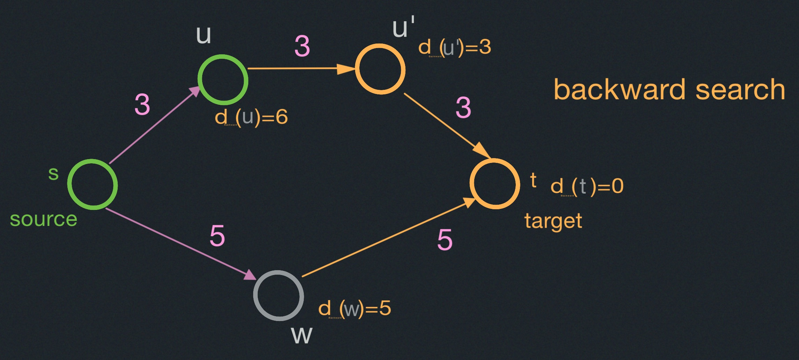
Forward:
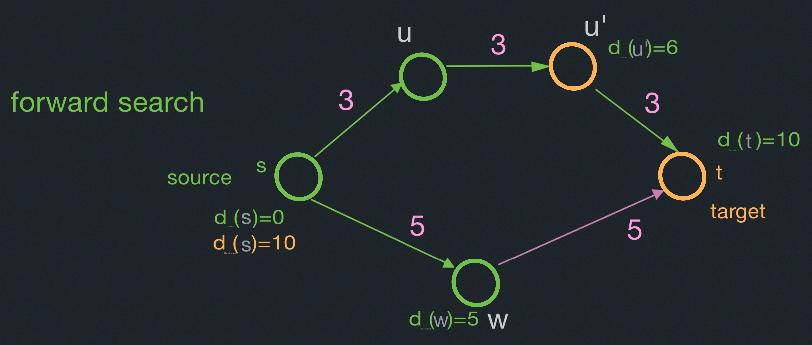
Backward:
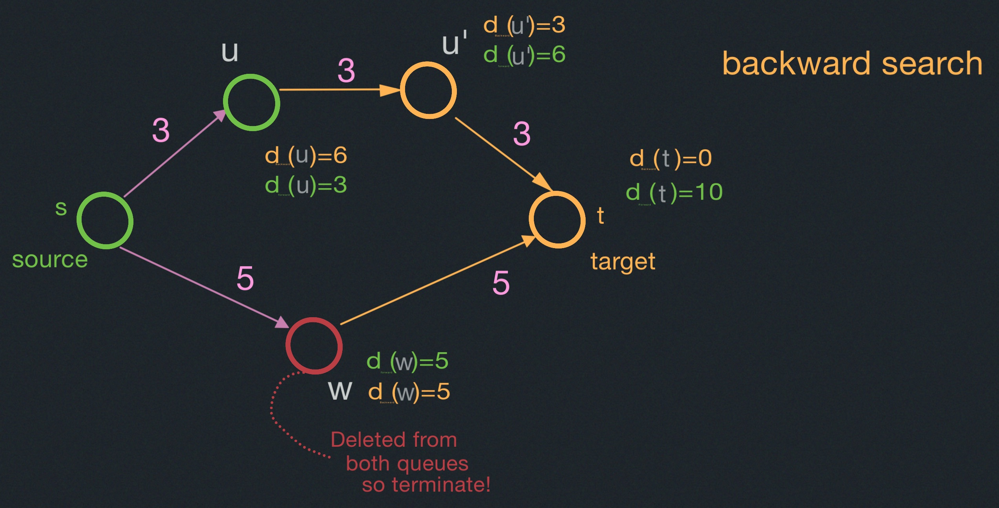

Targeted Search:
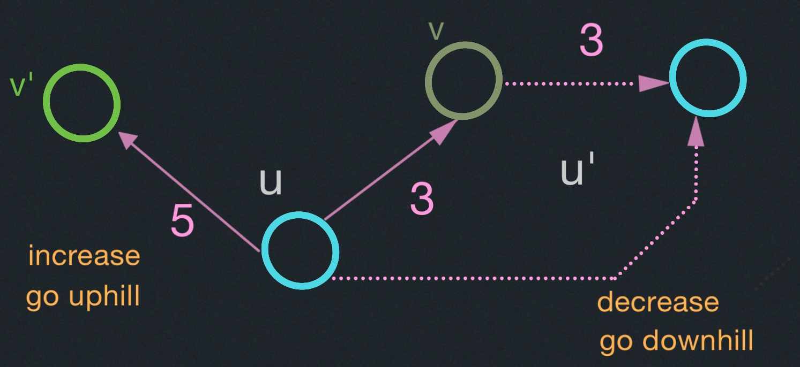

Modifying Edge Weights:
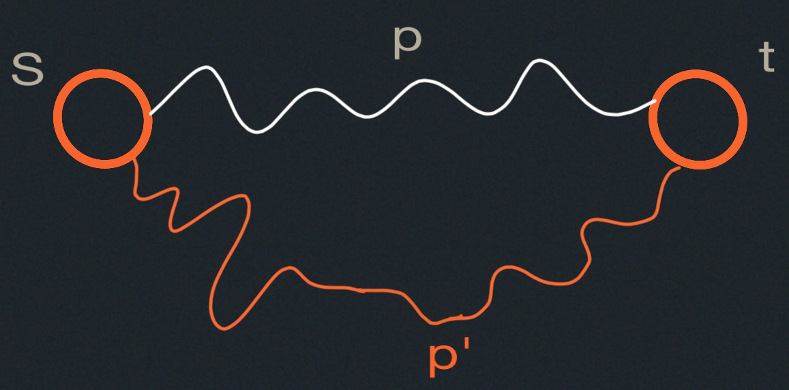
