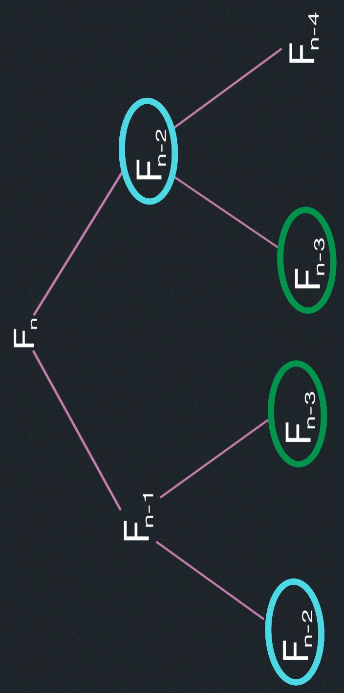
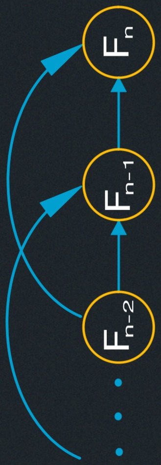
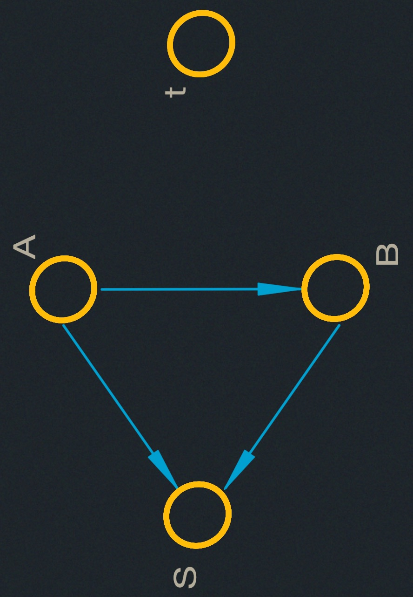
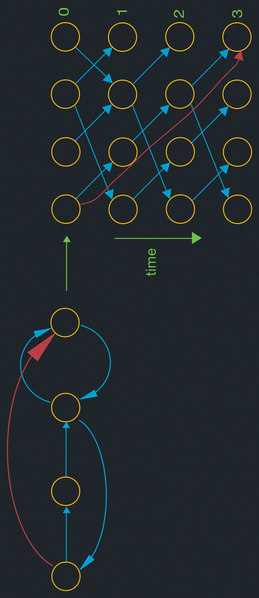

# Dynamic Programming I: Memoization, Fibonacci, Shortest Paths, Guessing

- Memoization and subproblems.
- Examples:
  - Fibonacci.
  - Shortest Paths.
- Guessing & DAG view.

## Dynamic Programming (DP)
<span style="color:rgb(90,255,100)">Big idea, hard, yet simple</span>

- Powerful algorithmic design technique.
- Large class of seemingly exponential problems have a polynomial solution
("only") via DP.
- Particularly for optimization problems (min/max) 
<span style="color:rgb(90,255,100)">(e.g. shortest paths)</span>.

<span style="color:red">*</span> $DP \approx$ "controlled brute force"

<span style="color:red">*</span> $DP \approx$ recursion + re-use

#### History 
##### Richard E. Bellman (1920 - 1984)
> Richard Bellman received the IEEE Medal of Honor, 1979. "Bellman ...
explained that he invented the name 'dynamic programming' to hide the
fact that he was doing mathematical research at RAND under a Secretary
of Defense who 'had a pathological fear and hatred of the term, research'.
He settled on the term 'dynamic programming' because it would be difficult
to give a 'pejorative meaning' and because 'it was something not even a 
Congressman could object to'" [John Rust 2006]

### Fibonacci Numbers
$$
F_1=F_2=1 \; \;\; \;\; \;\; \; Fn=F_{n-1}+F_{n-2}
$$

<span style="color:cyan">Goal:</span> compute $F_n$

### Naive Algorithm

<span style="color:blue">follow recursive definition</span>

```
fib(n):
  if n < 2:
    return n
  else:
    return fib(n-1) + fib(n-2)
```
<span style="font-size:0.75em">

$$
\implies T(n)=T(n-1)+T(n-2) + O(1) \geq F_n \approx \varphi^n
\geq 2T(n-2) +O(1) \leq 2^(n/2)
$$

</span>

  <u style="display:flex;color:red; justify-content: center">Exponential --- BAD!</u>



#### Memoized DP (Dynamic Programming) Algorithm
<span style="color:yellow">Remember, remember</span>

```
memo = {}
fib(n):
  if n in memo:
    return memo[n]
  elif n <= 2:
    f=1
  else:
    f = fib(n-1) + fib(n-2)
  memo[n] = f
  return f
```

$\implies$ fib$(k)$ only recurses first time called, $\forall k$

$\implies$ only n nonmemoized calls: $k=n,n-1,\dots,1$

$\implies$ memoized calls free $(\Theta(1)\text{ time})$.

$\implies \Theta(1)$ time per call (ignoring recursion).
<u style="display:flex;color:green; justify-content: center">Polynomial --- GOOD!</u>

<span style="color:red">*</span> $DP \approx$ resursion + memoization
- <u style="">memoize</u> (remember) & re-use solutions to <u style="">subproblems</u>
that help solve problem
  - in Fibonacci, subproblems are $F_{1},F_{2},\dots,F_{n}$ 

<span style="color:red">*</span> $\implies$ time = (# of subproblems) $\cdot$ (time/subproblem)
  - Fibonacci: # of subproblems is n, and (time/subproblem) is $\Theta(1)=\Theta(n)$
  (<span style="color:green">ignore recursion!</span>).

#### Bottom-up DP (Dynamic Programming) Algorithm
```
DP(): 
  ### O(n) time
  fib = {}
  for k in [1,2,...,n]:
    ### O(1) time
    if k <= 2:
      f=1
    else:
      f = fib(k-1) + fib(k-2)
    fib[k] = f
  return fib[n]
```

- exactly the same <u>computation</u> as memoized DP (<span style="color:green">recursion "uncontrolled"</span>).
- in general: topological sort of subproblem dependency DAG.

- practically faster: no recursion.
- analysis more obvious.
- can save space: just remember last 2 fibs $\implies \Theta(1)$ 

<span style="color:cyan; font-size:0.75em">

  [Sidenote: There is also an $O(\log n)$ - time algorithm
  for Fibonacci, via different techniques]

</span>

#### Shortest Paths
- Recursive formulation:

  $\delta(s,v)= \text{min}\{w(u,v) + \delta(s,u) | (u,v) \in E\}$

- Memoized DP algorithm: takes infinite time if cycles!

  <span style="color:green">in some sence necessary to handle negative cycles</span> 


  Shortest Paths

- works for directed acyclic graphs in $O(V+E)$

  <span style="color:green">effectively DFS/topological sort + Bellman-Ford round rolled 
  into single recursion.</span> 

<span style="color:red">*</span> Subproblem dependency should be acyclic

-  more subproblems remove cyclic dependence:

    $d_k(s,v)=$ shortest $s \rightarrow s \rightarrow v$ path using $\leq k$ edges

- recurrence:
$$
\delta_k(s,v)= \text{min}\{\delta_{k-1}(s,u)+ w(u,v) | (u,v) \in E \}\\
\delta_0(s,v)= \infty \text{ for s} \neq v \text{ (base case)} \\
\delta_k(s,s)= 0 \text{ for any } k \text{ (base case, if no negative cycles).}
$$

- <u>Goal</u>: $\delta(s,v)=\delta_{{}_{|V|-1}}(s,v)$ (if no negative cycles).
- memoize
- time: $\underbrace{\text{\# subproblems}}_{|V|\cdot |V|}$ $\cdot$ $\underbrace{\text{time/subproblem}}_{O(v)}$

  $|V|\cdot |V| \cdot O(v) = O(V^3)$

- actually $\Theta(\text{indegree}(v))$ for $\delta_k(s,v)$
- $\implies$ time = $\Theta\left(V \cdot \displaystyle\sum_{v \in V} \text{indegree}(V)\right)= \Theta(V\cdot E)$

<span style="color:red">Bellman-Ford!</span>

### Guessing
<span style="color:cyan">How to design recurrence</span>

- want shortest $s \rightarrow v$ path


- what is the last edge in path? dunno 🤷
- <u>guess</u> it is $(u,v)$
- path is $\underbrace{\text{shortest } s \rightarrow u \text{ path}}_{\text{by optimal substructure}} + edge(u,v)$
- cost is $\underbrace{\delta_{{}_{k-1}}(s,u)}_{\text{another subproblem}} + w(u,v)$
- to find best guess, try all (<span style="color:cyan">$|V|\text{ choices}$</span>) and use best.
- <span style="color:red">*</span> key: small (polynomial) # possible guesses per subproblem --- typically this 
dominates time/subproblem.

<span style="color:red">*</span> DP $\approx \text{recursion} + \text{memoization} + \text{guessing}$ 

###### DAG view


- like replicating graph to represent time
- converting shortest paths in graph $\rightarrow$ shortest paths in DAG

<span style="color:red; font-size:0.75em">*</span> DP $\approx$ shortest paths in some DAG.
