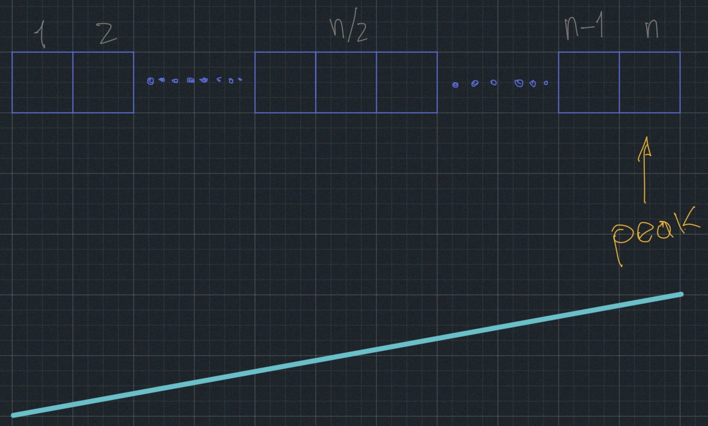

# Peak Finding

One-dimensional version:

a-i are natural numbers.

Position "2" is a peak $\text{iff } b \geq a$ and $b \geq c$.

Position "9" is a peak $\text{iff } i \geq h$.

#### Problem:
Find the peak if it exists.

#### Straightforward to the algorithm:

Note: Argue that any array will always have a peak, which means that only one value is greater than every other value. If there are two maximum values, there are no peaks.

Start from left:

the line below means that the numbers are increasing as you start from the left, the peak is somewhere in the middle, and then things start decreasing.

In this case, we look at the middle ${(n/2)}$ elements.

##### Worst case complexity $\Theta(n)$:
We call it like this because in the worst case, you might have to look at all n elements. And that would be the case where you started from the left and you have to go all the way to the right.
This is a notation that says of the order of $n$ elements, it provides us both boundaries, lower bound and upper bound. The Big $O(n)$ is just the upper bound.

This case is saying this algorithm that starts from the left is going to, essentially, require in the worst case something that's a Constant Times $n$.

We only care about asymptotic complexity that in this case is linear $\Theta(n)$.

#### Divide & Conquer:
In order to improve the search and get this complexity down, we can use Divide & Conquer strategy and then recursively break this one dimensional array into smaller arrays.
