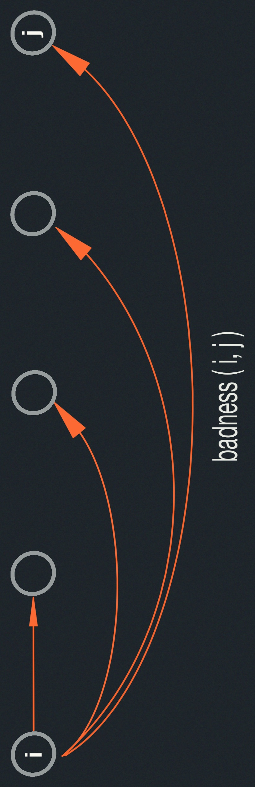

# Dynamic Programming II: Text Justification, Blackjack

- 5 easy steps.
- Text justification.
- Perfect-information Blackjack.
- Patent pointers.

### Summary

<span style="color:red">*</span> $DP \approx$ "careful brute force"

<span style="color:red">*</span> $DP \approx$ guessing + recursion + memoization

<span style="color:red">*</span> $DP \approx$ <span style="color:green">
dividing into reasonable # subproblems whose solutions relate --- acyclicly ---
usually via guessing parts of solution.
</span>

<span style="color:red">*</span> time = (# of subproblems) $\cdot$ 
$\underbrace{(time/subproblem)}_{\text{treating recursive calls as }O(1)}$

- usually mainly guessing
- essentially an <span style="color:cyan">amortization</span>: We're just changing around when we count the cost 
of each sub-problem, and then:
- count each subproblem only once; after first time, costs $O(1)$ via memoization.

<span style="color:red">*</span> $DP \approx$ shortest paths in some DAG
(directed acyclic graph).

## 5 Easy Steps to Dynamic Programming

| step  | description   | time   |
|-------------- | -------------- | -------------- |
| 1. | define subproblems     | count # subproblems |
| 2. | guess (part of solution) | count # choices |
| 3. | recurrence: relate subproblem solutions | compute time/subproblem | 
| 4. | recursive + memoize <br/><br/> OR build DP table bottom-up check subproblems acyclic/topological order| time = (time/subproblem) $\cdot$ (# subproblems)  | 
| 5. | solve original problem: <br/>= a subproblem OR by combining subproblems solutions | $\implies$ extra time|

| Example  | Fibonacci   | Shortest Paths   |
|-------------- | -------------- | -------------- |
| 1. <u>subprops | $F_k$ for $1\leq k\leq n$ | $\delta_{k}(s,v)$ for $v \in V, 0 \leq k \leq \|V\|=$ min $s \rightarrow v$ path using $\leq k$ edges |
|<span style="color:rgb(255,179,82)">#subprobs</span> |<span style="color:rgb(255,179,82)"> $n$|<span style="color:rgb(255,179,82)"> $V^2$ |
| 2. <u>guess: |nothing| edge into $v$ (if any)|
|<span style="color:rgb(255,179,82)"># choices|<span style="color:rgb(255,179,82)"> $1$|<span style="color:rgb(255,179,82)"> indegree$(v)+1$ |
| 3. <u>recurrence: |$F_{{}_k}= F_{{}_{k-1}} + F_{{}_{k-2}}$|$\delta_{{}_k}(s,v)=$min $\{\delta_{{}_{k-1}}(s,v), \delta_{{}_{k-2}}(s,v) \| (u,v) \in E\}$|
|<span style="color:rgb(255,179,82)">(time/subproblem)|<span style="color:rgb(255,179,82)"> $\Theta(1)$|<span style="color:rgb(255,179,82)"> $\Theta(1+ \text{indegree}(v))$ |
| 4. <u> topological order:|for $k=1,\dots ,n$|for $k=0,1,\dots \|V\|-1$ for $v \in V$|
|<span style="color:rgb(255,179,82)">total time:|<span style="color:rgb(255,179,82)"> $\Theta(n)$|<span style="color:rgb(255,179,82)"> $\Theta(V\cdot E)$</span> + <span style="color:pink">$\Theta(V^2)$ unless efficient about indeg. 0</span>|
| 5. <u>original problem:|$F_n$|$\delta_{{}_{\|V\|-1}}(s,v)$ for $v \in V$|
|<span style="color:rgb(255,179,82)">extra time:|<span style="color:rgb(255,179,82)"> $\Theta(1)$|<span style="color:rgb(255,179,82)"> $\Theta(V)$|

#### Text Justification
Split text into "good" lines
- <span style="color:green">obvious (MS Word/Open Office) algorithm: put as many words that fit on first line, repeat.</span> 
- But this can make <u>very bad</u> lines.


- Define <u>badness</u>$(i,j)$ for line of words$[i:j]$.

  For example, $\infty$ if $(\text{total length} > \text{page width})$ else $(\text{page width} - \text{total length})^3$
  ```
  badness(i,j):
    if (total_length > page_width):
      return INFINITY
    else:
      return (page_width - total_length)**3
  ```

- <u>goal</u>: split words into lines to min $\sum$ badness.

1. <u>subproblem</u> : min. badness for <span style="color:cyan">suffix</span> words$[i:]$

    $\implies$ # subproblems = $\Theta(n)$ where $n =$ # words
2. <u>guessing</u> : <span style="color:cyan">where to end first line (where to start 2nd line)</span>, say $i:j$

    $\implies$ # choices $= n-i=O(n)$

3. <u>Recurrence</u>:

    - DP$[i]$ = min$(\text{badness} (i,j) + \text{DP}[j] \text{ for j in range } (i+1,n+1))$
    - DP$[n]$ = 0

      $\implies$ time per subproblem $=\Theta(n)$
4. <u>order</u> for $i=n,n-1,\dots,1,0$

    total time = $\Theta(n^2)$

    

5. <u>solution</u> = DP$[0]$

#### Perfect-Information Blackjack

- Given entire deck order: $c_{{}_0},c_{{}_1},c_{{}_2},\dots,c_{{}_{n-1}}$
- 1-player game against stand-on-17 dealer.
- When should you hit or stand? GUESS
- <u>goal</u>: maximize winnings for fixed bet $\$1$.
- <span style="color:pink"> may benefit from losing one hand to improve future hands.</span>

1. <u>subproblem</u>: BJ$(i)$ = best play of $\underbrace{c_{{}_i},\dots c_{{}_{n-1}}}_{\text{remaining cards}}$ where $i$ is 
<span style="color:pink;font-size:0.8em"># cards "already played"</span><br/>
$\implies$ <span style="color:cyan"> # subproblems = $n$ choices</span>
2. <u>guess</u> how many times player "hits" (hit means <span style="color:pink">draw another card</span>)

    $\implies$ # choices $\leq n$
3. <u>Recurrence</u>: 
<br/>BJ$(i)$ = max( <br/>
    outcome $\in \{+1,0,-1\} +$ BJ$(i+ \text{\# cards used})$  <span style="color:rgb(255,179,82)">$O(n)$</span> <br/>
    for # hits in $0,1,\dots$ if valid play <span style="color:pink">~ don't hit after bust</span> <span style="color:rgb(255,179,82)">$O(n)$</span><br/>
    )

    $\implies$ time/subproblem = $\Theta(n^2)$
4. <u>order</u>: <br/> for $i=n,n-1,\dots,1,0$ &nbsp;&nbsp;&nbsp;&nbsp; or &nbsp;&nbsp;&nbsp;&nbsp; for $i$ in reversed(range($n$)) 

    total time = $\Theta(n^3)$

    
    <span style="color:pink">

      time is really 
      $\displaystyle \sum_{i=0}^{n-1}\cdot\sum_{\#h=0}^{n-i-O(1)} \Theta(n-i-\#h)=\Theta(n^3)$</span> 
      <span style="color:rgb(255,179,82)">still</span>
    </span>
5. <u>solution</u> BJ$(0)$ <br/>
detailed recurrence: <span style="color:rgb(255,179,82)">before memoization</span>
<span style="color:pink">(ignoring splits/betting)</span>.
```
BJ(i): # O(n²)
  if n-i < 4:
    return 0 #(not enough cards)
  for p in range(2,n-i-1): (# cards taken) # O(n)
    player = sum(c_[i], c_[i+2], c_[i+4:i+p+2])
    if player > 21: # (bust)
      options.append(-1(bust)+BJ(i+p+2))
      break;
    for d in range(2, n-i-p): # O(n) with care
      dealer = sum(c_[i+1], c_[i+3], c_[i+p+2:i+p+d])
      if dealer > 17:
        break
    if dealer > 21:
      dealer = 0 # (bust)
    options.append(cmp(player, dealer)+BJ(i+p+d))
  return max(options)
```

### Parent Pointers
To recover actual solution in addition to cost, store <u>parent pointers</u> (which guess used at each subproblem)
& walk back.

- typically: remember argmin/argmax in addition to min/max.
- example: text justification
```
(3)' DP[i]= min(badness(i,j) + DP[i][0],j)
                for j in range(i+1, n+1)
     DP[n] = (0, None) 
(5)' i = 0
     while i is not None:
       start line before word i
       i = DP[i][1]
```
- just like memoization & bottom-up, this transformation is <u>automatic</u>
<span style="color:pink">no thinking required</span>
