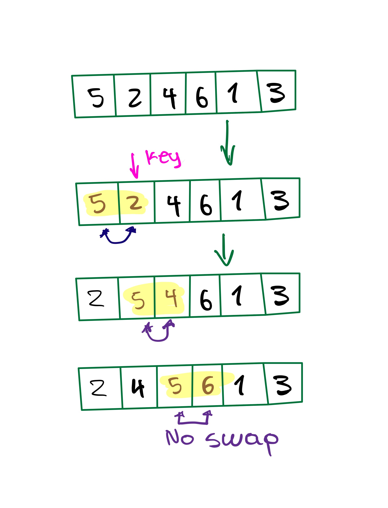
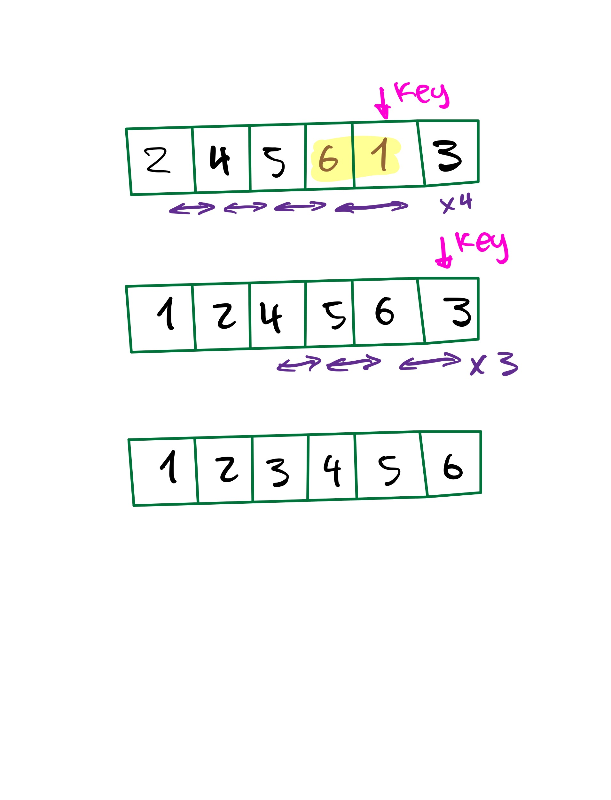
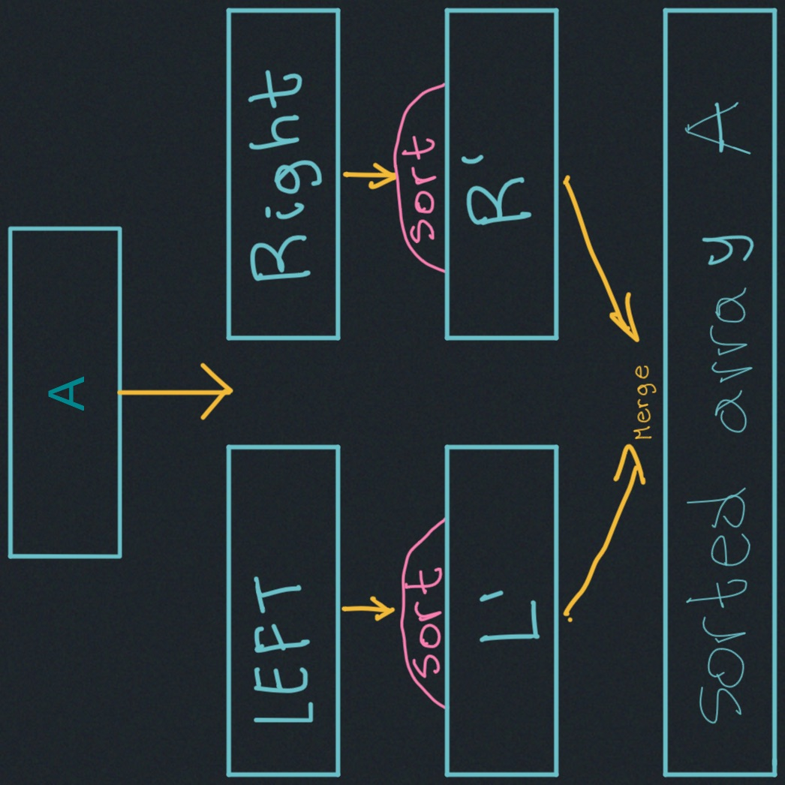
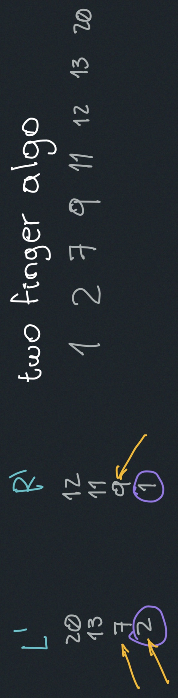
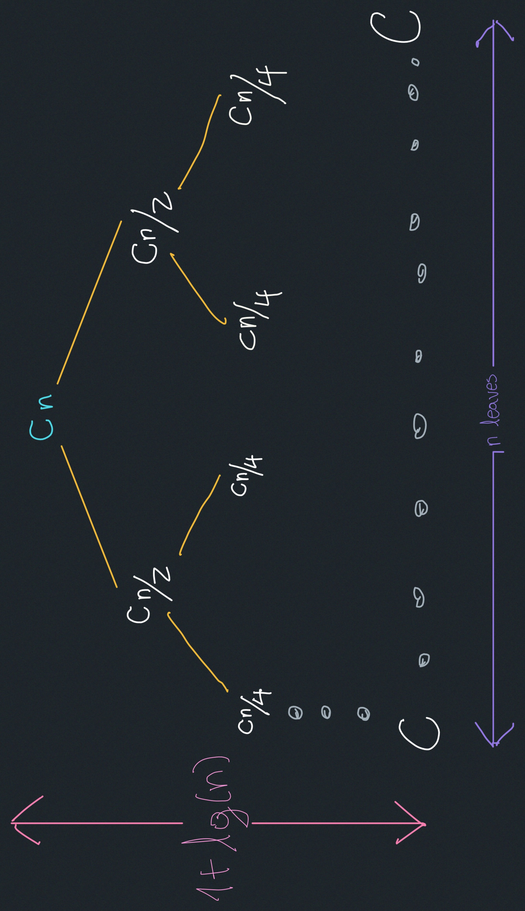
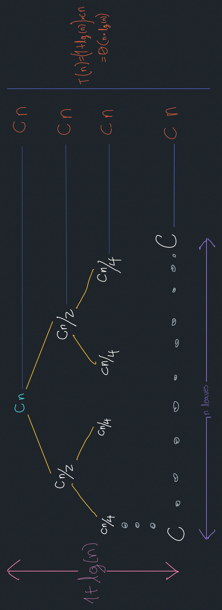
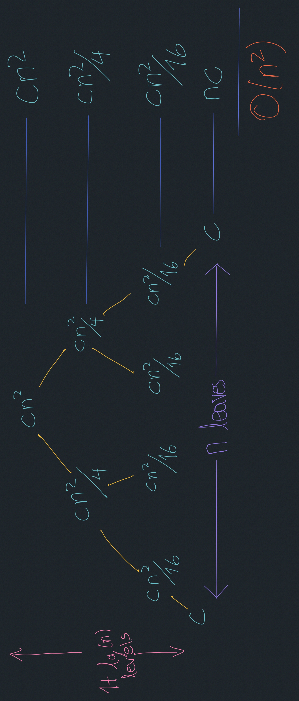
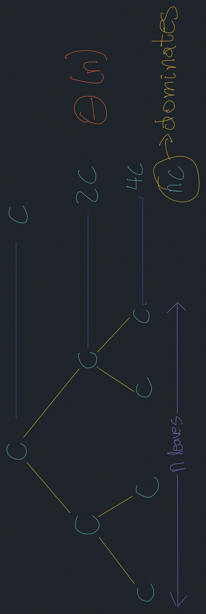

# Insertion Sort, Merge Sort
### Why sorting?
- Phone book
- Problems that become easy once items are sorted like:
  - Finding a median.
  ```
  array A[o:n] -> B[o:n]
  unsorted        B[n/2]
  ```
  ##### Binary Search
  ```
  A[o:n] # looking for specific item k
     |
     v
    B[o:n]
  ```
  - Compare k to `B[n/2]`
---
- Compression of data
- Computer Graphics

### Insertion Sort
---
```
  for i=1,2, ... n 
    insert A[i] into sorted array A[0: i-1]
```
By pairwise swaps down to the correct position.

Example:
 
Notice the number of steps by watching the movement of 
the key.


$\Theta(n)$ steps (key positions). Each step is $\Theta(n)$ (compares & swaps).
To summarise this process takes $O(n^2)$ time.

Let's say that compares are more expensive than swaps:

$(Compares) >> (Swaps)$ 

$\Theta(n^2)$ Comparison cost

#### Algorithm improvements: Binary Search
Replace the pairwise swap with a binary search.

Do a binary search on `A[0: i-1]` already sorted in $\Theta(lg(i))$  time.

$\Theta(n\cdot lg(n))$  compares.

We need to insert our `A[i]` into a right position in array `A[0: i-1]`

`A[i] --> A[0: i-1]`

So a binary search in insertion sort gives you $\Theta(n\cdot lg(n))$ compares,
but it still takes $\Theta(n^2)$ for swaps.

### Merge Sort: (Divide & Conquer)


- size number
- divide into 2 arrays of size $n/2$
- recursively sort the 2 arrays of size $n/2$
- get the sorted array of size $n$

#### Merge function:
The Merge function is going to take two sorted arrays (LEFT and RIGHT) as input.
  


`A[0: n]`

$L = A [0: (\frac{n}{2})-1]$ R... similarly.

Then Complexity of Merge Sort is: $\Theta(n)$

##### Complexity:
$\Theta(n)=$ $\underbrace{C_{1}}_{divide}$ 
+$\underbrace{2T\cdot(\frac{n}{2})}_{recursion}$
+$\underbrace{C_{2}\cdot n}_{merge}$




###### But what is the advantage of insertion sort over merge sort?
You have to make new copies of the halves due to recursion, which is going to take $\Theta(n)$ auxiliary space.

In-place sort => $\Theta(1)$ auxiliary space.

In-place merge sort is kind of impractical in terms of constant factors 
while it's in-place and it's still $\Theta(n \cdot lg(n))$.

##### In terms of numbers:
- Merge sort in `python = 2.2 n lg(n)` $\mu s$
- Insertion sort in `python =` $0.2\cdot n^2 \cdot lg(n) \mu s$
- Insertion sort in `C =` $0.01\cdot n^2 \cdot lg(n) \mu s$

##### Complexity associated with recursion
$T(n) = 2\cdot T\cdot(\frac{n}{2}) + C \cdot n^2$


$T(n) = 2\cdot T\cdot(\frac{n}{2}) + \frac{\Theta(1)}{C}$


