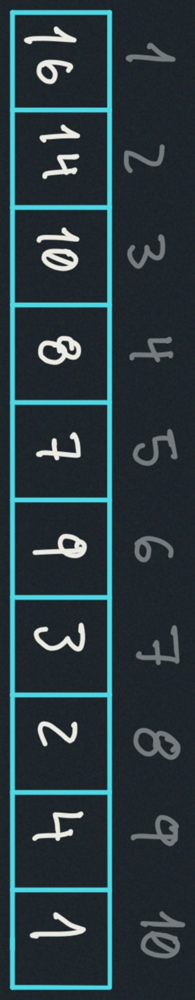
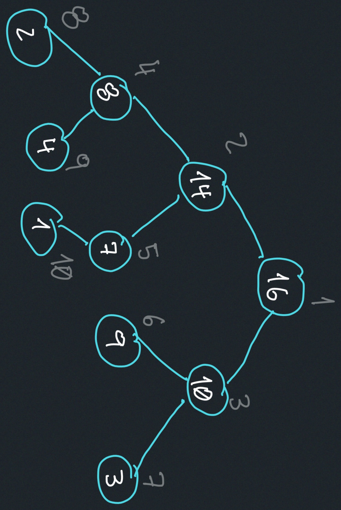
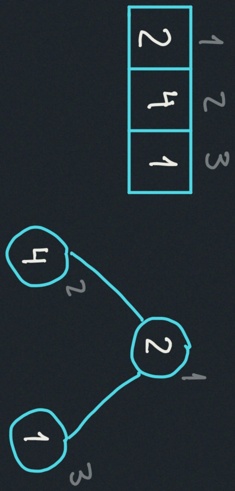
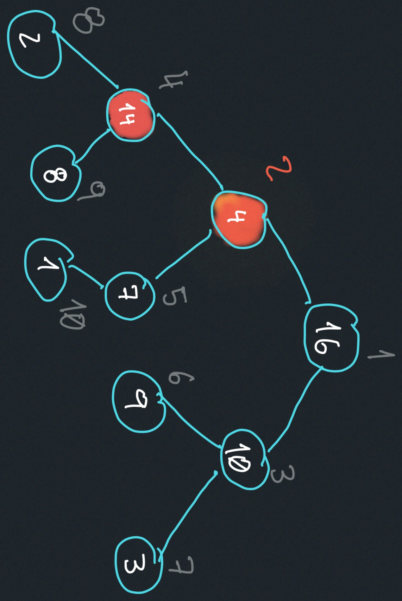
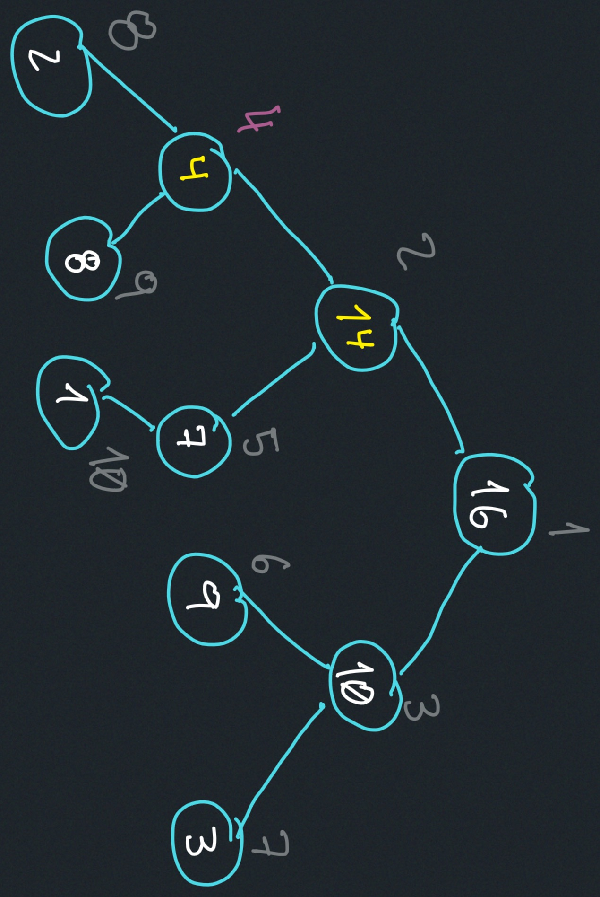
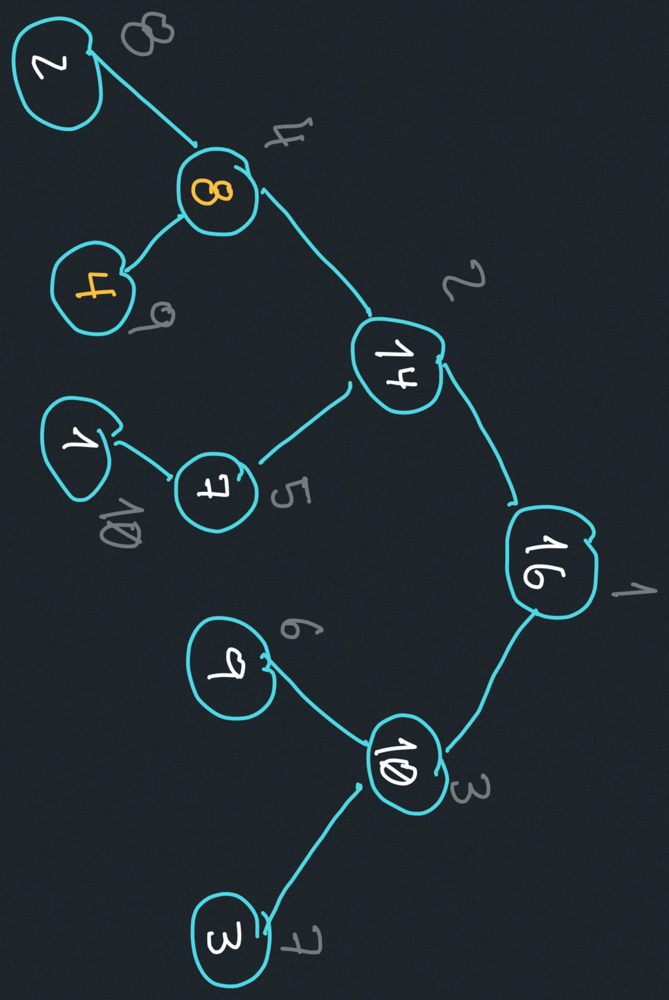

# Heaps and Heap Sort
- Priority Queues
- Heaps
- Heap Sort

# Priority Queues
Implement a set S of elements, each of elements is 
associated with a key.

- $insert(S,x):$ Insert element x into set S.
- $max(S):$ return element of S with the largest key.
- $extract_max(S):$ return element of S with the largest key,
and remove it from S.
- $increase_key(S,x,k):$ increase the value of x's key to new value k.

# Heap
An array visualized as a nearly complete binary tree:

## Heap as a Tree
- root of tree: first element `(i=1)`
- parent(i): $\frac{i}{2}$
- left child(i): $2i$
- right child(i): $2i+1$
### Max-Heap property:
The key of a node is $\geq$ the keys of its two children.

### Min-Heap property:
The key of a node is $\leq$ the keys of its two children.

### Key Questions to understand the heap:
- How do we maintain the max-heap property as we modify the heap?
- How do we going to build a max-heap of an initially unsorted array?

### Heap operations (methods)
- build_max_heap: produces a max heap from an unsorted array.
- max_heapify: correct a single violation of the heap property in a subtree's root.

#### max_heapify(A,i):
Assume that the trees rooted at `left(i)` and `right(i)` are max-heaps.

Max_heapify(A,2)

heap_size(A) = 10
- Exchange A[2] with A[4]

Call max_heapify(A,4)
- Exchange A[4] with A[9]

NO MORE CALLS!

#### Time Complexity
The visualization of a heap is a nearly complete binary tree, 
if this example had initialized with 15 elements, it would be 
a perfect binary tree. So the height of this visualization tree is 
bounded by $log_2(n)$

