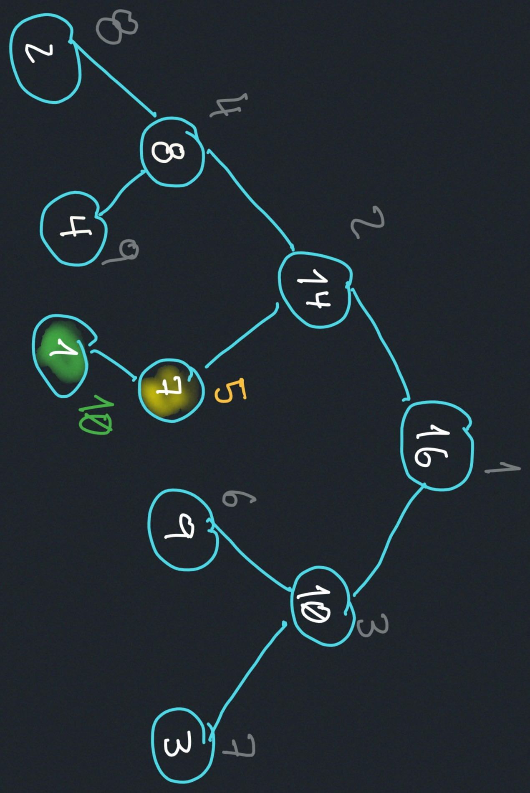
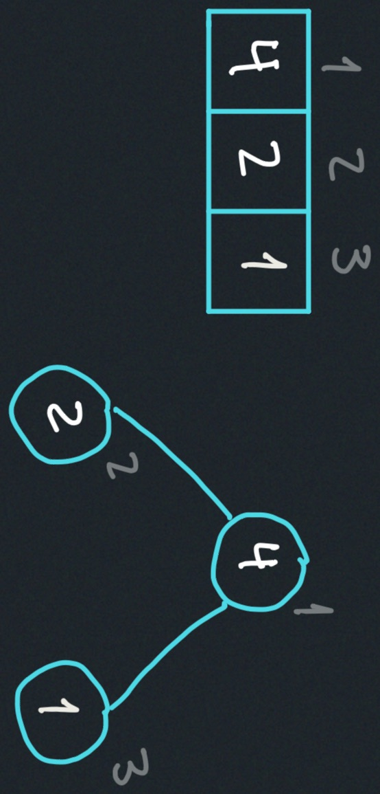
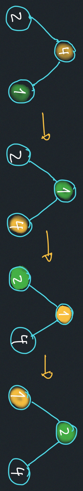

# Heaps and Heap Sort
- Priority Queues
- Heaps
- Heap Sort


# Priority Queues
Implement a set S of elements, each of elements is 
associated with a key.

- $insert(S,x):$ Insert element x into set S.
- $max(S):$ return element of S with the largest key.
- $extract_max(S):$ return element of S with the largest key,
and remove it from S.
- $increase_key(S,x,k):$ increase the value of x's key to new value k.

# Heap
An array visualized as a nearly complete binary tree:


Every array can be visualized as a heap.


## Heap as a Tree
- root of tree: first element `(i=1)`
- parent(i): $\frac{i}{2}$
- left child(i): $2i$
- right child(i): $2i+1$
### Max-Heap property:
The key of a node is $\geq$ the keys of its two children.

### Min-Heap property:
The key of a node is $\leq$ the keys of its two children.

### Key Questions to understand the heap:
- How do we maintain the max-heap property as we modify the heap?
- How do we going to build a max-heap of an initially unsorted array?


### Heap operations (methods)
- build_max_heap: produces a max heap from an unsorted array.
- max_heapify: correct a single violation of the heap property in a subtree's root.

#### max_heapify(A,i):
Assume that the trees rooted at `left(i)` and `right(i)` are max-heaps.


Max_heapify(A,<span style="color:red; font-weight:bold">2</span>)

heap_size(A) = 10
- Exchange A[<span style="color:red; font-weight:bold">2</span>] with A[4]


Call max_heapify(A,<span style="color:purple; font-weight:bold">4</span>)
- Exchange A[<span style="color:purple; font-weight:bold">4</span>] with A[9]


NO MORE CALLS!

#### Time Complexity
The visualization of a heap is a nearly complete binary tree, 
if this example had initialized with 15 elements, it would be 
a perfect binary tree. So the height of this visualization tree is 
bounded by $log_2(n)$

---

---
Convert $A[1\cdots n]$ into a max-heap
```
Build_max_heap(A):
  for i = n/2 downto 1:
    do max_heapify(A,i)
```

elements $A[\frac{n}{2}+1\cdots n]$ and all leaves,
the leafts satisfy the backseat property.

The reason this works is because we are calling max_heapify multiple times, but
every time you call it, you satisfy the precondition, and the leaves are 
automatically max-heaps after the execution of the max_heapify method.

Then you start with n over 2 `A[((2)/2)+1 ... (2)]`, 
you are going to see at least one leave as your children for the n 
over 2 node.

For Example:
if you pick A[<span style="color:yellow; font-weight:bold">5</span>]:
  
Its children satisfy the max_heap property.

#### Time Complexity
Looks like each of the steps is taking $O(\log_2(n))$, so:

$O(n \cdot \log_2(n))$

For the first level of nodes there is exactly one operation, the first 
level that are above the leaves. For the next level you may be doing
two operations. So there is an increase in operations as you get 
higher and higher up, but there are fewer and fewer nodes as you 
go at higher and higher up. Because there is only one node that is 
the highest node (the root node), that node has logarithmic number of operations,
but it's only one node.
The ones down on the bottom have a constant number of operations.

Observations:
1) Max_heapify takes $O(1)$ for nodes that are 
one level above the leaves and in general $O(l)$
time for nodes that are l level above the leaves. 

2) There are $\frac{n}{4}$ nodes that, give or take one, depending on the value of n.
There are $\frac{n}{4}$ nodes with level 1, $\frac{n}{8}$ with level 2, 
$\cdots$ 1 node with $\log_2(n)$ level (root node).
So the number of nodes decreases in terms of levels
So the number of nodes decreases in terms as the **WORK** you're doing increases.

##### Total amount of work in the for loop: (43:34)
$\frac{n}{4} \cdot (1 \cdot c) + 
\frac{n}{8} \cdot (2 \cdot c) + 
\frac{n}{16} \cdot (3 \cdot c)+
\cdots + 
1 \cdot \left(\log_2c\right)$

$\frac{n}{4} (1) \cdot (1 \cdot c) +
\frac{n}{4} (\frac{1}{2}) \cdot (2 \cdot c) + 
\frac{n}{4} (\frac{1}{4}) \cdot (3 \cdot c)$
$+ \cdots + \frac{1}{\left(\frac{n}{4}\right)} \cdot \left(\log_2c\right)$

set: $\frac{n}{4}= 2^{k}$

$2^{k} \cdot (1 \cdot c) + 
2^{k} \cdot \frac{1}{2} \cdot (2 \cdot c) + 
2^{k} \frac{1}{4} \cdot (3 \cdot c) +
\cdots + \frac{1}{2^{k}} \cdot \left(\log_2c\right)$

$c \cdot 2^{k} \cdot\left(\frac{1}{2^0}+ \frac{1}{2^1} + \frac{3}{2^2} + \cdots + \frac{log_2c}{2^{k}}\right)$

$
\frac{{\log_2 c}}{{2^k}} = \frac{{\frac{{\log c}}{{\log 2}}}}{{2^k}} = \frac{{\log c}}{{\log 2 \cdot 2^k}} = \frac{{\log c}}{{2^{k-1} \cdot 2}} = \frac{{\log c}}{{2^{k-1+1}}} = \frac{{\log c}}{{2^k}} = \frac{{k+1}}{{2^k}}
$

$c \cdot 2^{k} \cdot\left(\frac{1}{2^0}+ \frac{1}{2^1} + \frac{3}{2^2} + \cdots + \frac{k+1}{2^{k}}\right)$

$c \cdot 2^{k} \cdot \left(\displaystyle \sum_{i=0}^{k} \frac{i+1}{2^{i}}\right)$

1. Build_max_heap from unordered array. $O(n)$
2. Find max element `A[1]`.  $O(1)$
3. Swap elements `A[n]` with `A[1]`. $O(1)$
    - now max element is at the end of array.
4. Discard node n from heap - decrementing the size of the heap.
5. New root may violete max heap property but children are still max-heaps - max_heapify to fix it. $O(\log_2(n))$

    2.) Find max element `A[1]`




##### Time Complexity
$n \cdot \log_2(n)$
