# Balanced BSTs
- The importance of being balanced.
- AVL (Adelson, Velskii & Landis ) trees:
  - definition
  - rotations
  - insert
- Other balanced trees.
- Data structures in general.
- Lower bounds.

## Recall
- rooted binary tree.
- each node has:
  - key
  - left pointer
  - right pointer
  - parent pointer
- BST property:
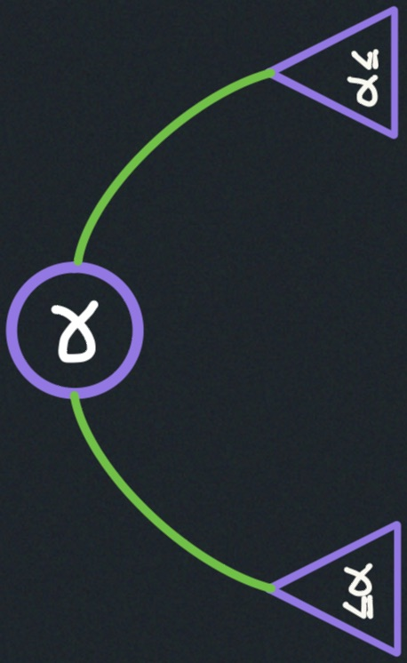
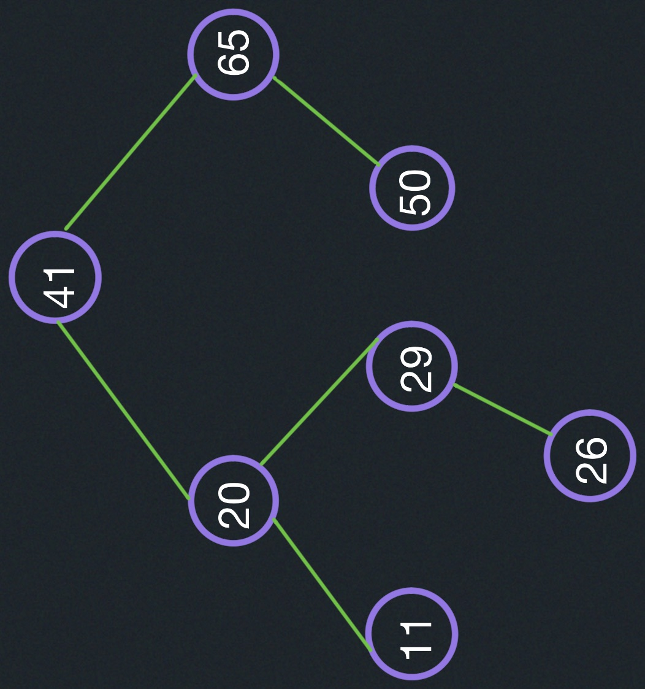

BSTs support insert, delete, min, max, next-larger, next-smaller, 
(successor, predecessor) in $O(1)$ time.

#### Balanced or not:
h: height of BST = length of the longest path from root to leaf.
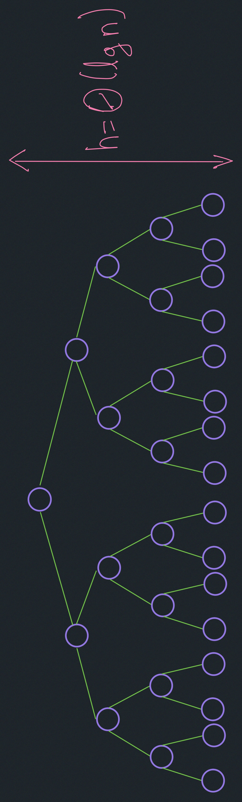
Is balanced if $h = \log_2(n)$
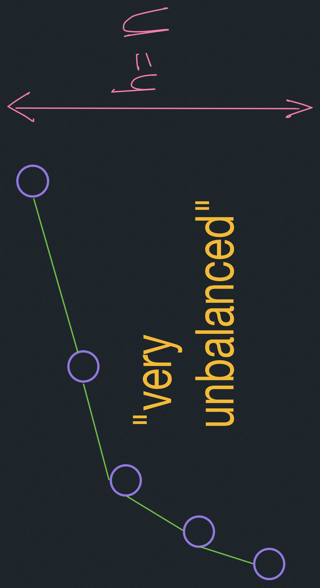

##### Height of a node:
length of the longest path from it down to a leaf.

A leaf is a node with null (-1) pointers in their both children left and right.
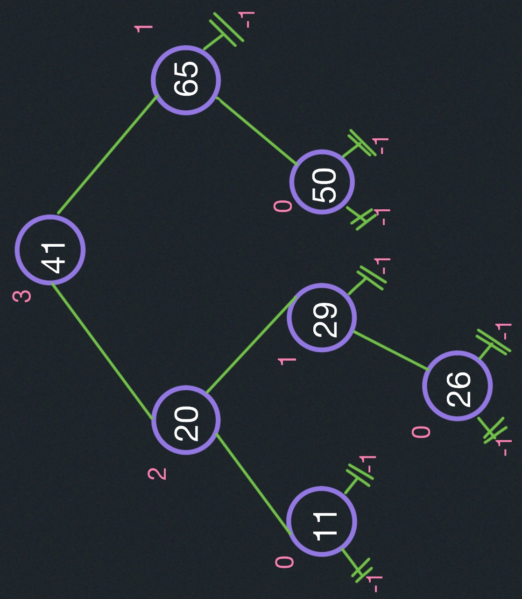

$\text{max}\{\text{height}(left child), \text{height}(right child)\}+1$

##### Data structure augmentation:
To maintain the size of every tree.
We start with any vanilla binary search tree, and then we maintained every time 
we did an operation on the tree, we also updated the size of the subtree rooted
at that node. We store the height of every node.

#### AVL trees
Require height of left & right children of every node to differ by at most $\pm 1$.
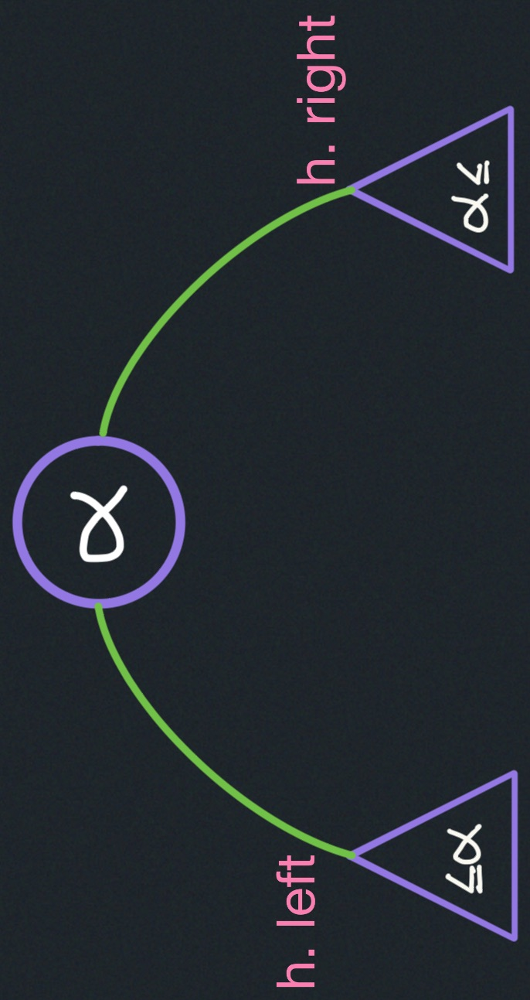

$|h_{left}-h_{right}| \leq 1$

##### AVL trees are balanced:
If I say I have $n$  nodes, how can I make the tree as high as possible, or 
conversely, if I have a particular height, how can I make it have as few nodes
as possible? That'd be like the sparsest, the least balanced situation for AVL trees.

For every node, lets make the right side have a height of one larger than the left side.

Worst case is when right subtree has height 1 more than left, for every node.
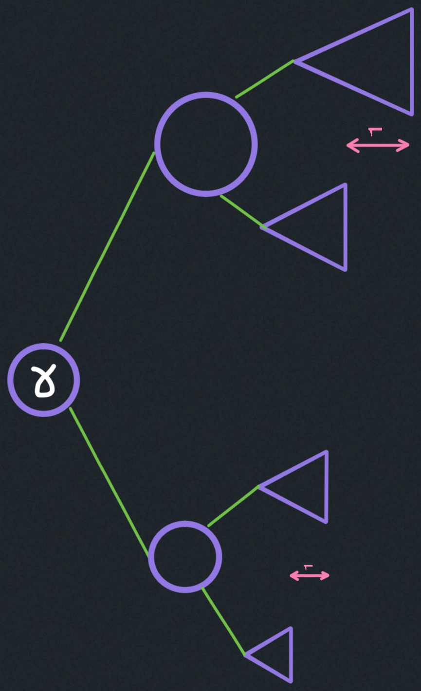

$N_{h}$: min # nodes in an AVL tree of height h

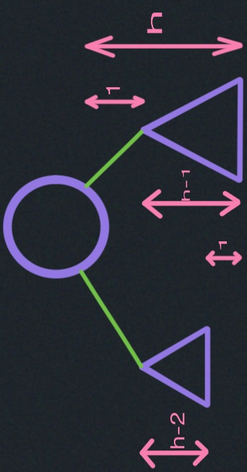

$N_{h}=1+ N_{h-1} + N_{h-2}$ # This equation is nearly similar to fibonacci sequence.

The Fibonacci numbers may be defined by the recurrence relation:
$F_{n}=F_{n-1}+F_{n-2}$

This is almost the same but what we need to notice here is:
$N_{h} > F_{h}$

$F_{h}=\frac{\varphi(h)}{\sqrt{5}}$

where the height of a node is $\varphi=1.6180339887$.

$\frac{\varphi(h)}{\sqrt{5}}< n$

$h - \epsilon < log_{\varphi}(n)$

where $\epsilon$ is a small number.

$h - \epsilon \approx 1.440 \cdot log_2(n)$

There is a much easier way to analyze this recurrence relation:
$N_{h}=1+ N_{h-1} + N_{h-2}$ 

$N_{h} > 1 + 2 \cdot N_{h-2}$ 

$N_{h} > 2 \cdot N_{h-2}$ 

$N_{h} = \theta(2^{\frac{h}{2}})$ 

$h < 2 \cdot log_2(n)$

Which combined with $h - \epsilon < log_{\varphi}(n)$:

$1.440 \cdot log_2(n) < h < 2 \cdot log_2(n)$

$h \approx 1.440 \cdot log_2(n)$

#### AVL insert:
1. Simple BST insert.
2. Fix AVL property.

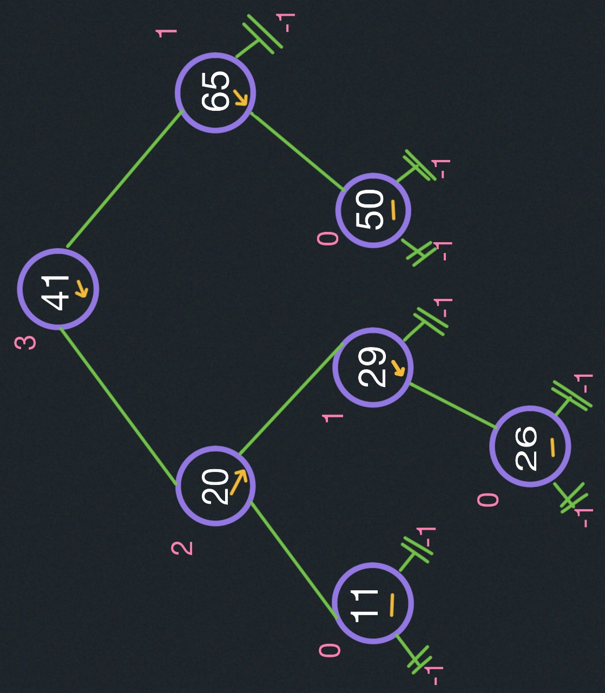

Add a new node "$23$" to the tree.

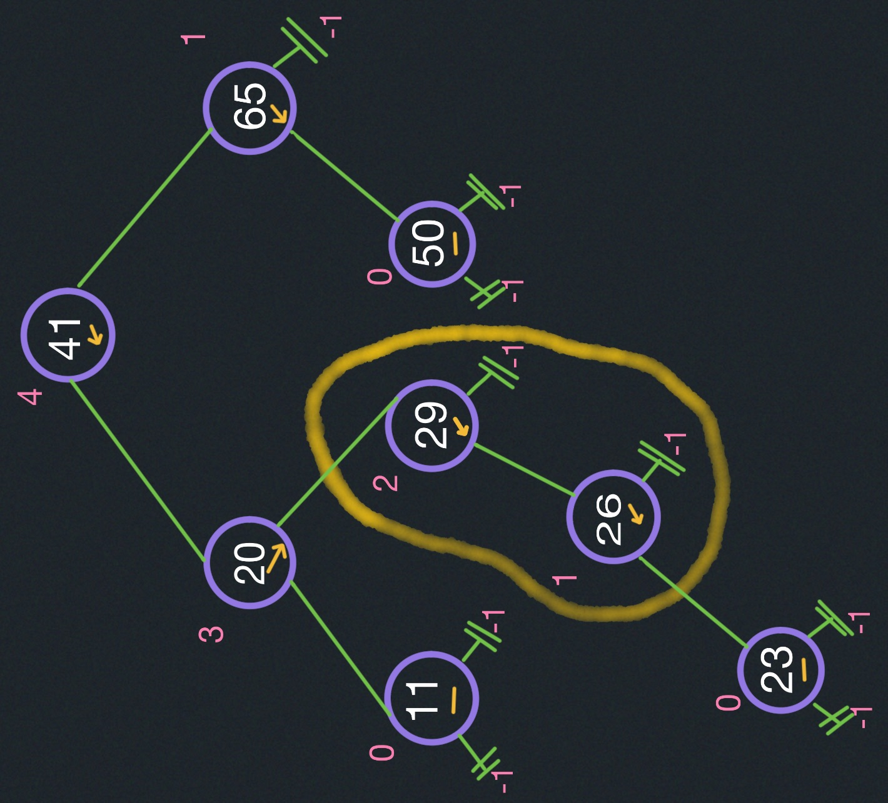

Notice the doubly left heavy subtree starting at the $29$ root.
This is bad for the symmetry of the tree. To fix this 
we use rotations:

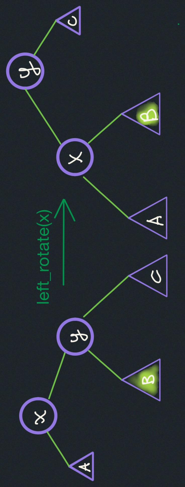

|  | original tree   | after rotation  |
|-------------- | -------------- | -------------- |
| array    | A,x,B,y,C     | A,x,B,y,C     |

This operation performs in $O(1)$ time.

As you can see the array both trees return the same array.

Now solve the doubly left heavy subtree:

Rotating the 29 node:

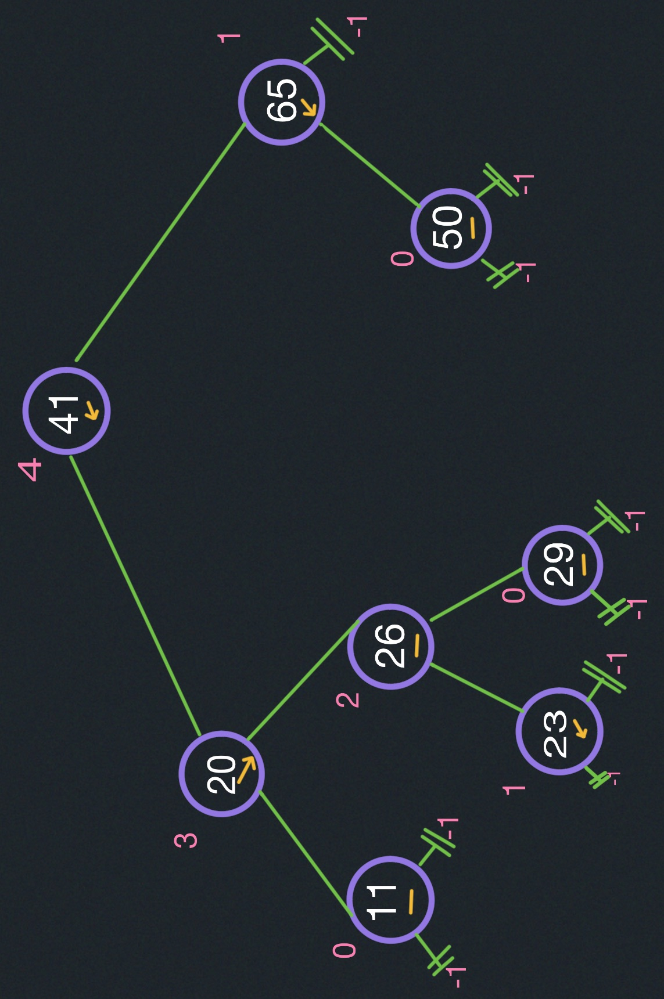

Insert 55:

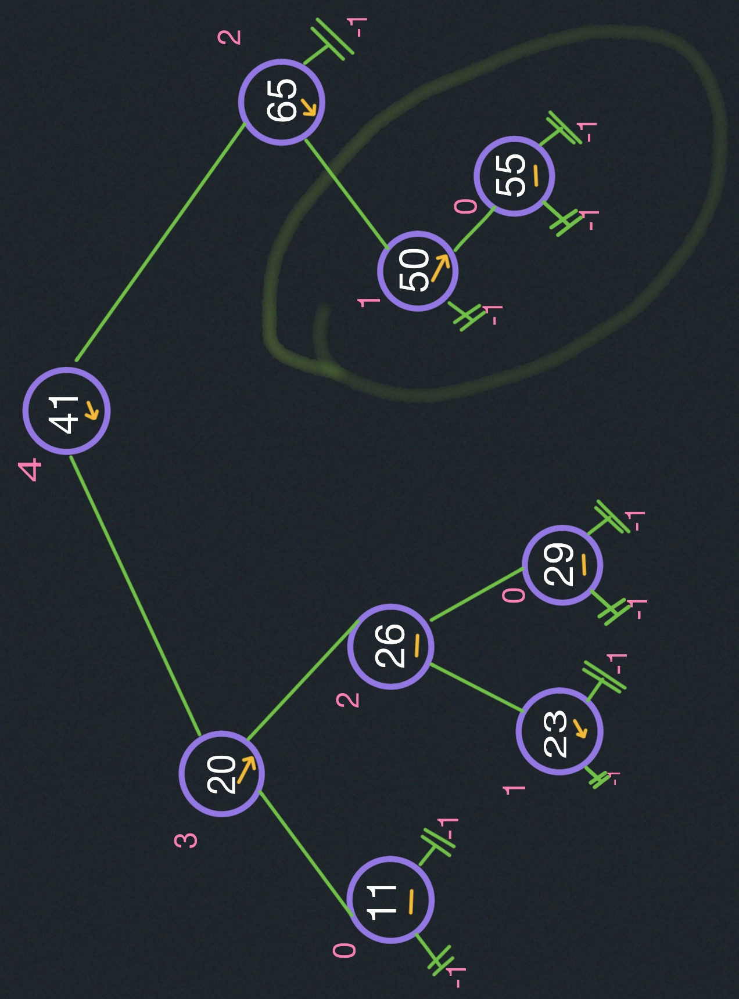

Rotate 65:

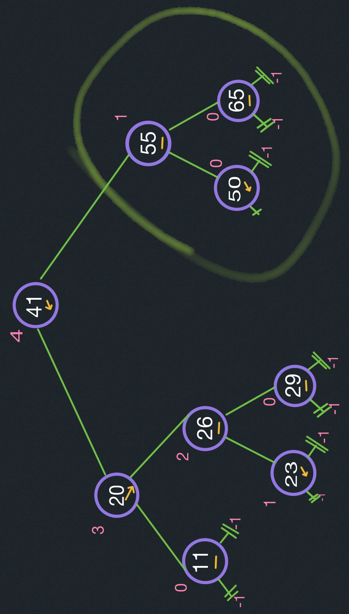

### Fix AVL property:
From the changed node, up:
- Suppose x is the lowest node violating AVL.
- Assume right child is heavier (x.right).

  - if x's right child is right-heavy or balanced.
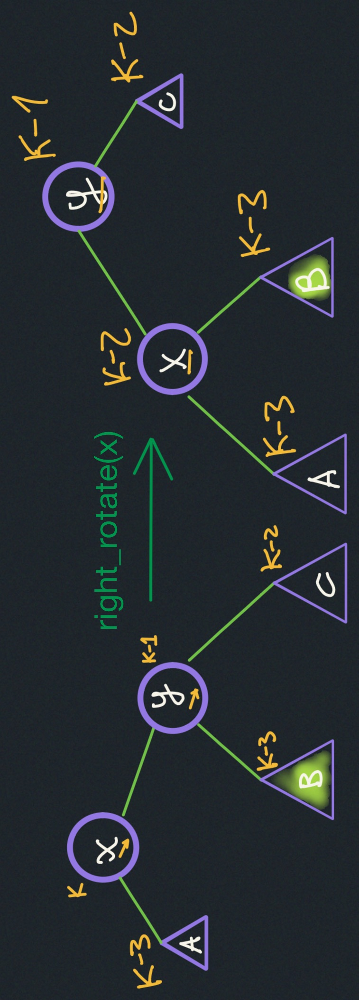

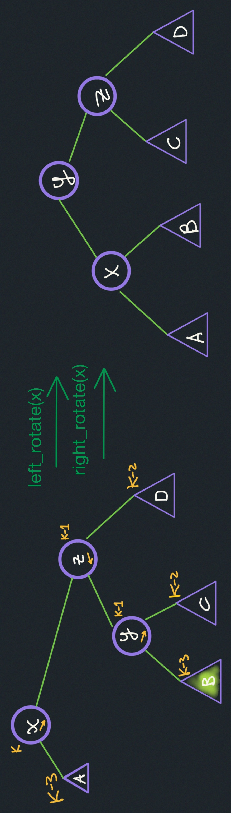

### AVL sort:
- insert $n$ items in $O(n log_2(n))$ time.
- in-order traversal $O(n)$ time.

### Abstract data type:

| operation  | Column2   | Column3   | Data structure |
|----------- | ----------| ----------| -----   |
| insert     | priority queue | Balanced BST | |
| delete     | priority queue | Balanced BST | |
| min        | priority queue | Balanced BST | |
| successor  |                | Balanced BST | |
| predecessor|                | Balanced BST | |

- insert & delete.
- min
- succerssor/predecessor.
