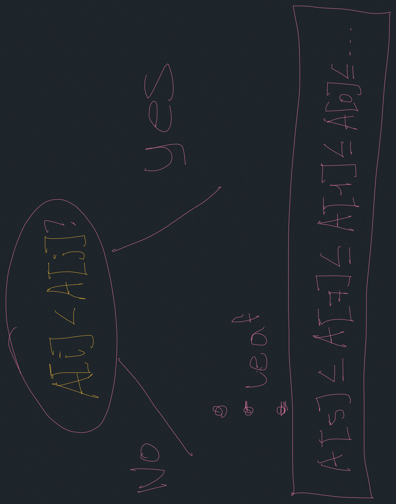

# Linear-Time Sorting
- Comparison model
- Lower bounds
  - Searching: $\Omega(log_2(n))$
  - Sorting: $\Omega(n \cdot log_2(n))$
- $\Theta(n)$ sorting algorithms.
  - Counting sort
  - Radix sort

## Comparison model
- All input items are black boxes (ADTs)
- Only operations allowed are comparisons 
($<$, $>$, $\leq$, $\geq$).

- time cost = # comparisons.

### Decision tree
Any comparison algorithm can be viewed as atree of all possible 
comparisons & their outcomes, and resulting answer.


| decision tree  | algorithm   | 
|-------------- | -------------- |
| internal node    | binary decision (comparisons)     |
| leaf | found answer |
| root to leaf | single algorithm execution|
| path length | running time of execution|
| height of the tree | worst case running time |

For any particular n

E.g. binary search

for $n=3$

### Searching lower bounds
$n$ preprocessed items finding a given item among them in 
comparison model requires $\Omega(log_2(n))$ in the worst case.

#### Proof
- Decision tree is binary & must have $\geq n$ leaves, 
one for each answer.

$\text{height} \geq \log_2(n)$

#### Sorting lower bound:


- decision tree is binary & # leaves $\geq$ # possible answers $= n!$

$\text{height} \geq \log_2(n!)$

$\text{height} = \log_2(n(n-1)\cdot(n-2) \cdots )$

$\text{height} = \log_2(n) + \log_2(n-1) + \cdots + \log_2(1)$

$\text{height} = \displaystyle \sum_{i=1}^{n} \log i$


$\geq \displaystyle \sum_{i=\frac{n}{2}}^{n} \log i$

$\geq \displaystyle \sum_{i=\frac{n}{2}}^{n} \log \frac{n}{2}$

$\geq \displaystyle \sum_{i=\frac{n}{2}}^{n} (\log_2 n -1)$

$= \frac{n}{2} \cdot \log_2 n -\frac{n}{2}$

$= \Omega(n \cdot \log_2 n)$

After taylor series iteration you can get the exact result:

$n \cdot \log_2 n - O(n)$

Due to we don't care about constants:

$\Omega(n \cdot \log_2 n)$

### Linear-time Sorting (integer sorting)

- Assume n keys sorting are integers 
$\in \{0,1,2,\cdots, k-1\}$ (& each fits in a word)
- Can do a lot more than comparisons.
- for $k \cdots$   can sort in $O(n)$ time. $k=n^{O(1)}$

$O(n \cdot \sqrt{\log_2 (\log_2 n)})$ advanced algorithm in 6854.

----
### Counting sort


Traverse the array of counters and the array is already written in order 
by key.


$L:$ array of k empty lists

```
L = list() # O(k)
for j in range(n): # O(n)
   L[key(A[j])].append(A[j]) # O(1)

output = []

for i in range(k): # O(n+k)
  output.extend(L[i])
```

The time complexity for Counting sort is $O(n+k)$

---
### Radix sort
- imagine each integer as base b.

d: # of digits
$d=\log_b k + 1$

- sort integers by least significant digit

... 

d iterations 

...

- sort integers by most significant digit

- Sort by digit using counting sort $O(n+b)$

- Total time: $O((n+b) \cdot d))$
$= O((n+b) \cdot \log_b k)$

  - minimized when $b=\Theta(n)$
    - $= O(n \cdot \log_n k)$ if $k=n^c$ then $\Theta(n\cdot c)$
