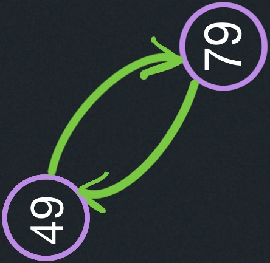

# Binary Search Trees, BST Sort
- Runaway reservation system.
  - Defn.
  - How to solve with arrays/lists.
- Binary Search Trees operations.

## Runaway reservation system
Airport with a single runaway:
  - Reservations of future landings
  - Reserve request specifies leanding time `t`
  - Add `t` to the set `R` if no other landings are scheduled within k minutes.
  - Remove from set `R` after plane lands.

Note: We'd like to do all of these operations in $O(n)$ time.

### Example:

- $k = 3$
- $53$ OK
- $44$ not allowed
- $20$ not allowed (past)

--- 
#### Unsorted list/array:
- Insert in $O(1)$ time without check
  - Check takes $O(n)$ time
--- 
#### Sorted list/array:

Find smallest i such that $R[i] \geq t$ in $O(n)$ time.

Compare $R[i]$ and $R[i-1]$ against $t$ in $O(1)$ time.

Note: Sadly, actual insertion (shifting) takes $O(n)$ time.

Sorted List:
Fast insertion into a sorted list:

Heaps: min/max

element that is $node\geq k$ or node $\leq k$ from t in $O(n)$ time

Suppose that we want to insert $25$ into the heap:

We want a data structure that does the steps 
for a fast insertion into a sorted 
array, described in the images above that 
and do this in $O(n)$ time. Here is when Binary Search Trees come:

#### Binary Search Trees

In this structure you can move upwards or backwards.

| node x  | key (x)   |
|-------------- | -------------- |
| Pointers    |  parent(x), left(x), right(x)     |
| Unlike a heap    |      |

##### Invariant BST
For all nodes x, if y is in the left subtree of 
x $key(y) \leq key(x)$.

$y$ is the right $\cdots key(y) \geq key(x)$.

So, if you look at the BST in the example:

Every node in the right is greater or equal to its node of the left.

##### Insert 
|operation  | Node   | 
|--------- | ------ |
| Insert    | 49    |

|operation  | Node   |
|--------- | ------ |
| Insert    | 79    |

|operation  | Node   |
|--------- | ------ |
| Insert    | 46    |

|operation  | Node   |
|--------- | ------ |
| Insert    | 41    |

|operation  | Node   | k |
|--------- | ------ | -- |
| Insert    | 42    | 3 |

$42 \leq 49$ ✅ then it goes to the left ⬅️. 

$42 \leq 46$ ✅ then it goes to the left ⬅️. 

$42 \leq 41$ ❌ then it goes to the right ➡️.

$(42-41) \geq 3$ ❌ then the insertion fails 🚫.

If you didn't have to check, we would put the $42$ into:

But because you have to check the element lies in range t-k or t+k, the insertion fails 🚫
because it violates k constraint.

##### Time complexity
$h:\text{height of tree}$
Insertion with check: $O(h)$ time.

| Function  | Description| Time Complexity |
|--------- | --------- | -------------- |
| Find_min()    | Go to the left until leaf     | $O(h)$ |
| next_larger()    |      | $O(h)$ |

Find min
Go to the left until leaf: $O(h)$ time complexity.
next_larger$(x)$

**New requirement:** 
| Function  | Description| Time Complexity |
|--------- | --------- | -------------- |
| Rank(t)    | How many planes are scheduled to land at times $\leq t$ ?||

#### Augment the BST structure

Insert or delete modifying "size" numbers, 
these numbers corresponds to subtrees sizes.

##### How to calculate the size?
You want to think about this as you started with an empty 
set and you kept inserting into it, and you were doing a sequence
of insert and delete operations, and if I explain to you how an 
insert operation modifies these numbers, that is pretty much all 
you need. 
To summarize the total of descendent nodes plus itself:

Let's do an example adding a 43 node into the tree:

The analog case for deleting a node.

##### What lands before t?
For snapshot of the tree:

1. Walk down tree to find desired time.
2. Add in the nodes that one smaller
3. Add in the subtrees size to the left.

###### Example:
$t= 79$ 

| step  | Description   | 
|-------------- | -------------- | 
| 1    | Look at 49     | 
| 2    | Compare to 79| 
| 3    | Add 1| 
| 4    | Move the right | 
| 5    | add 2 | 
| 6    | Subtree 46 | 
| 7    | see 79 and add 1| 
| 8    | go to the left of 79 | 
| 9    | add 1 corresponding to the 64 | 
| 10    | final answer 5| 

