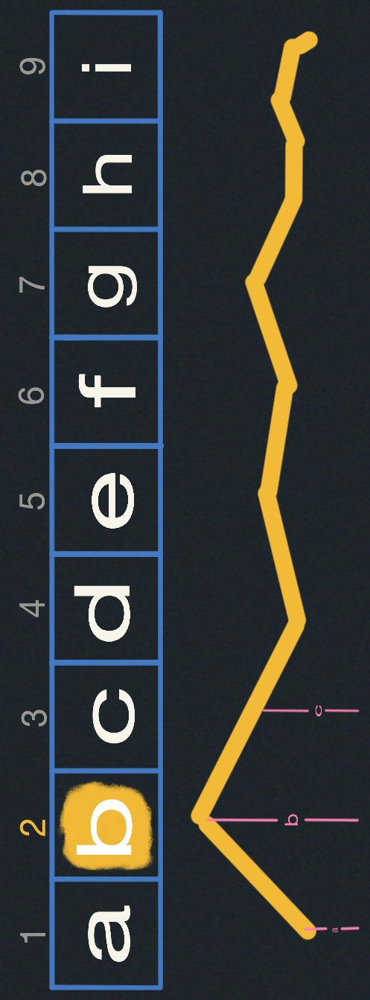
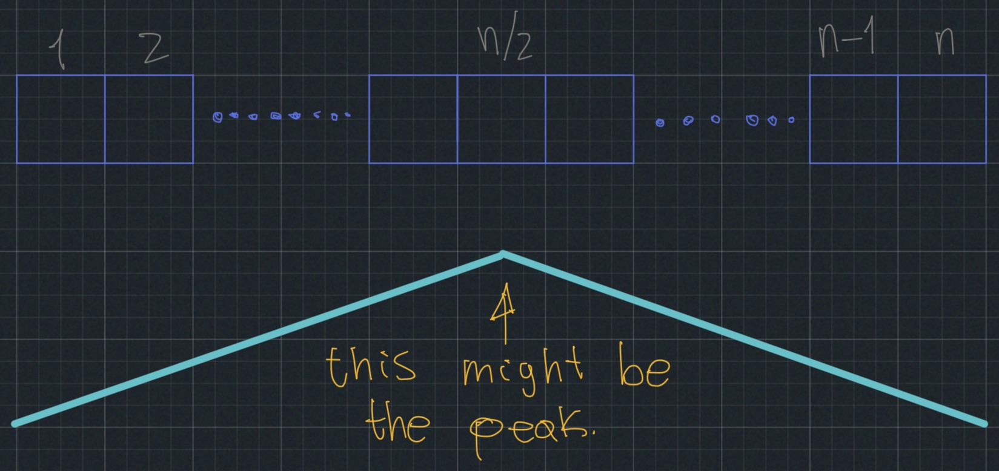
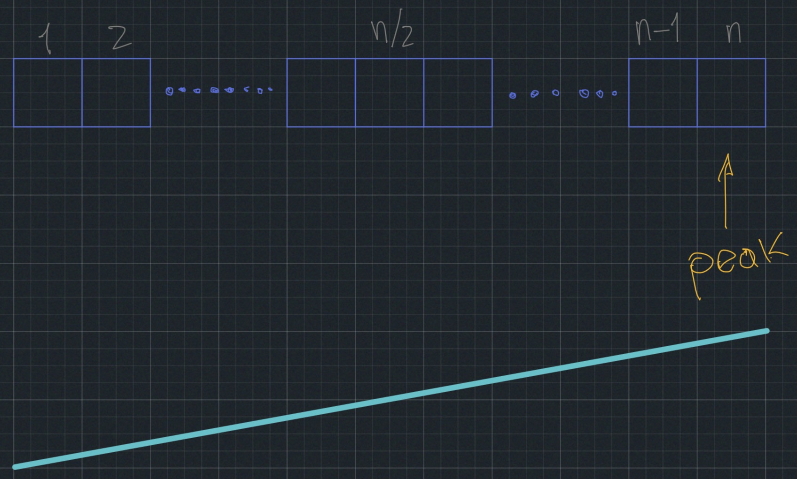
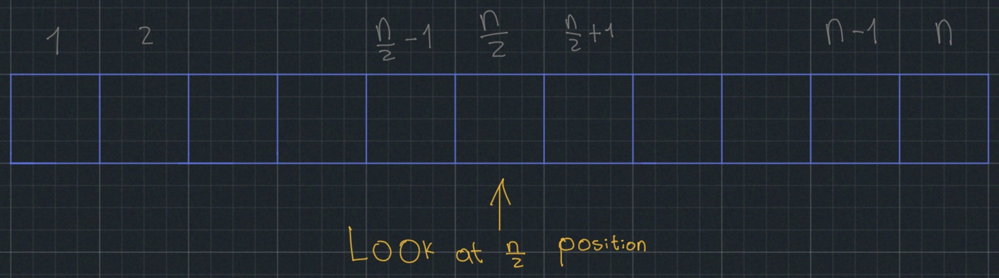
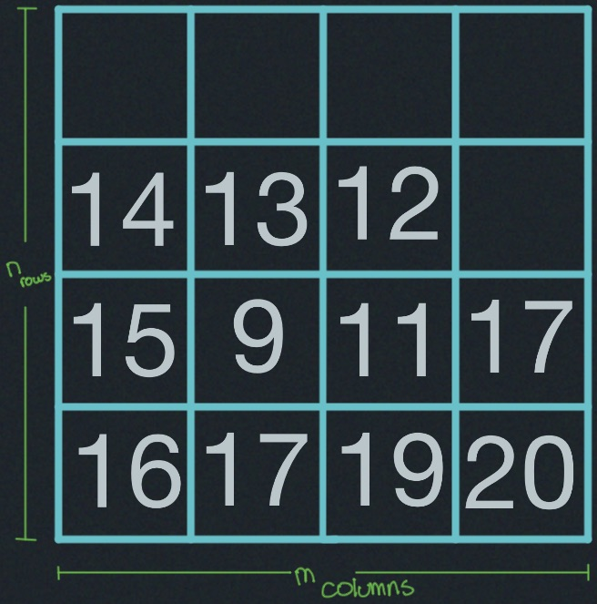
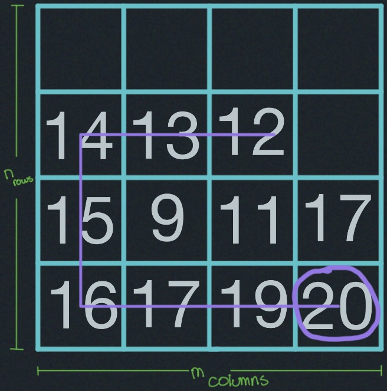
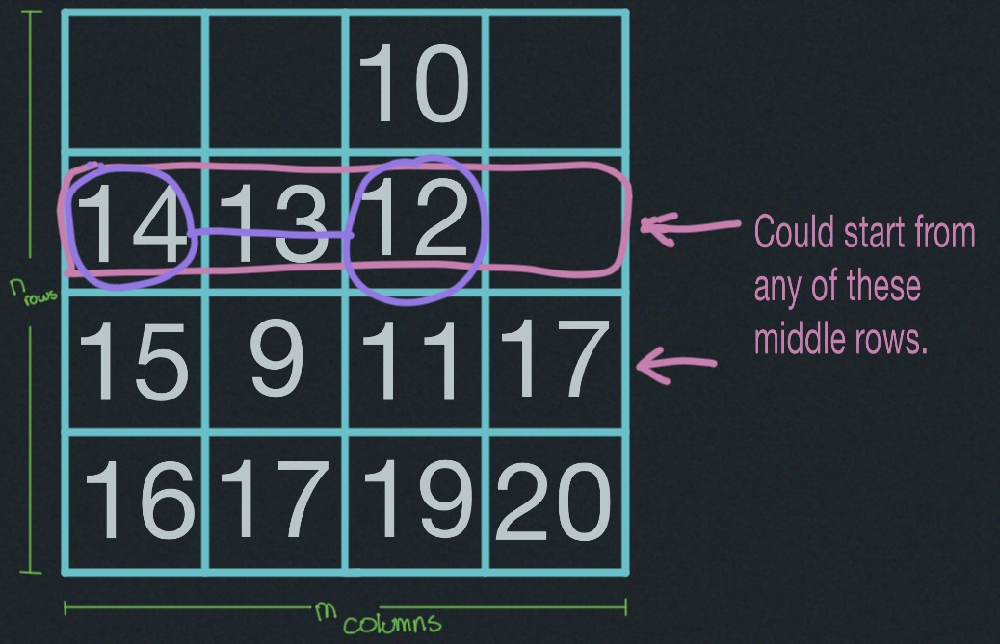

# Peak Finding

One-dimensional version:

Numbers in range `a - i` are natural numbers.

**Position `2` is a peak:** 

  $\text{iff } (b \geq a)$ & $(b \geq c)$.

**Position `9` is a peak:**

  $\text{iff } (i \geq h)$.

#### Problem:
Find the peak if it exists.

#### Straightforward to the algorithm:

Note: Argue that any array will always have a peak, which means that only one value is greater than every other value. If there are two maximum values, there are no peaks.

Start from left:

the line below means that the numbers are increasing as you start from the left, the peak is somewhere in the middle, and then things start decreasing.

In this case, we look at the middle ${(n/2)}$ elements.

##### Worst case complexity $\Theta(n)$:
We call it like this because in the worst case, you might have to look at all n elements. And that would be the case where you started from the left and you have to go all the way to the right.
This is a notation that says of the order of $n$ elements, it provides us both boundaries, lower bound and upper bound. The Big $O(n)$ is just the upper bound.

This case is saying this algorithm that starts from the left is going to, essentially, require in the worst case something that's a Constant Times $n$.

We only care about asymptotic complexity that in this case is linear $\Theta(n)$.

#### Divide & Conquer:
In order to improve the search and get this complexity down, we can use Divide & Conquer strategy and then recursively break this one dimensional array into smaller arrays.

${ \text{if } a[n/2] < a[n/2-1]}$ then only look at the left half $1 \cdots (\frac{n}{2}- 1)$ to look for a peak.
Else ${ \text{if } a[n/2] < a[n/2+1]}$ then look at the right half $(\frac{n}{2}+1) \cdots n$ to look for a peak.

Otherwise, if both of these conditions don't fire, then the algorithm has found a peak in the early running, so $(\frac{n}{2})$ position is a peak.

##### Complexity of algorithm
The recurrence relation between ${T}$ and ${n}$:

${\text{where:}}$

${T: \text{work the algorithm does on input of size}}$ $n$

${n: \text{number of elements}}$

${T(n) = T\left(\frac{n}{2}\right) + \Theta(1)}$

###### Base case: $T(1) = \Theta(1)$
Because you have one element in the array,  in that array the algorithm has already found a peak.

###### Expand:
If we make the input growth, we will notice that the algorithm halves the array after each iteration. So every additional element adds half of the last iteration.

$
T(n) = \Theta(1) + T(n/2) \\
     = \Theta(1) + \Theta(\log_{2} (n/2))\\
     = \Theta(1) + \Theta(\log_{2} n - 1)\\
     = \Theta(1) + \Theta(\log_{2} n) - \Theta(1)\\
     = \Theta(\log_{2} n).
$

$\vdots$

$T(n) = \underbrace{\Theta(1) + \cdots + \Theta(1)}_{\Theta(\log_2 n)} = \Theta(\log_{2} n)$

## 2D-dimensional version:

$\text{a is a 2D-peak iff } a\geq b ,\quad a\geq c ,\quad a\geq d ,\quad a\geq e$

The greedy ascent algorithm essentially picks a direction and follows that direction in order to find the peak.
#### Example:

Then what might happen is, if I started at some arbitrary mid position, so the Greedy Ascent algorithm has to make choices as: to where to start. You want to start in the middle and then go to a position of middle of the matrix, and keep going in that direction until it hits an edge, it could move to next row (possibly down), so it make some choices like what the default traversal directions are.

Let's say we start at "12" and it is going to go look for something to left, so:
- if the number in the new position is greater than the number in the previous position, then it is going to follow that direction.
- if the number in the new position is less than the number in the previous position, then it is going to follow the opposite direction.

In this case it will go to 12,13,14,15,16,17,19 and when it reaches 20 it will find the peak.

Sometimes it may end up touching a large fraction of elements in this 2D array (Matrix). And it is quite possible that starting from the midpoint the algorithm touches up half the elements, and in some cases touching all elements.

###### Complexity of algorithm: 
$\Theta(n \cdot m)$

$\Theta(n^{2}) \text{ if } m={n}$

##### Apply Divide & Conquer into 2D array:
Pick middle column $j=\frac{m}{2}$.

Find a 1D-peak at $(i,j)$

Use $(i,j)$ as a start position to find a 1D-peak on row $i$.
This algorithm is INCORRECT

It is efficient because it is going to take logarithmic time $\Theta(\log_{2} n)$ but INCORRECT

###### Problem:
the 2D peak may not exist on row $i$.

Let's say we start at 12 in the middle row and middle column, it will assess the peak in the column $j$ and it will choose 12 as peak even that 19 is the actual greatest value, but this is going to happen because $12$ is the greater between both values in column 10 above and 11 below. So after choosing this particular row it will go to the left direction until find the edge at $14$, that is going to be the peak at this row, but $14$ is not the 2D-peak.
So in this particular example the algorithm is going to return $14$ which is not the 2D-peak.

##### The efficient and the actual correct algorithm
Pick middle column $j=\frac{m}{2}$, find global max on column $j$ at $(i,j)$ 
compare $(i,j-1),(i,j),(i,j+1)$

Pick left columns if $(i,j-1) > (i,j)$ and similarly for the right $(i,j+1) > (i,j)$
if in fact either of these two conditions are false then $(i,j)$ is the 2D-peak:

  if $(i,j) \geq (i,j-1)$ and $(i,j) \geq (i,j+1) \rightarrow (i,j)$ is a 2D-peak. 

It solves the new problem with half the number of columns.

When we have a single column, find the global max, and then we are done.
###### Complexity of algorithm: 
$T(n,m) = T(n,\frac{m}{2}) + \underbrace{\Theta(n)}_{max}$

$T(n,1) = \Theta(n)$

$T(n,m)=$ $\underbrace{\Theta(n)+ \cdots + \Theta(n)}_{\log_2 m}$ $=\Theta(n \cdot \log_2 m)$
