# Graphs II: Depth-First Search
- Depth-First Search (DFS)
- Edge Classification
- Cycle Testing
- Topological Sort

## Recall:
- <u style="color:rgb(237,93,177)">Graph search</u>: Explore a graph
  - e.g., find a path from start vertex $s$ to a desired vertex.
- <u style="color:rgb(237,93,7)">Adjacency list</u>: array 
$Adj$ of $|V|$ linked lists.
  - for each vertex $u \in V$, $Adj[u]$ stores $u$'s neighbors,
  i.e., 
  $\{v \in V | (u,v)\in E\}$ (<span style="color:orange">just outgoing
  edges if directed</span>)

For example:
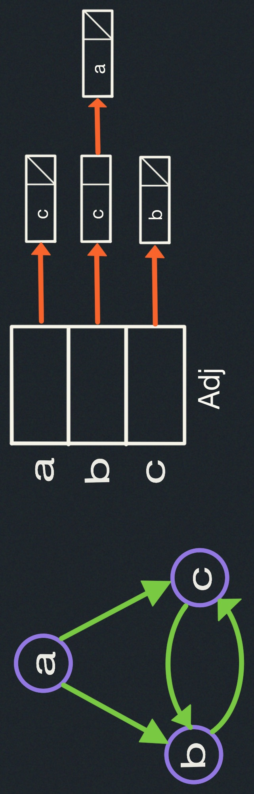

### Breadth-first Search (BFS):
Explore level-by-level from $s$ --- find shortest paths.

### Depth-First Search (DFS):
This is like exploring a maze:
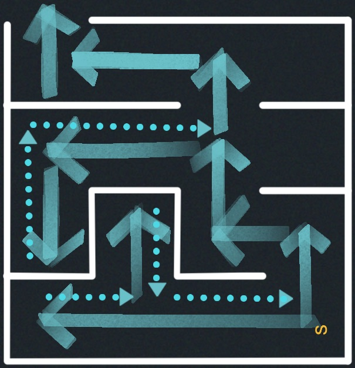

#### Depth-First Search Algorithm:
- Follow the path until you get stuck.
- Backtrack along breadcrumbs until reach unexplored neighbor.
- Recursively explore.
- Be careful not to repeat a vertex.

<div style="display:flex;align-items:center;justify-content:space-around">

  ```
  parent = { s: None }
  DFS_visit(V,Adj, s):
    for v in Adj[s]:
      if v not in parent:
        parent[v] = s
        DFS_visit(V, Adj, v)
  ```

  
</div>
We have a vertex $s$ and we look at all of the outgoing edges from $s$, for each one, We pick $v$
and check if the vertex $v$ have been visited already, to check it out we are going to set a 
parent dictionary where it is initialized as None, so there is no parents yet, and if the vertex 
chosen is not in the parent dictionary, we mark it as seen by setting its parent to $s$, and 
then we recursively visit it.

```
  DFS(V,Adj):
    parent = {}
    for s in V:
      if s not in parent:
        parent[s] = None
        DFS_visit(V, Adj, s)
```

So the complete code for this Algorithm is:
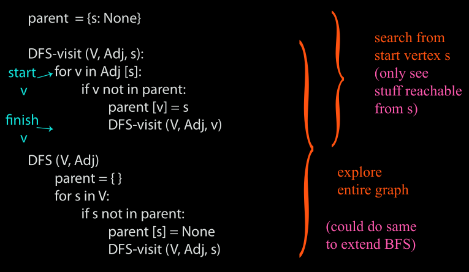

##### Example:
| step  | description   | illustration   |
|----- | --------- | -------------- |
| 1    | Set node `a` as the starting node:     | 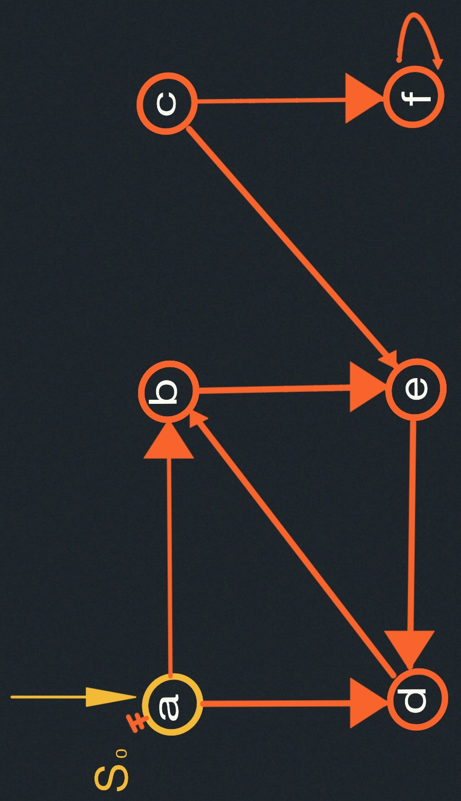|
| 2    | We move to `b` node, and then set the parent dictionary to `parent = {a: None, b: a }`: | 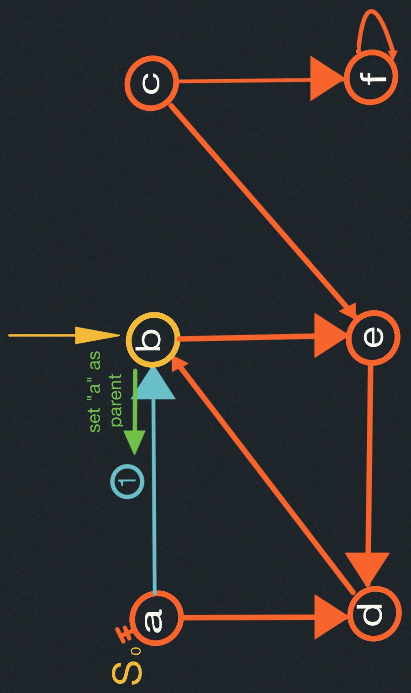 |
| 3    |Then we are recursively visit the next node `e` from `b`, the `parent = { a: None, b: a, e: b }`:|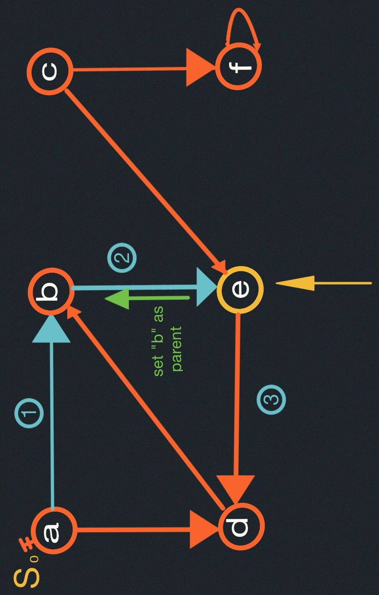|
| 4    |The node `e` only has one path to go `d`, so move recursively to `d` and set `parent = { a: None, b: a, e: b, d:e }`:|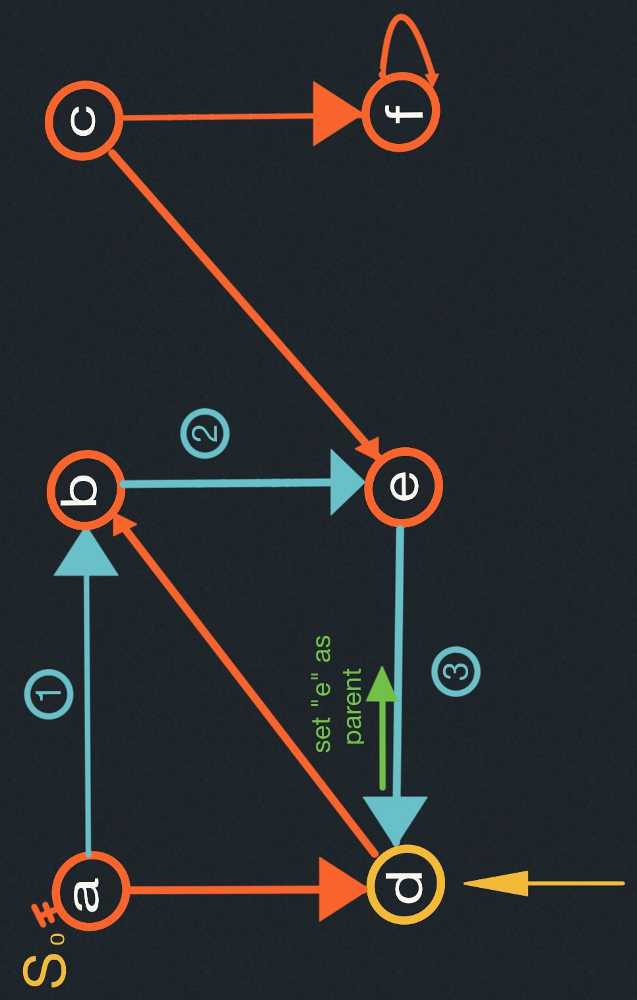|
| 5    |- `d` has only one outgoing edge `b`, but `b` is on parent dictionary.<br/>- We've already visited `b`, which means this path is done. <br/>- The algorithm returns to the next level up. Next level up was `e`, we were iterating over the outgoing edges from `e`,but there is no outgoing edge from `e`, so we are done. So `e` finishes. <br/>- Then we backtrack to `b`, which is always going back along the parent pointer, but it's also just in the recursion<br/>- We know where to go back to. We were going over the outgoing edges from `b`, there's only one we're done.<br/>- We're going back to `a` we only looked at one outgoing edge from `a`, and there's another outgoing edge, which is `a`, but we have visited `d`, so we skip it out too.<br/>- Now we are done recursively visiting everything reachable from `a`.|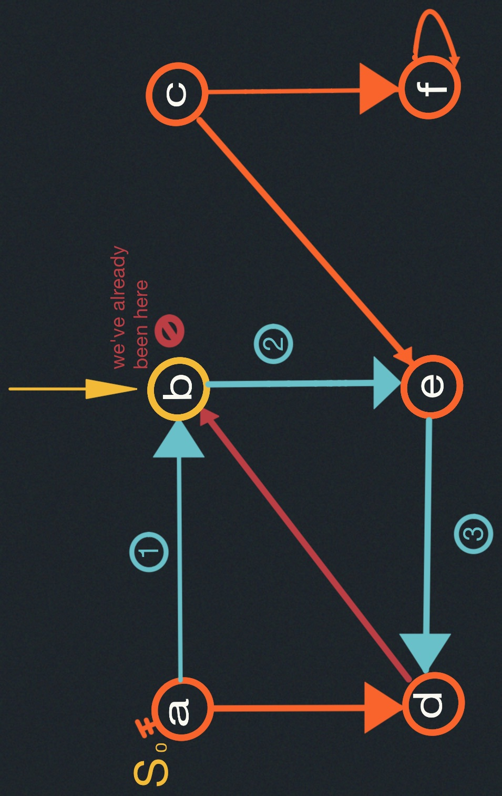|


- Going back to the loop:
```
    for s in V:
      if s not in parent:
        parent[s] = None
        DFS_visit(V, Adj, s)
```
| step  | description   | illustration   |
|----- | --------- | -------------- |
| 10    | `f` has not been visited, so we set its parent pointer to c: `parent = { a: None, b: a, e: b, d:e, c: None, f: c }`  |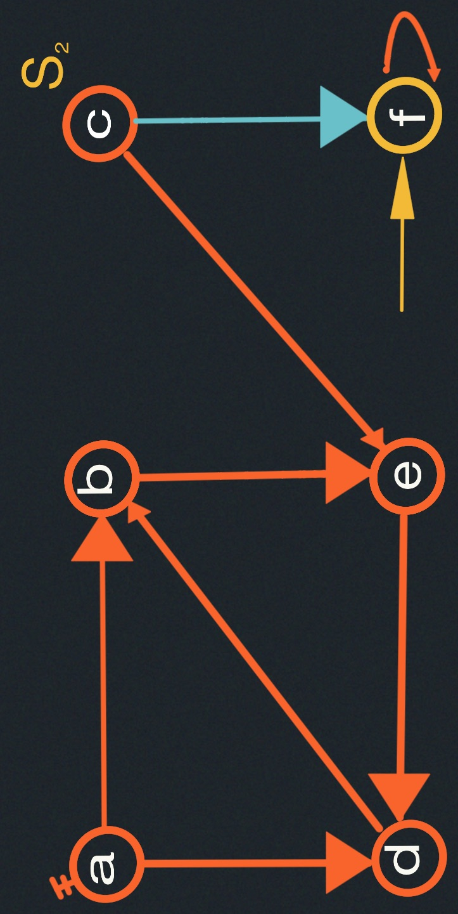|
| 11    |We look for an outgoing for `f`: <br>-`f` is an outgoing for `f`.<br>- conclude that `f` has been already visited.<br>- There is no point of set the parent pointer.<br>- We are done with `f`. That's the only outgoing edge. |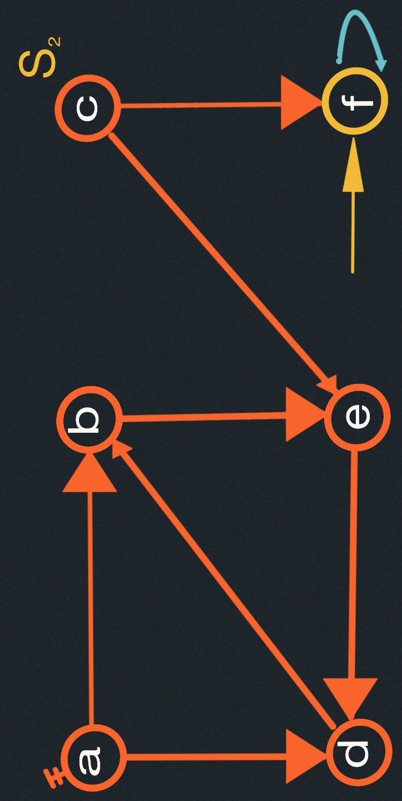|

Backtrack to `c`, there is other outgoing edge, but it leads to a vertex we've already visited, namely `e`.
So, We are done with visiting everything reachable from `c`. We have not visited every node from `c`, but 
the previous iterations did.

Executing the next iteration of the loop, we have realized that every node else has been visited.

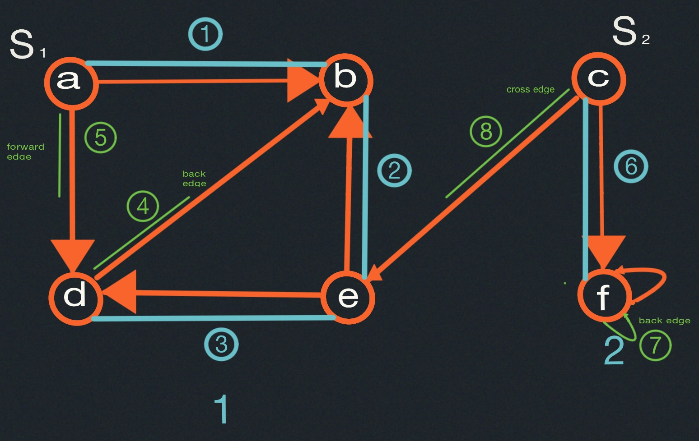


#### Analysis
- DFS-visit gets called with a vertex $s$ only once (because then $parent[s]$ set).

  $\implies$ time in DFS-visit $=\displaystyle \sum_{s \in V} |Adj[s]| = O(E)$

- DFS outer loop adds just $O(V)$
$\implies O(V+E)$ time (<span style="color:orange">linear time</span>).

BFS is better for short paths, to find fastest ways to solve the Rubik's cube will not find it.
DFS is useful for the way it classifies edges.

##### Edge Classification
There are three types of edges:
- Forward edges
- Backward edges
- Cross edges


5. is forward edge because it goes, in some sense, forward along the tree, it goes from root of tree to 
a descendant.
---
4.  is a backward edge because it goes from a node in the tree to an ancestor in the trees
---
7.  is a cross edge because it goes to a node with no ancestor related. They are siblings, due to 
edge connects to sub-trees.

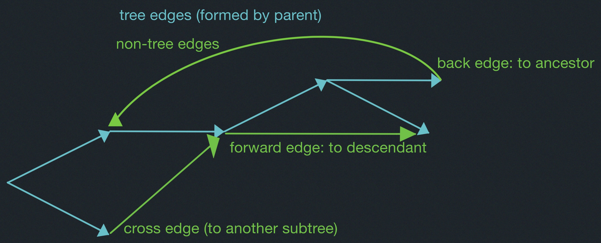

- To compute this classification (<span style="color:cyan">back or not</span>), mark nodes for duration they are
"on the stack".

- Only tree and back edges in undirected graph.
We could never have forward edges in undirected graph.
### Cycle Detection
Graph $G$ has a cycle $\iff$ DFS has a back edge.

### Proof:
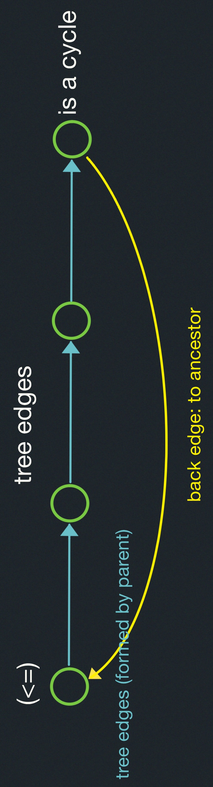

--
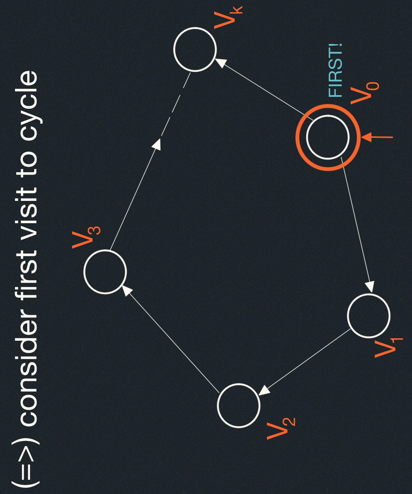

- before visit to $v_i$ finishes,

  Will visit $v_{i+1}$ ($\&$ finish):

  Will consider edge $(v_i, v_{i+1})$

  $\implies$ visit $v_{i+1}$ now or already did

- $\implies$ before visit to $v_0$ finishes,
will visit $v_k$ ($\&$ didn't before)

- $\implies$ before visit to $v_k$ (or $v_0$) finishes,
will see $(v_k, v_0)$ as back edge.

##### Job scheduling
Given Directed Acylic Graph ($DAG$), where vertices represent tasks $\&$ edges represent 
dependencies, order tasks without violationg dependencies.

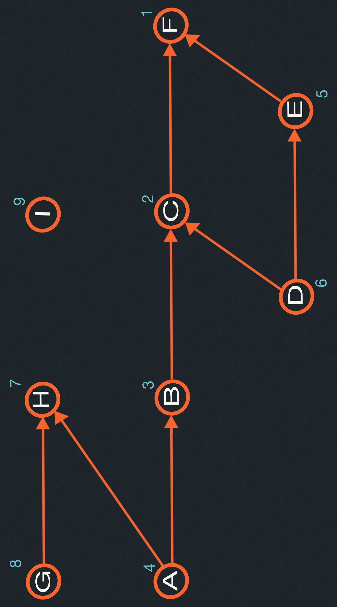

###### Source:

<span style="display:block; margin-left:auto; margin-right:auto">
Source : vertex with no incoming edges : schedulable at beginning
(<span style="color:orange">A,G,I</span>)
</span>

### Attempt:
BFS from each source:
- from A finds A, BH, C,F
- from D finds D, BE, CF <span style="color:cyan">$\leftarrow slow ... wrong!$</span>
- from G finds G, H
- from I finds I

### Topological Sort

<div style="display:flex; align-items:center">

Reverse of DFS <u style="color:cyan">finishing times</u> (time at which DFS-Visit($v$) finishes)

$$
\begin{cases}
DFS-Visit(v) \\
\ \ \ \ \cdots \\
\ \ \ \ order.append(v)\\
order.reverse()
\end{cases}
$$

</div>


##### Correctness
For any edge $(u,v)$ --- $u$ ordered before $v$, i.e., $v$ finished before $u$.


- if $u$ visited before $v$:
  - before visit to $u$ finishes, will visit $v$ (<span style="color:rgb(237,93,177)">via ($u,v$) or otherwise</span>)
  - $\implies v$ finishes before $u$. 

- if $v$ visited before $u$:
  - graph is acyclic
  - $\implies$ $u$ cannot be reached from $v$.
  - $\implies$ visit to $v$ finishes before visiting $u$.
