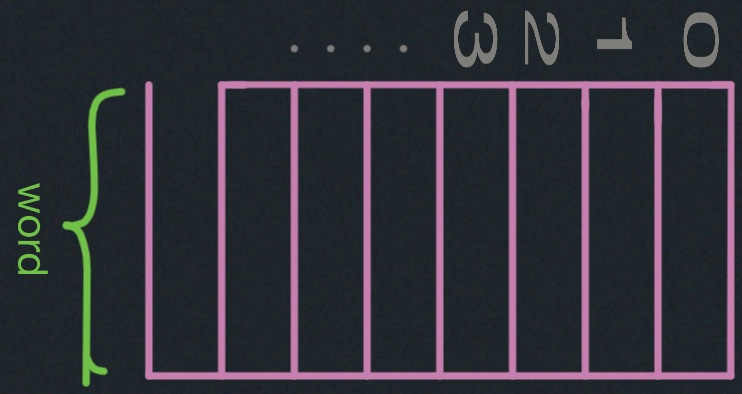
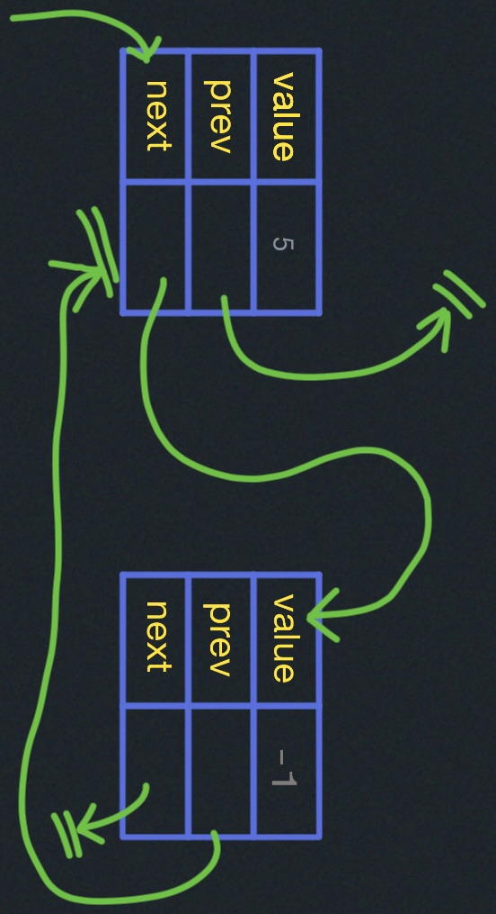
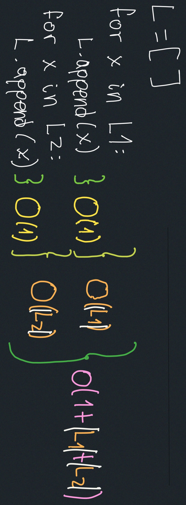
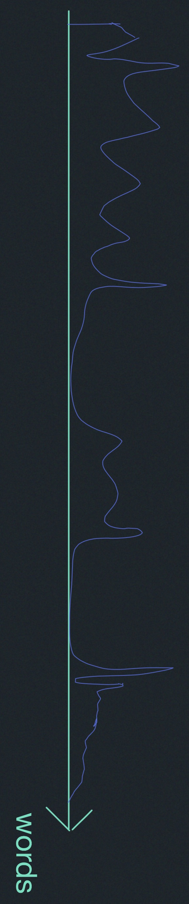
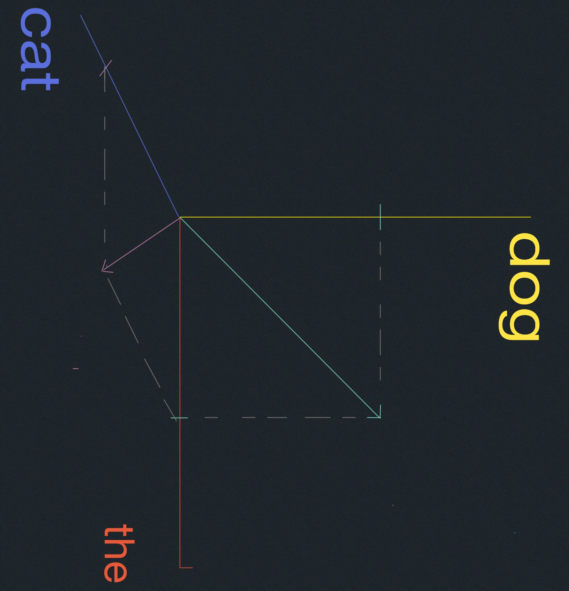
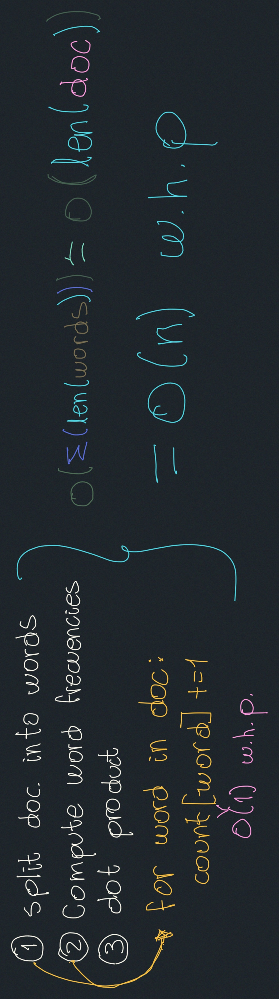

# Models of Computation

#### Where does the word algorithm come from?

`al-Khwārizmī’s`

There are many words from these roots.
#### What is an algorithm?
Computational procedure for solving a problem:

`input->algorithm->output`

An algorithm is a mathematical analog of a computer program:

```
what makes sense for computers   |   what makes sense for humans
                        Program <-> algorithm 
            Programing language <-> [ preseudocode/structured English]
                      Computer  <-> model of Computation
```

#### Model of Computation
Specifies:

- What operations an algorithm is allowed to perform
- Cost (time, space) of each operation.

### Models of Computation to cover in this lecture

Which you can just think of as different ways of thinking, commonly called `styles of programming`:
- Object-oriented programming
- Procedural programming
- Assembly programming
- Functional programming

These models gives you a way of structuring your thinking about how you write an algorithm.

1. RAM (Random Access Memory)
2. Pointer Machine.

#### 1. RAM (Random Access Memory)


<div style="display: flex; align-items: center;">
    <div style="flex: 1;">

- Modeled by a big array:
- In $\Theta(1)$ time, can:
  - Load $\Theta(1)$ words
  - Do $\Theta(1)$ computations
  - Store $\Theta(1)$ words
- Have $\Theta(1)$ of registers

    </div>
    <div style="flex: 1;">
      
    </div>
</div>


##### Word: space of memory usually in 32bits of 64bits (w bits)
- $w \geq \log(\text{size of memory})$, because a word should be able to specify an index into the memory array.
- For this course, we are going to assume everything we're given is one word and it's easy to compute on.


You load some words into registers and do some computations on those registers,
then you can write them back to store them in locations that are specified by the registers. 
This is what Assembly programming is like. It is in some sense annoying to humans to write algorithms 
with this model but it makes sense to computers.


#### 2. Pointer Machine
- dynamically allocated objects.
- Object has $O(1)$ fields.
- `Field:word (e.g. int) 
` or `Pointer: to another object (e.g. int*) or null`  .


In This diagram, we have a pointer to the previous element, a pointer to the next element, and some value. 
This is a data structure using a pointer machine, in python you might call it tuple or just an 
object with three attributes.
You can implement this model into the RAM, where a pointer becomes an index into this giant array, 
that is like the pointers in C, where you can take a pointer and you can add one to it and go to the next thing
after that, all you imagine to do with this List takes O(1).
The Pointer Machine is basically a weaker model than the RAM because you can implement a Pointer Machine
with a Random Access Machine.

## Python Model
### 1. List: it is what in data structures is known as `array`, it could be thought of as a list, but the implementation is an array.
In python, when you have a list `L`, and you do something like:
```
L[i] = L[j] + 5 # This operation takes O(1) time.
```

(w.h.p.: With High Probability)

### 2. Object with $O(1)$ number of attributes.
```
x=x.next # This operation takes O(1) time. 
```
Append an object, requires table doubling (Lecture 9).
```
L.append(x) # This operation takes O(1) time.
```

To operate the concatenation of two arrays `L=L1+L2` the equivalent operation:


The concatenation of the two arrays is NOT constant time ($O(1)$)
which means it takes $O(n)$ time.

The operations:
- `x in L` takes $O(n)$ time.
- `len(L)` takes $O(1)$ time.
- `L.sort()` -> $O(|L| \log(|L|))$ 
time. (Lecture 3,4 and 7)

### 3. Dictionaries:
```
d[key] = value # This operation takes O(1) time.
```
(Lectures 8 to 10)

### 4. Longs:
Long integers (lecture 11)
`x + y`  takes $O(|x| + |y|)$
`x * y`  takes $O((|x| + |y|)^{Log_2(3)})$

(Note: $lg$ means $\log_2$)

### 5. Heap Queue:
lecture 4

## Document Distance Problem
$d(D_{1},D_{2})$

- $D_{1}:$ Document 1 

- $D_{2}:$ Document 2

- Document: sequence of words.
- word: a string of alphanumeric characters.

The distance function is used in case as:
- Assess two almost identical websites, because then you store less 
and you can have a canonical page and present it differently to users.
- In Wikipedia, there is a list of all mirrors of articles 
and find the specific with this function
- To detect cheating in two problem sets that are identical. 
- Web search.
- Idea: look for shared words.
- Think of a document as a vector.
$D(w):$ # occurrence of w(word) in document

Every document could be illustrated in the following diagram where one of this occurrences
is one of these plots in this common axis:


#### Example:
- $D_0 =$ <span style="color:cyan">"the dog"</span>
- $D_1 =$ <span style="color:pink">"the cat"</span>


#### Apply inner product(dot product):
To find the distance between two documents:

$d(\vec{D_{1}},\vec{D_{2}}) = \vec{D_{1}} \cdot \vec{D_{2}}$ = 
$\displaystyle\sum_{w} \vec{D_{1}}[w] \cdot \vec{D_{2}}[w]$

Divide by length of the vectors:

$d(\vec{D_{1}},\vec{D_{2}})$ = $\displaystyle{\frac{\vec{D_{1}} \cdot \vec{D_{2}}}{|\vec{D_{1}}| \cdot |\vec{D_{2}}|}}$

 = $\arccos\left({\frac{\vec{D_{1}} \cdot \vec{D_{2}}}{|\vec{D_{1}}| \cdot |\vec{D_{2}}|}}\right)$

### Initial Algorithm:
1) Split document into words.
2) Compute word frequencies.
3) Dot product.

#### Algorithm improvements:
1) 228.1 seconds.
2) 164.7 seconds.
3) 123.1 seconds.
4) 71.7 seconds.
5) 18.3 seconds.
6) 11.5 seconds.
7) 1.8 seconds.
8) 0.2 seconds.

###### Algorithm:
1) Split document into words.
2) Compute word frequencies.
3) Dot product.
```
for word in document:
  count[word] += 1  
```


We implement this in python with:
```
re.findall(r'\w+', document)
```
The problem is that this could take $O(e^n)$ exponential time.
