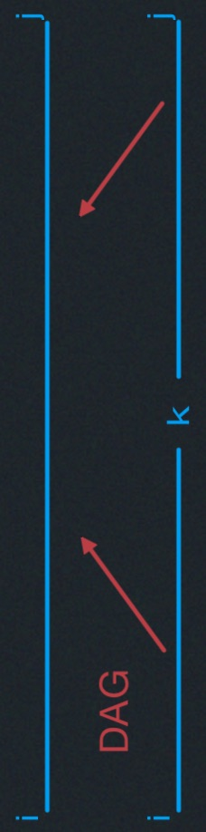
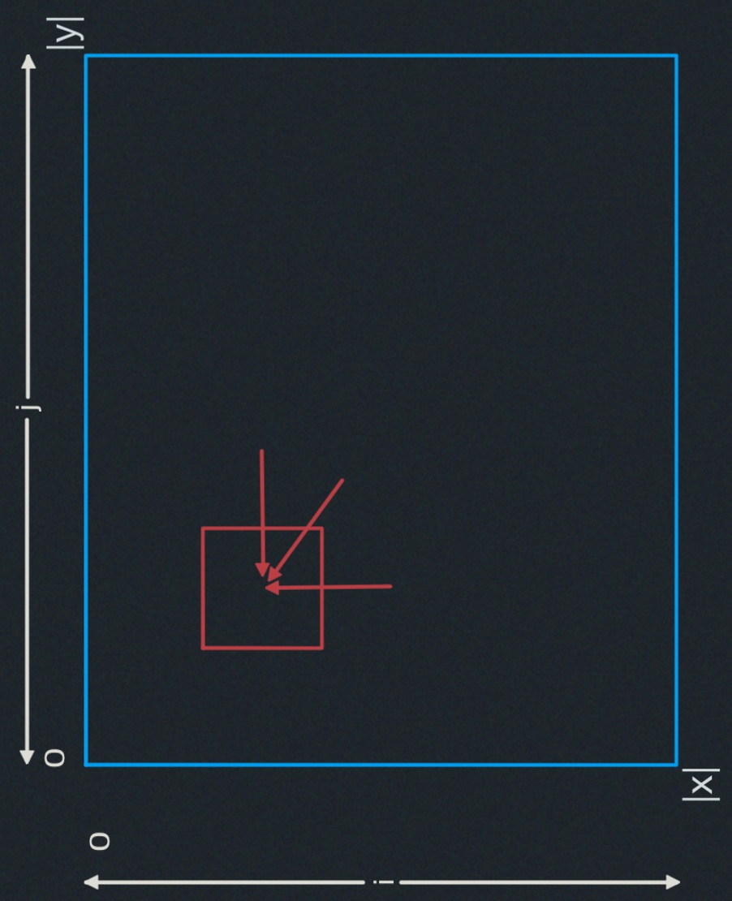

# DP III: Parenthesization, Edit Distance, Knapsack
- Sub-problems for strings
- Parenthesization
- Edit distance (& longest common subsequence)
- Knapsack
- Pseudo-polynomial Time

## Review

<span style="color:rgb(255,0,0)">*</span> 5 easy steps to dynamic programming

| step  | description   | time   |
|-------------- | -------------- | -------------- |
| 1. | define subproblems     | count # subproblems |
| 2. | guess (part of solution) | count # choices |
| 3. | recurrence: relate subproblem solutions | compute time/subproblem | 
| 4. | recursive + memoize <br/><br/> OR build DP table bottom-up check subproblems acyclic/topological order| time = (time/subproblem) $\cdot$ (# subproblems)  | 
| 5. | solve original problem: <br/>= a subproblem OR by combining subproblems solutions | $\implies$ extra time|

<span style="color:rgb(255,0,0)">*</span> problems from <span style="color:rgb(0,255,0)">L20</span>
(text justification, Blackjack) are on sequences (words, cards)

<span style="color:rgb(255,0,0)">*</span> useful problems for strings/sequences $x$:


## Parenthesization:
Optimal evaluation of associative expression $(A[0]\cdot A[1]) \cdot \dots (\dots)\cdot A[n-1]$ --- e.g., multiplying rectangular matrices:


2. <u>guessing</u> : outermost multiplication
<span style="color:rgb(0,158,241)">$(\underbrace{A_{{}_0}\cdots A_{{}_{k-1}}}_{k-1})\cdot(\underbrace{A_{{}_{k}}\cdots A_{{}_{n-1}} }_{k})$</span>

<span style="color:rgb(0,158,241)">$(\underbrace{A_{{}_i}\cdots A_{{}_{k-1}}}_{k-1})\cdot(\underbrace{A_{{}_{k}}\cdots A_{{}_{j-1}} }_{k})$</span>

  $\implies$ # choices  $O(j-i+1)=O(n)$

--

1. <u>subproblems</u>: <s>prefixes & suffixes?</s> <span style="color:cyan;font-weight:bold">NO</span>
<br><u>subproblems</u>: cost of substring $A[i:j]$

    $\implies$ # subproblems = $O(n^2)$

--

3. <u>recurrence</u>: 
    - DP$[i,j]$ = min(
      <span style="text-align:center;font-size:10px">
      $DP[i,k]+DP[k,j]+ \text{ cost of multiplying } (A[i] \cdot A[k] \cdots A[k-1])
      \text{ by } 
      (A[k] \cdots A[j-1]) \text{ for } k \text { in range}(i+1,j)$
      </span >
      )
      
    - DP$[i,i+1]=0$ 

      $\implies$ cost per subproblem $=O(j-i)=O(n)$

4. <u>topological order</u>:  Total time = $O(n^3)$ by <span style="color:cyan">increasing sub-string size</span>!
5. <u>Original problem</u>: $DP[0,n]$ <br/>
<span style="color:pink">(& use parent pointers to recover parents.)<br/>
NOTE:</span> Above DP is <u>not</u> shortest paths in the subproblem DAG!<br/>
Two dependencies $\implies$ not paths!


### Edit Distance
<span style="color:pink">Used for DNA comparison, diff, CVS/SVN/..., spellchecking (typos),
plagiarism detection, etc.</span>

Given two strings $x$ and $y$, what is the cheapest possible sequence of character <u>edits</u>
(<span style="color:rgb(0,158,241)">insert c, delete c, replace c $\leftarrow c'$</span>)
to transform $x$ into $y$?:

- <u>cost</u> of edit depends only on characters c, c'
- <span style="color:pink"> for example in DNA, $C\rightarrow G$ common mutation $\implies$ low cost
- cost of sequence = sum of costs of edits
- If insert & delete cost 1, replace cost 0. minimum edit distance equivalent to finding longest common
<u>subsequence</u>. <span style="color:rgb(0,158,241)">Note that a subsequence is sequential but not necessarily
contiguous.</span>
- for example 
&nbsp;<span style="color:cyan">H</span>
I
<span style="color:cyan">E</span>
R O G
<span style="color:cyan">L</span>
Y P H O
<span style="color:cyan">L O</span>
G Y
&nbsp;&nbsp;&nbsp;&nbsp;$vs.$&nbsp;&nbsp;&nbsp;&nbsp;&nbsp;&nbsp;&nbsp;
M I C
<span style="color:cyan">H</span>
A
<span style="color:cyan">E L</span>
A N G E 
<span style="color:cyan">L O</span>

&nbsp;&nbsp;&nbsp;&nbsp;&nbsp;&nbsp;&nbsp;&nbsp;&nbsp;The longest common subsequence:

&nbsp;&nbsp;&nbsp;&nbsp;&nbsp;&nbsp;&nbsp;&nbsp;&nbsp;&nbsp;&nbsp;&nbsp; $\implies$ <span style="color:cyan">HELLO</span>

#### Edit Distance DP (Dynamic Programming)

(1) <u>subproblems</u>: $c(i,j):$ edit-distance$(x[i:],y[j:])$ for $0 \leq i \leq |x|, 0\leq j < |y|$<br/>
&nbsp;&nbsp;&nbsp; $\implies$ <span style="color:cyan">$\Theta(|x|\cdot|y|) \approx \Theta(n^2)$ subproblems.</span>

(2) <u>guess</u>: whether, to turn $x$ into $y$,(<span style="color:rgb(0,158,241)">3 choices</span>):


- $x[i]$ replacement by $y[j]$
- $x[i]$ deletion
- $y[j]$ insertion

(3) <u>recurrence</u>: $c(i,j)=$ maximum of:
  - cost$(\text{delete } x[i])+ c(i+1,j)$ if $i < |x|$
  - cost$(\text{insert } y[j])+ c(i,j+1)$ if $j < |y|$
  - cost$(\text{replace } x[i] \rightarrow y[j])+ c(i+1,j+1)$ if $(i < |x|)$ and $(j < |y|)$

&nbsp;&nbsp;&nbsp;&nbsp;&nbsp;&nbsp;base case: $c(|x|,|y|)=0$

&nbsp;&nbsp;&nbsp;&nbsp;&nbsp;&nbsp;$\implies \Theta(1)$ time per subproblem. 

(4) <u>topological order</u>: DAG (Directed Acyclic Graph) in 2D table:

```
for i =|x|, ... 0:
  for j =|y|, ... 0:
    ...
```


  - bottom-up OR right to left
  - only need to keep last 2 rows/columns.

&nbsp;&nbsp;&nbsp;&nbsp;&nbsp;&nbsp;$\implies$ linear space
  - total time $= \Theta(|x|\cdot|y|)$

(5) <u>Original problem</u>: $c(0,0)$ <br/>
$\Theta(1)/sub-problems$

time= $\Theta(|x|\cdot|y|)$

## Knapsack (😵)
Knapsack of size $S$ you want to pack
- item $i$ has integer <u>size</u> $s_i$ & real <u>value</u> $v_i$
- <u>goal</u>: choose subset of items of maximum total value subject to total size $\leq S$

<span style="color:rgb(0,158,241);font-size:30px">First Attempt:</span>

1. <s style="color:red">subproblem = value for suffix $i$ </s> 
<span style="color:red;font-weight:bold;font-size:20px">
  WRONG!
</span>
2. guessing : whether to include item $i \implies$ # choices = 2
3. recurrence:
  - $DP[i]= \text{max}(DP[i+1],v_{{}_i}+ DP[i+1] \text{ if }$ (<s style="color:red">$s_{{}_i} \leq S$</s>)?! $)$
  - <span style="color:pink;">not enough information to know whether item $i$ fits --- how much space is left?</span>
  <span style="color:pink;font-weight:bold;font-size:20px">
    GUESS!
  </span>

<span style="color:rgb(0,158,241);font-size:30px">Correct:</span>
1. subproblem = value for suffic $i$:

&nbsp;&nbsp;&nbsp;&nbsp;&nbsp;&nbsp;&nbsp;&nbsp;&nbsp;&nbsp;&nbsp;&nbsp;
<u>given</u> knapsack of size X

&nbsp;&nbsp;&nbsp;&nbsp;&nbsp;&nbsp;&nbsp;&nbsp;&nbsp;&nbsp;&nbsp;&nbsp;
$\implies$ # subproblems = $O(nS)$


3. recurrence:
  - $DP[i,X]= \text{max}(DP[i+1,X],v_{{}_i}+DP[i+1,X - s_{{}_i}]$ if $s_{{}_i} \leq X)$
  - $DP[n,X]=0$

&nbsp;&nbsp;&nbsp;&nbsp;&nbsp;&nbsp;&nbsp;&nbsp;&nbsp;&nbsp;&nbsp;&nbsp;
$\implies$ time per subproblem = $O(1)$

4. topological order: for $i$ in $n,\dots,0:$ for $X in 0,\dots, S$

&nbsp;&nbsp;&nbsp;&nbsp;&nbsp;&nbsp;&nbsp;&nbsp;&nbsp;&nbsp;&nbsp;&nbsp;
total time = $O(nS)$

5. Original problem: $DP[0,S]$

<span style="color:pink;font-weight:bold;font-size:20px">
&nbsp;&nbsp;&nbsp;&nbsp;&nbsp;&nbsp;&nbsp;&nbsp;&nbsp;&nbsp;&nbsp;&nbsp;
  (& use parent pointers to recover subset.)
</span>
<span style="color:pink;font-weight:bold;font-size:20px">
  <u>AMAZING!</u> effectively trying all possible subsets! ... but is this actually fast?
</span>

## Polynomial time
Polynomial time = polynomial in <u>input size</u>

- here \Theta(n) if number S fits in a word.
- $O(n \log_2 S)$ in general.
- S s <u>exponential</u> in $\log_2 S$ (<span style="color:pink">not polynomial</span>)

### Pseudo-polynomial time
Pseudo-polynomial time = polynomial in the problem size AND the <u>numbers</u>
(<span style="color:rgb(0,158,241)">here: S, $s_{{}_i}'s ,v_{{}_i}'s$</span>)

REMEMBER:
|    |    |
|-------------- | --------- | 
| polynomial    | GOOD      |
| exponential   | BAD       |
| pseudopoly    | SO SO     |

