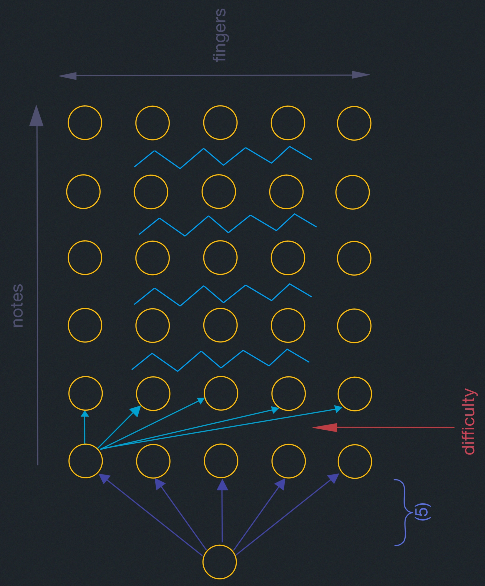
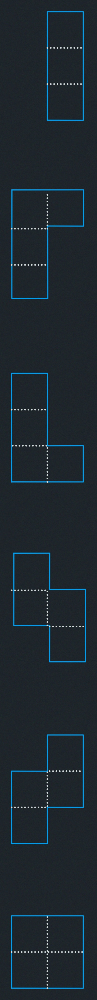

# Dynamic Programming IV: Guitar Fingering, Tetris, Super Mario Bros.
- 2 kinds of guessing
- Piano/Guitar Fingering
- Tetris
- Super Mario Bros.

## Review

<span style="color:rgb(255,0,0)">*</span> 5 easy steps to dynamic programming
| step  | description   | time   |
|-------------- | -------------- | -------------- |
| a. | define subproblems     | count # subproblems |
| b. | guess (part of solution) | count # choices |
| c. | recurrence: relate subproblem solutions | compute time/subproblem | 
| d. | recursive + memoize <br/><br/> OR build DP table bottom-up check subproblems acyclic/topological order| time = (time/subproblem) $\cdot$ (# subproblems)  | 
| e. | solve original problem: <br/>= a subproblem OR by combining subproblems solutions | $\implies$ extra time|

<span style="color:rgb(255,0,0)">*</span> 2 kinds of guessing

(A) In (3), guess which other sub-problems to use 
(<span style="color:green">used by every DP except Fibonacci</span> )

(B) In (1), create more sub-problems to guess/remember more structure of solution 
<span style="color:green"> used by knapsack DP</span>

#### Piano/Guitar Fingering:
##### Piano
<span style="color:green">
  [Parncutt, Sloboda, Clarke, Raekallio, Desaing, 1997]<br/>
  [Hart, Bosch, Tsai 2000]<br/>
  [Al Kasimi, Nichols, Raphael 2007] etc.
</span>

- Given sequence of $n$ notes, find fingering for
each note(single). Given musical piece to play, say sequence of $n$ (single) notes
with right hand. 

- fingers $1,2,\dots, F$ <span style="color:rgb(0,158,241)">$=5$ for humans</span>

$p$: note

$f$: finger

$q$: note

$g$: finger

- metric $d(f,p,g,q)$ of <u>difficulty</u> going from note $p$ with finger $f$ to note
$q$ with finger $g$

<span style="color:rgb(0,158,241);display:flex;">

  e.g.,$1<f<g$ & $p>q \implies$ uncomfortable<br/>
  stretch rule: $p << q \implies$ uncomfortable<br/>
  legato (smooth) $\implies \infty$ if $f=g$<br/>
  weak-finger rule: prefer to avoid $g \in {4,5}$ <br/>
  $3\implies 4$ &  $4 \implies 3$ annoying ~ etc.

</span>


<span style="color:cyan">
  Q: What are the sub-problems for a set-up like this?<br/>
  Ans: Prefixes, suffixes and substrings
</span>

### First Attempt:
<span style="color:red; font-weight:bold">
1. <s style="color:red">subproblem : min. difficulty for surffix notes $[i:]$ </s>

<span style="color:red; font-weight:bold">how to play notes$[i:]$</span>

2. <s style="color:red">guessing : finger f for first note$[i]$</s>

<span style="color:red; font-weight:bold">which finger to use for notes$n[i]$</span>


3. recurrence: <br/>
<s style="color:red">$DP[i]=$ min($DP[i+1]+d(note[i],f,note[i+1],$ 
  <span style="color:yellow">?</span>)for $f \cdots$)</s><br/>
$\rightarrow$ not enough information!

</span>


#### Correct DP:
<span style="color:green;">
1. <u>sub-problem</u>: min. difficulty for suffix notes $[i:]$ given finger $f$ on
first note$[i]$<br/>
$\implies (n \cdot F) subproblems$


2. <u>guessing</u>: finger g for next note$[i+1]$<br/>
$\implies F$ choices


3. <u>recurrence</u>: <br/>
$DP[i,f]=min\left(\;DP[i+1,g]+d(note[i],f,note[i+1],g\right)$ for $g$ in range $(F)\;)$<br/>
$DP[n,f]=0$<br/>
$\implies \Theta(F)$ time/subproblem

4. <u>topological order</u>: <br/>
```
for i in reversed(range(n)):
  for f in 1,2,...,F:
    ...
```

  - Total time: $\Theta(nF^2)$

5. <u>Original problem</u>= $min(FP[0,f]$ for $f$ in $1,2,\dots,F$) <br/>
<span style="color:pink">(guessing very first finger)</span>


</span>

## Guitar
Up to $S$ ways to play same note! <span style="color:rgb(0,158,241)">(where $S$ is # strings)</span>
- redefine "finger" = finger playing note + string playing note
- $\implies F \rightarrow F \cdot S$ 

## Generalization

Multiple notes at once <span style="color:rgb(0,158,241)">e.g. chrods</span>

- input: notes$[i]=$ list of $\leq F$ notes 
(<span style="color:rgb(0,158,241)">can't play > 1 note with a finger</span>)

- <u>state</u> we need to know about "past" now assignment of <span style="color:rgb(0,158,241)">F</span>
fingers to <span style="color:rgb(0,158,241)">$\leq F+1$</span> notes/null

$\implies (F+1)^F$ such mappings

(1) $n \cdot (F+1)^F$ subproblems where $(F+1)^F$ is 
<span style="color:rgb(0,158,241)">how notes$[i]$ is played</span>

(2) $(F+1)^F$ choices (<span style="color:rgb(0,158,241)">how notes$[i+1]$ is played</span>)

(3) $n\cdot (F+1)^{2F}$ total time

- works for 2 hands <span style="color:rgb(0,158,241)">$F = 10$</span>
- <span style="color:green">just need to define appropiate $d$</span>


## Tetris Training:

- initially empty
- given sequence of $n$ Tetris pieces & an empty board of small width $w$ 
- must choose orientation & $x$ coordinate for each.
- then must drop piece till it hits something
- full rows <span style="color:rgb(0,158,241)">do not clear <br/> without

the above two artificialities</span> <span style="color:rgb(0,158,241);font-weight:bold">WE DON'T KNOW!</span><br/>
<span style="color:pink">but: if nonempty board & $w$ large then NP-complete</span>
- <span style="color:cyan">goal</span>: survive $i.e.$, stay within height $h$.

<span style="color:rgb(0,158,241);font-size:30px">First attempt:</span>
1. <s> subproblem = survive in suffix $i:$?</s> <span style="color:red;font-weight:bold"> WRONG!</span>
2. guessing = how to drop piece $i \implies$ # choices = $O(w)$
3. <s>recurrence:</s> $\sout{DP[i]=DP[i+1]}$ 
<span style="color:red;font-weight:bold">?! not enough information!</span>

    <span style="color:rgb(0,158,241)">What do we need to know about prefix $:i$?</span>

<span style="color:rgb(0,158,241);font-size:30px">Correct:</span>
1. <u>sub-problem</u>: survive? in suffix $i:$
  given initial column occupancies $h_{{}_0},h_{{}_1},\dots,h_{{}_{w-1}}$, call it
  <span style="color:rgb(0,158,241)">$h$</span>
  $\implies$ # subproblems = $O(n\cdot h^w)$

--

3. <u>recurrence</u>: $DP[i,$ <span style="color:rgb(0,158,241)">$h$</span>$]$
$=max(DP[i,$ <span style="color:rgb(0,158,241)">$m$</span>] for valid moves
<span style="color:rgb(0,158,241)">m</span> of piece $i$ in <span style="color:rgb(0,158,241)">$h$</span>)

4. <u>topological order</u>: <br/>
```
for i in reversed(range(n)):
  for h in range(h+1):
    ...
```
Total time: $\Theta(n\cdot w\cdot h^w)$
(<span style="color:rgb(0,158,241)">DAG as above</span>)

5. <u> solution</u> $=DP[0,$ <span style="color:rgb(0,158,241)">$0$</span>$]$

(<span style="color:rgb(0,158,241)">& use parent pointers to recover to recover moves</span>)

## Super Mario Bros.

Platform Video Game
- given entire level (objects, enemies, $\dots$) (<span style="color:rgb(0,158,241)">$\leftarrow n$</span>)
- small ($w \times h$) screen
- <u>configuraion</u>
  - screen shift (<span style="color:rgb(0,158,241)">$\leftarrow n$</span>)
  - player position & velocity $O(1)$ (<span style="color:rgb(0,158,241)">$\leftarrow n$</span>)
  - object slates, monster position, etc. (<span style="color:rgb(0,158,241)">$\leftarrow c^{w\cdot h}$</span>)
  - anything outside screen gets reset (<span style="color:rgb(0,158,241)">$\leftarrow c^{w\cdot h}$</span>)
  - score (<span style="color:rgb(0,158,241)">$\leftarrow S$</span>)
  - time (<span style="color:rgb(0,158,241)">$\leftarrow T$</span>)
- transition function $\delta$: (`config`,`action`) $\rightarrow$ `config'`
<span style="color:rgb(0,158,241)">noting, $\uparrow, \downarrow, \rightarrow, \leftarrow$,B A press/release</span>

(1) <u>sub-problem</u>: best score (<span style="color:rgb(0,158,241)">or time</span>) from config, $C$

$\implies n\cdot C^{w\cdot h}\cdot S \cdot T$ subproblems

(2) <u>guess</u>: next action to take from $C$

$\implies O(1)$ choices 

(3) <u>recurrence</u>: 

<div style="display:flex;flex-direction:column; align-items:center">

  $DP(C)= \begin{cases}
    C.score  & \text{ if on flag} \\
    \infty   & \text{ if C.dead or C.time = 0} \\
    max(DP(\delta(C,A)))   & \text{ for A in actions} \\
  \end{cases}$

  $\implies O(1) \text{ (time/sub-problem)}$
</div>
(4) <u>topological order</u>: increasing time

(5) <u>original problem</u>: $DP$(start config)

- pseudopolynomial in $S$ & $T$.
- polynomial in $n$
- exponential in $w \cdot h$
