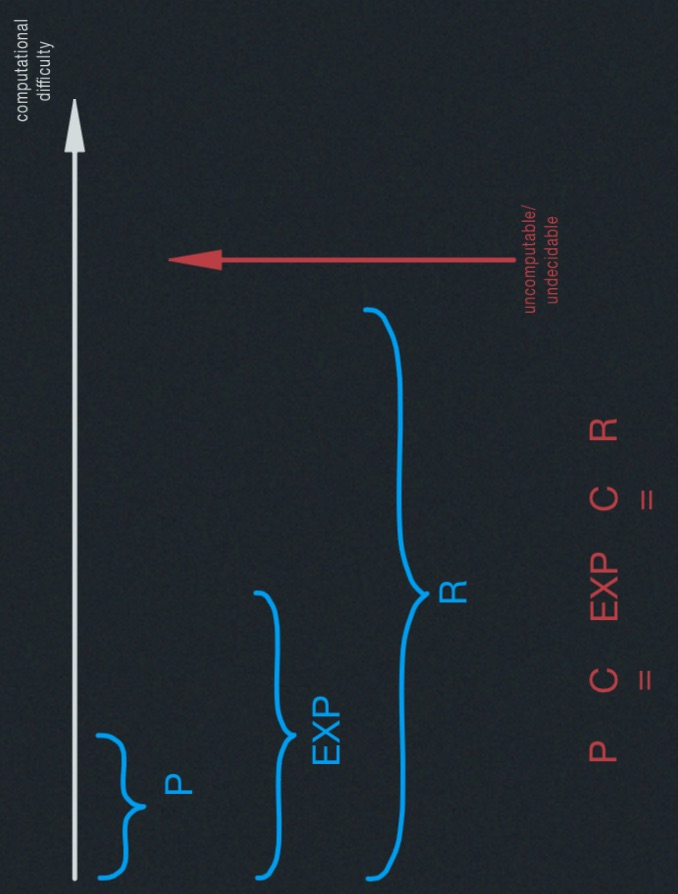
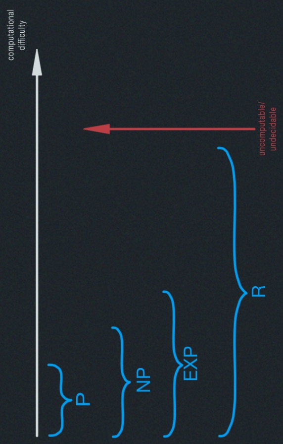
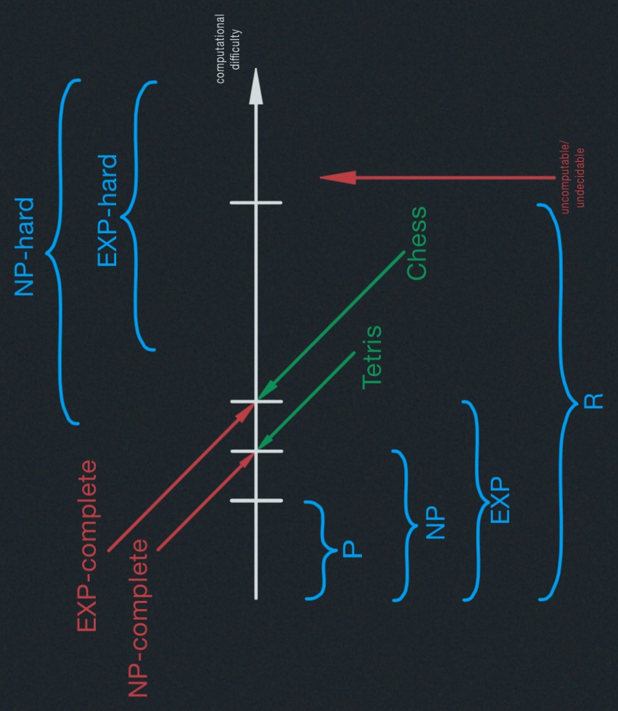

# Computational Complexity

- P. EXP. R
- Most problems are uncomputable.
- NP
- Hardness & completeness
- Reductions

## Definitions:
- <u>P</u>  $={$ problems solvable in polynomial
$n^2$ time $}$

(what this class is all about )

- <u>EXP</u>$= {$ problems solvable in exponential
$2^{n^c}$ time $}$

- <u>R</u> $= {$ problems solvable in finite time $}$
"recursive"
[Turing 1936: Church 1941] 

#### Examples
- negative-weight cycle detection $\in P$

- $n \times n \text{ Chess } \in$ EXP but $\notin P$ 
Who wins from given board configuration?

- Tetris $\in$ EXP but do't know whether $\in P$ 
Survive given pieces from given board.

#### Halting Problems:
Given a computer program, does it ever halt (stop)?

- <u>uncomputable</u> ($\in R$): no algorithm solves it (correctly in finite time on all inputs)
- <u>decision problem</u>: answer is "YES" o "NO"

### Most Decision Problems are **UNCOMPUTABLE**
- program $\approx$ binary string $\approx$ nonneg. integer $\in N$
- decision problem :  
a function from <u>binary strings</u>($\approx$ 
nonneg. integers) to <u>boolean</u>
${$ YES (1) NO (0) $}$

- $\approx$ infinite sequence of bits $\approx$ real number $\in \mathbb{R} \\
|\mathbb{N}|<<|\mathbb{R}|$: no assignment of unique nonneg. integers to real numbers
($\mathbb{R}$ uncountable)

- $\implies$ not nearly enough programs for all problems

- each program solves only one problem

- $\implies$ almost all problems cannot be solved

## NP (Non-deterministic Polynomial)

$NP={$ Decision problems solvable in polynomial time via a "lucky" algorithm $}$.
The "lucky" algorithm can make lucky guesses, always "right"
<u>without</u> trying all options.

- <u>non-deterministic model</u>: algorithm makes guesses & then says YES or NO

- guesses guaranteed to lead to YES outcome if possible (no otherwise)

In other words, $NP={$ Decision problems solvable with solutions that can be "checked" in polynomial time$}$.
This means that when answer = YES, can "prove" it & polynomial-time algorithm can check proof.

#### Example:
Tetris $\in NP$:
- non-deterministic algorithm: guess each move, did I survive?
- proof of YES: list what moves to make (rules of Tetris are easy).

#### P$\neq NP$
Big conjecture a Millenium Prize problem $(\text{worth } \$1'000,000)$
- $\approx$ cannot engineer luck.
- $\approx$ generating (proofs of) solutions can be harder than checking them.

## Hardness and Completeness

#### Claim:
If $P \neq NP$, then Tetris $\in (NP -P)$ 
[Breukelaar, Demaine, Hohenberger, Hoogeboom, Kosters, Liben-Nowell 2004]

#### Why:
Tetris is <u>NP-hard</u> = "as hard as" every problem $\in NP$. In fact <u>NP-complete</u> = 
NP $\cap$ NP-hard. We cannot say harder than NP because it's non-strict, so it's at least as hard as every
problem in NP.

#### Similarly:
Chess is <u>EXP-complete</u> = EXP $\cap$ EXP-hard. EXP-hard as hard as every problem
in EXP. If $NP \neq EXP$, then Chess $\notin$ EXP \ NP. Whether NP $\neq$ EXP is also an open
problem but less famous/"important".

### Reductions
Convert your problem into a problem you already know how to solve
(<m style="color:rgb(0,158,241)">instead of solving from scratch</m>).

  Q: how to solve a "shortest path problem"?

  A: BFS, Djikstra, Bellman-Ford

  But Djikstra solves weighted shortest paths, and my problem has no weights.

  Q:What do we do? 

  A: set all weights to 1

- most common algorithm design techniques.
- unweighted shortest path $\rightarrow$ weighted (<m style="color:rgb(0,158,241)">set weights $=1$</m>).
- min-product path $\rightarrow$ shortest path (<m style="color:rgb(0,158,241)">take logs</m>)
[<m style="color:green">Problem Set 6-1 </m>]
- longest path $\rightarrow$ shortest path 
(<m style="color:rgb(0,158,241)">negate weights</m>)
[<m style="color:green">Quiz 2, P1k </m>]
- shortest ordered tour $\rightarrow$ shortest path 
(<m style="color:rgb(0,158,241)">$k$ copies of the graph</m>)
[<m style="color:green">Quiz 2, P5 </m>]
- cheapest leaky-tank path $\rightarrow$ shortest path (<m style="color:rgb(0,158,241)">graph reduction</m>)
[<m style="color:green">Quiz 2, P6 </m>]

All the above are <u>One-call reductions</u>: A problem $\implies$ B solution $\implies$ A
solution <u>Multicall reductions</u>: solve A using free calls to B --- in this sense, every algorithm
reduces problem $\rightarrow$ model of computation.

NP-complete problems are all interreducible using polynomial-time reductions 
(<m style="color:rgb(0,158,241)">same difficulty</m>). This implies that we can use reductions to prove
NP-hardness --- such as in 3-Partition $\rightarrow$ Tetris.

## Examples of NP-Complete Problems
- Knapsack (<m style="color:rgb(0,158,241)">pseudo-poly, not poly</m>)
- 3-Partition: given $n$ integers, can you divide them into triples of equal sum?
- Traveling Salesman Problem: shortest path that visits all vertices of a given graph
--- decision version: is minimum weight $\leq x$?
- longest common subsequence of $k$ strings
- Minesweeper, Sudoku, and most puzzles.
- SAT: given a Boolean formula (and, or, not), is it <u>ever</u>
true? <m style="color:rgb(0,158,241)">$x$ and not $x \rightarrow NO$</m>
- shortest paths amidst obstacles in 3D.
- 3-coloring a given graph.
- find largest clique in a given graph.
