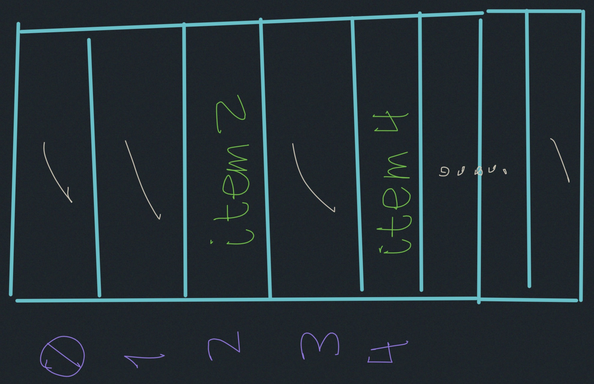
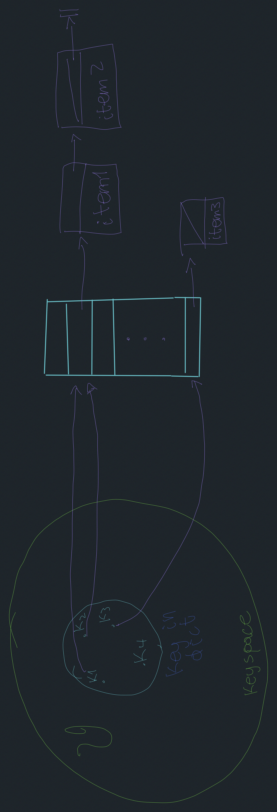

# Hashing with chaining

- Dictionaries & Python.
- Motivation.
- Prehashing.
- Hashing.
- Chaining.
- Simple uniform hashing.
- "Good" hash functions.

## Dictionary
Abstract Data Type (ADT).

Maintain set of items, each with a key.

    - insert (item) (overwrite any existing key)
    - delete (item)
    - search (key): return item with given key or report doesn't exist.

- $O(\log_2 n)$ via AVL to $O(1)$.

## Python: dict
```
D[key] ~ search
D[key] = value ~ insert
del D[key] ~ delete

item = (key, value)
```
### Motivation:
- docdist
- database
- compilers & interpreters
- network router
- network server
- substring search
- string commonalities
- file/dir syncronization
- cryptography

---
### Simple approach: Direct-access table
- store items in array.
- store indexed by key.



#### Badness:
1. key may not be non-negative integers.
2. Gigantic memory hog.

## Solution to (1): prehash
- maps, keys to non-negative integers.
- In theory, keys are finite and discrete. (string of bits)

- in python `hash(x)` is the prehash of `x`

- `hash('\0B') = hash('\0\0C') = 64`

Ideally:
`hash(x)=hash(y)` then
`x=y`

`__hash__` id

## Solution to (2): hashing
- reduce universe $\vartheta$ of all keys (integers) of keys (itegers)
down to reasonable size $m$ for table


## Chaining:
Linked list of colliding elements in each slot of hash table.


$h: \vartheta \rightarrow \{0,1, \cdots, m-1\}$

__worst case:__ $\Theta(n)$

## Simple uniform hashing
Each key is equally likely to be hashed to any slot of the table, 
independent of where other keys hashing.

### Analysis:
- expected length of chain:
```
for n keys, m slots
```
$= \frac{n}{m} = \alpha = \frac{\text{load}}{\text{factor}}$

$\Theta(n)$ if $m=\Theta(n)$ 

running time = $\Theta(1+|\text{chain}|)$

running time = $\Theta(1+\alpha)$

## Hash functions
### division method:
$h(k)=k \cdot \text{mod} \cdot m$

### multiplication method:
$h(k) = \left[(a \cdot k) \cdot \text{mod} \cdot 2^w\right]>> (w-r)$

$k:$ w bit


#### Universal hashing: 
$h(k)=[(\underbrace{a}_{random} \cdot k + \underbrace{b}_{r\{0,1,\cdots, p-1\}}) \cdot \text{mod} \cdot p] \cdot \text{mod} \cdot m$

`for worst-case keys` $k_1 \neq k_2:

$Pr\{h(k_1)=h(k_2)\}=\frac{1}{m}$

$\underbrace{Pr}_{\text{a \& b}}\{h(k_1)=h(k_2)\}=\frac{1}{m}$
