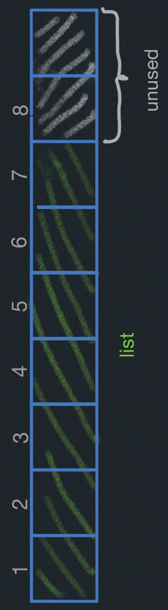
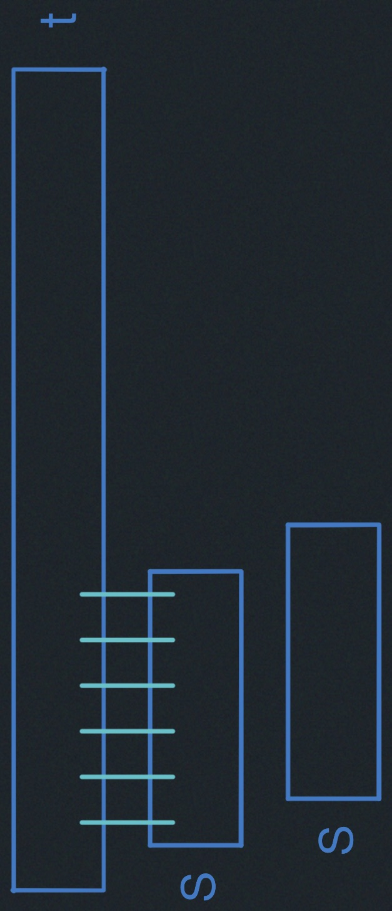

# Hashing II 

- Table Resizing
- Amortization
- String Matching and Karp-Rabin
- Rolling Hash

## Recall:


__Expected cost (insert/delete/search):__ $\Theta(1+\alpha)$, assuming simple
uniform hashing "$OR$" universal hashing "$\&$" hash function $h$ takes $O(1)$ time.
As long as $\alpha$ is a constant, we get $\Theta(1)$ time.

### Division Method:

$h(k)= k \cdot mod \cdot m$

Where $m$ is ideally prime.

### Multiplication Method:

$h(k) = [(a\cdot k)\cdot mod \cdot 2^\omega] >> (\omega - r)$

Where `a` is a random odd integer between $2^{\omega-1}$ and $2^{\omega}$, $k$
is given by $\omega$ bits, and $m=\text{table}$ $\text{size}=2^r$.

## How Large should Table be?
What should $m$ (in expected chain length $\alpha=\frac{n}{m}$ ) be?

##### how to choose $m$?
- want $m = \Theta(n)$ at all times.
- don't know how large $n$ will get at creation.
- $m$ too $\text{small}\implies\text{slow}$; $m$ too big $\implies$ wasteful.

### Idea:
Start small (constant) and grow (or shrink) as necessary.

$m_{initial}=8$

If ($n>m$): grow the table

#### Grow the table: $m \to m'$
- make table of size $m'$
- build new hash $h'$
- rehash:
```
for item in old_table:
  new_table.insert(item)
```
$\implies \Theta(n+m+m')$ 

The hash function is all about mapping the universe of keys
to a table of size m, so if $m$ changes, we definitely need
a new hash function. If you use the old hash function, you 
would just use the beginning of the table.

If you add more slots, you are not going to use them.



For every key you've got to rehash it and figure out where it 
goes.
### Rehashing:
To grow or shrink table hash function must change $(m,r)$

$\implies$ must rebuild hash table from scratch
```
for item in old table: # -> for each slot, for item in slot
  insert into new table
```

$\implies \Theta(n+m) \text{ time} = \Theta(n)$ if $m=\Theta(n)$ 

### How fast to grow?
__How much bigger m should be?__ (<span style="color:green">correct answer $m'=2\cdot m$</span>)

When $n$ reaches $m$, say
- __$m' = m+1$:__ 

  $\implies$ rebuild every step

  $\implies$ n inserts cost $\Theta(1+2+3+4\cdots+n)=$<span style="color:red">$\Theta(n^2)$ horrible time</span>

- $m'=2 \cdot m$: 


  $m=\Theta(n)$ still $(r+=1)$

  $\implies$ rebuild at insertion $2^i$

  $\implies$ n inserts cost $\Theta(1+2+4+8\cdots+\underbrace{n}_{\text{the next power of 2}})=\Theta(n)$

- a few inserts cost linear time, but $\Theta(1)$ "on average".

### Amortized Analysis
<span style="color:green">This is a common technique in data structures — like paying rent: 
$\frac{\$1500}{\text{month}}$ $\approx$ $\frac{\$50}{\text{day}}$</span>

- Operation has <u>amortized cost</u> $T(n)$ if $k$ operations take: (cost) $\leq k\cdot T(n)$
- "$T(n)$ amortized" roughly means $T(n)$ "on average", but averaged over all operations.
  - Table doubling:
   `k` inserts take $\Theta(k)$ time.

    $\implies O(1)$ amortized/insert

    - also `k` inserts & deletes take $\Theta(k)$ time.

- e.g. insertion into a hash table takes $O(1)$ amortized time.

### Back to Hashing:
Maintain $m=\Theta(n) \implies \alpha = \Theta(1) \implies$ support search in $O(1)$
expected time (<span style="color:green">assuming simple uniform or universal hashing</span>)

### Delete:
Also $O(1)$ expected as is.

- Space can get big with respect to $n$ e.g. $n\times \text{insert}$, $n\times delete$
- <u>Solution</u>: When $n$ decreases to $\frac{m}{4}$, shrink to half the 
$size \implies O(1)$ amortized cost for both insert and delete --- analysis is harder;

### Resizable Arrays:
- Same trick solves Python "list" (array).
- $\implies$ list.append and list.pop in $O(1)$ amortized.


### String Matching
Given two strings $s$ and $t$, does $s$ occur as a substring of $t$? (and if so, where and how 
many times?)

E.g. `s='6.006'` and $t:$ your entire INBOX (<span style= "color:green">'grep' on UNIX</span>)

### Simple Algorithm:
```
any(s== t[i:i+len(s)]) for i in range(len(t) - len(s)) 
```
- $O(|s|)$ time for each substring comparison
$\implies \Theta(|s|\cdot(|t|-|s|))$ time

$=O(|s|\cdot|t|)$ <span style= "color:green">potentially quadratic</span>



### Rolling Hash ADT
Maintain string $x$ subject to
- `r():` reasonable hash function $h(x)$ on string $x$.
- `r.append(c)` add letter `c` to end of string `x`.
- `r.skip(c)` remove front letter from string `x`, assuming it is `c`

### Karp-Rabin Algorithm
- Compare `h(s) == h(t[i: i + len(s)])`
- If hash vales match, likely so do strings.
  - can check `s == t[i:i + len(s)]` to be sure ~ cost $O(|s|)$
  - if yes, found match --- done
  - if no, happened with probability $\leq \frac{1}{|s|}$

    $\implies$ expected cost is $O(1)$ per i.
- need suitable hash function.
- expected time $= O(|s| + |t| \cdot \text{h}).$
  - naively $h(x) \cdot costs |x|$
  - we'll achieve $O(1)!$
  - idea: `t[i: i + len(s)]` $\approx$ `t[i+1:i+1+len(s)]`.

### Karp-Rabin Application
```
for c in s: 
  rs.append(c)
for c in t[:len(s)]: 
  rt.append(c)
if rs() == rt():
  ...
```
This first block of code is $O(n)$

```
for i in range(len(s), len(t)):
  rt.skip(t[i-len(s)])
  rt.append(t[i])
  if rs() == rt():
    ...
```
The second block of code is $O(|t|) +O\left(\#\text{  matches} - |s|\right)$ to verify.

### Data Structure:
Treat string $x$ as a multidigit number $u$ in base $a$ 
<span style="color:#89F9ff">where $a$ denotes the alphabet size, e.g., 256</span>.

- $r()=u \cdot mod \cdot p$ for (<span style="color:green">ideally random</span>)
prime $p\approx |s|$ or $|t|$ (<u>division method</u>)
- `r stores` $u \cdot mod \cdot p$ and $|x|$ (<span style="color:#89f9ff">really $a^{|x|}$</span>), not $u$

  $\implies$ smaller and faster to work with ($u \cdot mod \cdot p$ 
  fits in one machine word).

- `r.append(c):` 
$(u \cdot a + ord(c)) \cdot mod \cdot p =[(u \cdot \text{mod} \cdot p) \cdot a + ord(c)]\cdot mod \cdot p$

- `r.skip(c):`$[u-ord(c)\cdot(a^{|u|-1}\cdot mod \cdot p)]\cdot \text{mod} \cdot p$

$=[(u\cdot p)-ord(c)\cdot(a^{|u|-1}\cdot mod \cdot p))]\cdot \text{mod} \cdot p$
